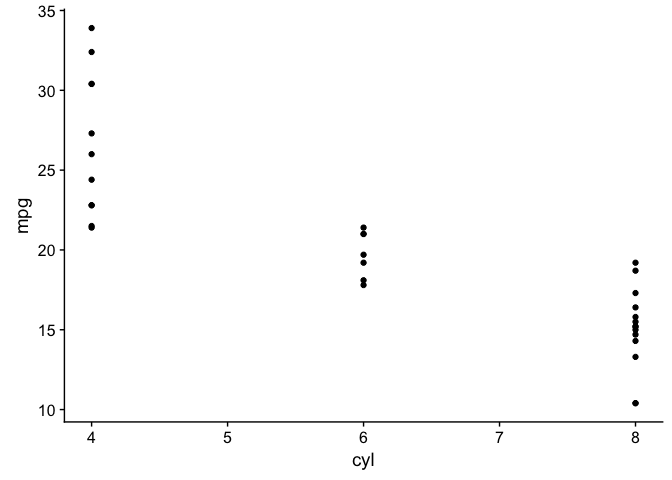

R Basics
================
Hause Lin
2018-01-20

Set current working directory
=============================

The **working directory** (also known as current working directory) is the folder you're currently in. If you're navigating your computer with your mouse, you'll be clicking and moving into different folders. Directory is just a different way of saying 'location' or where you're at right now (which folder you're currently in).

To set your working directory, first find and copy the path (the long string of characters/letters such as "Users/John/Desktop/Projects/") to your current working directory. You might want to create a new folder on your computer for each new project, and then copy the path to this folder or directory. After you've copied the directory path, let R know you want this to be your working directory by using the `setwd()` function (setwd: "set working directory"). The path to my directory is "/Users/Hause/Dropbox/Working Projects/RDataScience/R Basics/".

``` r
setwd("/Users/Hause/Dropbox/Working Projects/RDataScience/R Basics/")
```

To get print your current working directory in RStudio's console, use `getwd()`

``` r
getwd() # get working directory
```

    ## [1] "/Users/Hause/Dropbox/Working Projects/RDataScience/R Basics"

Variables and vectors... and classes
====================================

``` r
variable1 <- 10
variable2 <- 200
v3 <- variable1 + variable2

variable1; variable2; v3 # print all 4 variables to console
```

    ## [1] 10

    ## [1] 200

    ## [1] 210

**Vectors** are objects that store data of the same **class**

``` r
c(1, 3, 5) # numeric
```

    ## [1] 1 3 5

``` r
c("I am happy", "I am sad", "I am ambivalent") # character
```

    ## [1] "I am happy"      "I am sad"        "I am ambivalent"

``` r
c(TRUE, FALSE) # logical (boolean TRUE/FALSE)
```

    ## [1]  TRUE FALSE

Installing and loading packages/libraries
=========================================

You only have to install packages once!

``` r
# install.packages(c("tidyverse", "data.table", "dtplyr", "lme4", "lmerTest", "ggbeeswarm", "cowplot"))
```

To load libraries, use `library(library_name_you_want_to_load)`

``` r
library(tidyverse); library(data.table);library(broom); library(dtplyr); library(cowplot); library(lme4); library(lmerTest); library(ggbeeswarm)
```

Reading files into R
====================

A script comment that includes **markdown** formatting.

``` r
ggplot(mtcars, aes(cyl, mpg)) +
    geom_point()
```



``` r
# rmarkdown::render("R Basics.R", "github_document")
```
