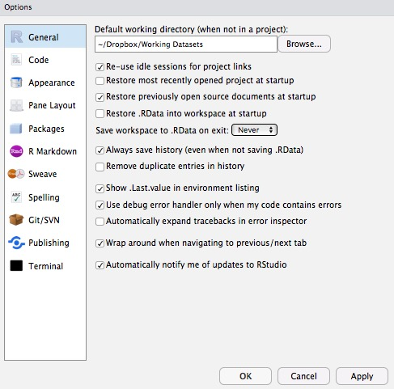

Tutorial 1: R and programming basics
================
Hause Lin

-   [What is data science?](#what-is-data-science)
-   [Setting up: Installing R packages/libraries `install.packages()`](#setting-up-installing-r-packageslibraries-install.packages)
-   [Using/loading R packages when you begin a new RStudio session `library()`](#usingloading-r-packages-when-you-begin-a-new-rstudio-session-library)
-   [Changing R default option settings](#changing-r-default-option-settings)
-   [Working/current directory: Where are you and where should you be? `getwd()`](#workingcurrent-directory-where-are-you-and-where-should-you-be-getwd)
    -   [Two ways to change/set your working directory (both uses `setwd()`).](#two-ways-to-changeset-your-working-directory-both-uses-setwd.)
-   [Getting help via ? or `help()`](#getting-help-via-or-help)
    -   [Which package does a function come from?](#which-package-does-a-function-come-from)
-   [Objects, variables, and classes](#objects-variables-and-classes)
-   [Indices and indexing with \[i, j\]](#indices-and-indexing-with-i-j)
-   [Using functions](#using-functions)
-   [Piping with `%>%`](#piping-with)
-   [Functions and argument order](#functions-and-argument-order)
-   [Pressing Tab key to autocomplete! Tab will be your best friend!](#pressing-tab-key-to-autocomplete-tab-will-be-your-best-friend)
-   [Good practices for reproducible research](#good-practices-for-reproducible-research)
-   [Four-step philosophy](#four-step-philosophy)
-   [Common beginner errors](#common-beginner-errors)

What is data science?
---------------------

-   Cleaning, wrangling, and munging data
-   Summarizing and visualizing data
-   Fitting models to data
-   Evaluating fitted models

Setting up: Installing R packages/libraries `install.packages()`
----------------------------------------------------------------

Use the `install.packages()` function to install packages from CRAN (The Comprehensive R Archive Network), which hosts official releases of different packages (also known as libraries) written by R users (people like you and I can write these packages).

Install packages once and you'll have them on your computer. You only need to update them regularly in the future. No need to rerun `install.packages()` every time you want to use these packages.

For more information, see [here](https://github.com/hauselin/RDataScience).

Installing packages one by one.

``` r
# install one by one
install.packages("tidyverse")
install.packages("data.table")
install.packages("broom")
install.packages("dtplyr")
install.packages("lme4")
install.packages("lmerTest")
install.packages("ggbeeswarm")
install.packages("cowplot")
install.packages("piecewiseSEM")
install.packages("compute.es")
install.packages("sjstats")
install.packages("sjPlot")
```

Or install packages all at once, calling `install.packages()` function just once, using the `c()` (combine/concatenate) to combine all your package names into one big vector (more on what vectors and classes are later).

``` r
install.packages(c("tidyverse", "data.table", "broom", "dtplyr", "lme4", "lmerTest", "ggbeeswarm", "cowplot", "piecewiseSEM", "compute.es", "sjstats", "sjPlot"))
```

Using/loading R packages when you begin a new RStudio session `library()`
-------------------------------------------------------------------------

Use `library()` to load packages and use semi-colon (;) to load multiple packages in the same line. I always load the packages below whenever I start a new RStudio session. Sometimes you'll see people using `require()` instead of `library()`. Both works!

``` r
library(tidyverse); library(data.table); library(broom); library(dtplyr); library(lme4); library(lmerTest); library(ggbeeswarm); library(cowplot)
```

Changing R default option settings
----------------------------------

I also strongly recommend changing a few default R options. Click on **RStudio -&gt; Preferences -&gt; General Tab** and (un)check the boxes below.

-   You might want to change your default working directory at the top. This directory will be where RStudio saves all your work automatically if you don't manually specify/change your working directory later on (more on directories later on).
-   By default, RStudio reloads your previously saved work whenever you reopen it, which can often be disastrous (just like you might not want Microsoft Word to always reopen the document you last worked on every single time you open it). So we are disabling (unchecking) relevant features.



Working/current directory: Where are you and where should you be? `getwd()`
---------------------------------------------------------------------------

The **working directory** (also known as current directory) is the folder (also known as directory) you're currently in. If you're navigating your computer with your mouse, you'll be clicking and moving into different folders. Directory is just a different way of saying 'location' or where you're at right now (which folder you're currently in).

``` r
getwd() # this function prints in the console your current working directory (get working directory)
```

    ## [1] "/Users/Hause/Dropbox/Working Projects/RDataScience"

The path above tells you where your working directory is now. It's conceptually equivalent to you opening a window and using your mouse to manually navigate to that folder.

To change your working directory (to where your project folder is located), use the `setwd()`. This function is easy to use, but the difficulty for most beginners is getting the path to your folder (e.g., "/Users/Hause/Dropbox/Working Projects/RDataScience") so you can specify something like `setwd("/Users/Hause/Dropbox/Working Projects/RDataScience")`.

### Two ways to change/set your working directory (both uses `setwd()`).

1.  Go to your menubar (at the top). Click **Help** and search for **set working directory**. RStudio will tell you how to do it via the **Session** menu. Select **Set Working Directory** and **Choose Directory**. Then navigate to your project directory and you're done.

2.  On one of the RStudio panes, you'll see a **Files** tab (click on it). Use that pane to navigate to your project directory. When you're there, click **More** and **Set As Working Directory**.

Whether you choose method 1 or 2, you should see your new directory being set in the console panel, which should look something like `> setwd("your/path/is/here")`. **COPY AND PASTE THIS OUTPUT (but without the &gt;) to your current script**. So you should be copying something like this:

``` r
setwd("your/path/is/here")
```

Getting help via ? or `help()`
------------------------------

To get help and read the documentation for any function, use `?` or the `help()` function. Beginners will often find the **Examples** section of the documentation (at the bottom of the document) most useful. Try copying and pasting the code from that section into your script to see how that function works.

Equivalent ways to get help:

``` r
# get help for mean function
?mean # I usually use this version because there's less typing
?mean()
help(mean)

# get help for setwd function
?setwd
?setwd()
help(setwd)
```

### Which package does a function come from?

If you ask for help using `?` or `help()`, at the top left corner of the documentation, you'll see something that looks like `functionName{anotherName}`, the name within the `{}` tells you which package a particular function comes from.

``` r
?lm # linear regression, lm{stats}, so comes from stats package (which comes with R)
?mean # mean, mean{base}, so comes from base package (which comes with R)
```

To explicitly specify which package to use, you can use the code below. Often we don't have to explicitly specify which package unless different packages have functions with the same names.

``` r
mean(c(1, 2, 3))
```

    ## [1] 2

``` r
base::mean(c(1, 2, 3)) # same as above but explicitly specifies the base package
```

    ## [1] 2

``` r
lm(mpg ~ cyl, data = mtcars)
```

    ## 
    ## Call:
    ## lm(formula = mpg ~ cyl, data = mtcars)
    ## 
    ## Coefficients:
    ## (Intercept)          cyl  
    ##      37.885       -2.876

``` r
stats::lm(mpg ~ cyl, data = mtcars) # same as above but explicitly specifies the stats package
```

    ## 
    ## Call:
    ## stats::lm(formula = mpg ~ cyl, data = mtcars)
    ## 
    ## Coefficients:
    ## (Intercept)          cyl  
    ##      37.885       -2.876

Objects, variables, and classes
-------------------------------

Objects are 'things' in your environment. Just like physical objects (e.g., jeans, frying pan) in your physical environment. Different objects have different properties, and thus belong to different categories/classes: jeans belong to clothes and frying pan belongs to utensils. Same with programming language objects: different objects in your environment belong to different categories/classes (often also known as type). And different categories/classes have different properties associated with them. You wear your jeans but not your frying pan; you can fry eggs with your pan but not your jeans. Same with different programming objects, which includes **vectors, lists, dataframes, datatables, matrices, characters (also known as strings), numerics, integers, booleans** (and the list goes on). Different programming objects/classes/categories have different properties and actions associated with them.

Note (courtesy of John Eusebio): You can fry your jeans on your frying pan. It's just not recommended. Same thing with some R functions. You can do some things, like use a for loop to iterate through and operate on every element of a matrix, but you shouldn't. There are tools that are made to do stuff like matrix operations much more smoothly.

You can check the class/category/type of an object with the `class()` function.

``` r
class(mean)  
```

    ## [1] "standardGeneric"
    ## attr(,"package")
    ## [1] "methods"

Creating objects (specifically vectors) with the `<-` assignment operator

Keyboard shortcut for `<-`: Alt -

``` r
variable1 <- 10 # assign/store the value 10 in variable1
variable2 <- 2000
v3 <- variable1 + variable2 # add variable1 to variable2
variable1; variable2; # print variables to console
```

    ## [1] 10

    ## [1] 2000

``` r
v3 # print variables to console
```

    ## [1] 2010

``` r
print(v3) # same as just typing v3 (the print() function just explicitly tells R to print output to the console, which is unnecessary here)
```

    ## [1] 2010

Check your panes and click on the **Environment** tab. What do you see there right now? What's new?

Note that R variable names can only begin with characters/letters, not numbers or other symbols.

``` r
class(variable1)
```

    ## [1] "numeric"

``` r
class(variable2)
```

    ## [1] "numeric"

``` r
class(v3)
```

    ## [1] "numeric"

``` r
v4 <- c(1, 2, 3, 4, 5) # 'c' stands for concatenate or combine
v4 # prints v4, which is a vector
```

    ## [1] 1 2 3 4 5

What does `c()` do?

**Vectors** are objects that store data of the same **class**

`c()` combines values of the same class into a vector (or list). Think: like how you put all your clothes (one category/class of objects) into your wardrobe (vector)

``` r
v4
```

    ## [1] 1 2 3 4 5

``` r
class(v4)
```

    ## [1] "numeric"

``` r
roomsInHouse <- c("Kitchen", "Bedroom") # a vector with all characters
roomsInHouse
```

    ## [1] "Kitchen" "Bedroom"

Note that all the values in `roomsInHouse` are in quotation marks "", meaning that the values are all characters (a category or class of objects in R).

``` r
class("Date of Birth")
```

    ## [1] "character"

``` r
class(12121999)
```

    ## [1] "numeric"

``` r
mixedClasses <- c("Date of Birth", 12121999)
mixedClasses # what class is this? why?
```

    ## [1] "Date of Birth" "12121999"

``` r
class(mixedClasses) 
```

    ## [1] "character"

Why is it character?

``` r
sleep # dataframe that is built into R (comes with any R installation)
```

    ##    extra group ID
    ## 1    0.7     1  1
    ## 2   -1.6     1  2
    ## 3   -0.2     1  3
    ## 4   -1.2     1  4
    ## 5   -0.1     1  5
    ## 6    3.4     1  6
    ## 7    3.7     1  7
    ## 8    0.8     1  8
    ## 9    0.0     1  9
    ## 10   2.0     1 10
    ## 11   1.9     2  1
    ## 12   0.8     2  2
    ## 13   1.1     2  3
    ## 14   0.1     2  4
    ## 15  -0.1     2  5
    ## 16   4.4     2  6
    ## 17   5.5     2  7
    ## 18   1.6     2  8
    ## 19   4.6     2  9
    ## 20   3.4     2 10

``` r
# for more datasets that came with R, type data()
```

``` r
class(sleep)
```

    ## [1] "data.frame"

Booleans (class called "logical"): `TRUE` or `FALSE` values. `TRUE` is actually coded as 1 and `FALSE` coded as 0. Must be all upper-case (`TRUE`, `T`, `FALSE`, `F`). Lower-case doesn't work!

``` r
booleanExample <- c(T, F)
class(booleanExample) # true
```

    ## [1] "logical"

``` r
class(c(TRUE, FALSE))
```

    ## [1] "logical"

``` r
class(F) # false
```

    ## [1] "logical"

``` r
class(c(T, F))
```

    ## [1] "logical"

Indices and indexing with \[i, j\]
----------------------------------

|           |   Column 1   |   Column 2   |   Column 3   |
|:---------:|:------------:|:------------:|:------------:|
| **Row 1** | i = 1, j = 1 | i = 1, j = 2 | i = 1, j = 3 |
| **Row 2** | i = 2, j = 1 | i = 2, j = 2 | i = 2, j = 3 |
| **Row 3** | i = 3, j = 1 | i = 3, j = 2 | i = 3, j = 3 |

i: row index, j: column index

Index is just a fancy way of saying numbering or counting.

``` r
exampleMatrix <- matrix(c(10, 20, 30, 40), nrow = 2) # create a matrix with values 10, 20, 30, 40, and make it 2 rows long
exampleMatrix
```

    ##      [,1] [,2]
    ## [1,]   10   30
    ## [2,]   20   40

To select specific values in the matrix, use the \[i, j\] syntax, where i refers to the row number and j refers to the column number.

``` r
exampleMatrix[1, 2] # what does this return? ('return' is a way to say "output" or "spit out")
```

    ## [1] 30

What indices would you use to get the value 20 specifically?

``` r
exampleMatrix[2, 1]
```

    ## [1] 20

Using functions
---------------

Functions take some input, transform that input, and spits out (returns you) some output.

``` r
mean(c(10, 20, 30)) # mean function
```

    ## [1] 20

What is the input to the `mean()` function above? What is the output?

What are the inputs to the `matrix()` function below? How is the `matrix()` function transforming your input? What do you think the output will be?

``` r
matrix(c(10, 20, 30, 40, 50, 60), nrow = 6)
```

    ##      [,1]
    ## [1,]   10
    ## [2,]   20
    ## [3,]   30
    ## [4,]   40
    ## [5,]   50
    ## [6,]   60

``` r
paste0(c("a", "b", "c"), 1:3) # what is the paste0 function doing?
```

    ## [1] "a1" "b2" "c3"

``` r
paste(c("a", "b", "c"), 1:3) # How is paste() different from paste0() above?
```

    ## [1] "a 1" "b 2" "c 3"

``` r
paste(c("a", "b", "c"), 1:3, sep = '_ _ _') # What's happening?
```

    ## [1] "a_ _ _1" "b_ _ _2" "c_ _ _3"

Piping with `%>%`
-----------------

Often we apply multiple functions in succession. We say we "wrap" or "nest" functions within functions.

``` r
x <- c(10.1, 10.1, 20.3, 20.3, 30.2, 30.7, 30.7)
x
```

    ## [1] 10.1 10.1 20.3 20.3 30.2 30.7 30.7

``` r
mean(x) # mean of values in x
```

    ## [1] 21.77143

``` r
unique(x) # unique values in x
```

    ## [1] 10.1 20.3 30.2 30.7

``` r
mean(unique(x)) # mean of unique values in x
```

    ## [1] 22.825

``` r
round(mean(unique(x))) # round of mean of unique values in x
```

    ## [1] 23

As you can see, wrapping or nesting functions within functions can be quite difficult to read. We can get rid of such nesting/wrapping with pipes `%>%`, which is available to you when you load the `tidyverse` package with `library(tidyverse)` above. Read `%>%` as "then".

Keyboard shortcut for `%>%`: Shift-Command-M (Mac) or Shift-Ctrl-M (Windows)

Take output of `x`, then apply `unique()` to that output.

``` r
x %>% unique()
```

    ## [1] 10.1 20.3 30.2 30.7

Take output of `x`, then apply `unique()` to that output, then apply `mean()` to that output.

``` r
x %>% unique() %>% mean()
```

    ## [1] 22.825

Take output of `x`, then apply `unique()` to that output, then apply `mean()` to that output, then apply `round()` to that output.

``` r
x %>% unique() %>% mean() %>% round()
```

    ## [1] 23

Same outputs below

``` r
round(mean(unique(x))) # less legible
```

    ## [1] 23

``` r
x %>% unique() %>% mean() %>% round() # more legible
```

    ## [1] 23

Piping with `%>%` makes it easier to read your code (reading left to right: `x %>% unique() %>% mean() %>% round()`), rather than from inside to outside: `round(mean(unique(x)))`.

If your pipes get too long, you can separate pipes into different lines.

``` r
x %>% # one line at a time (press enter after each pipe)
    unique() %>% 
    mean() %>% 
    round() 
```

    ## [1] 23

Functions and argument order
----------------------------

Make sure to specify your function arguments in the correct order. If not, make sure to specify the name of each argument you're using!

``` r
numbers <- c(1:3, NA)
numbers
```

    ## [1]  1  2  3 NA

Argument-value pairs: argument is x, value is `numbers` (defined above as 1, 2, 3, NA)

``` r
mean(x = numbers) # what happened?
```

    ## [1] NA

Argument-value pairs

-   argument1 = x, value = `numbers`
-   argument2 = na.rm, value = `TRUE`

``` r
mean(x = numbers, na.rm = TRUE) # remove missing (NA) values by giving the value TRUE to the na.rm argument
```

    ## [1] 2

Note that `TRUE` can be written simply as `T` and `FALSE` can be written as `F`.

``` r
mean(na.rm = T, x = numbers) # does this work?
```

    ## [1] 2

``` r
mean(numbers, na.rm = T) # does this work?
```

    ## [1] 2

``` r
mean(na.rm = T, numbers) # NEVER DO THIS EVEN IF IT WORKS!!! BAD PRACTICE!!! 
```

    ## [1] 2

Why is this so bad?

``` r
mean(numbers, TRUE) # what happens? why?
```

    ## Error in mean.default(numbers, TRUE): 'trim' must be numeric of length one

The function fails to run. Why? Type `?mean` in the console and read the documentation to figure out why. What arguments do the `mean` function also have? What's the expected order of the arguments?

What are the default values to the arguments? How do you know if there are default values?

Pressing Tab key to autocomplete! Tab will be your best friend!
---------------------------------------------------------------

We often will never remember all the arguments all the functions will require (there are just too many functions!). But when we type the function name followed by brackets `mean()`, the cursor will automatically move between the brackets. You can press the `Tab` key on your keyboard to get RStudio to tell you what arguments this function expects.

Be creative! Tab and autocomplete works in MANY other situations! Explore! (variables, filenames, directory paths etc.)

Good practices for reproducible research
----------------------------------------

-   One directory/folder per project
-   Clear your environment and set your working directory at the top of each script
-   Load your libraries at the top of each script
-   Save and restore your work with `save.image()` and `load()`
-   Give your variables and objects sensible names

Four-step philosophy
--------------------

1.  Know your subgoals and especially your end goals
2.  Know what you’re passing in to functions
3.  Know what your functions return you
4.  Know how to verify or summarize what your functions return you

Common beginner errors
----------------------

-   Not looking at the output in the console (treating R like a black box)
-   Console still expects more code: + rather than &gt; (press Escape to get rid of +)
-   Naming your variables unsystematically and calling the wrong variable because of typos
-   Not knowing what data you’re giving a function
-   Not knowing what class of data a function expects
-   Not knowing what class of data your function returns
-   Not learning how to **properly** use [stackoverflow](https://meta.stackoverflow.com/questions/252149/how-does-a-new-user-get-started-on-stack-overflow)
