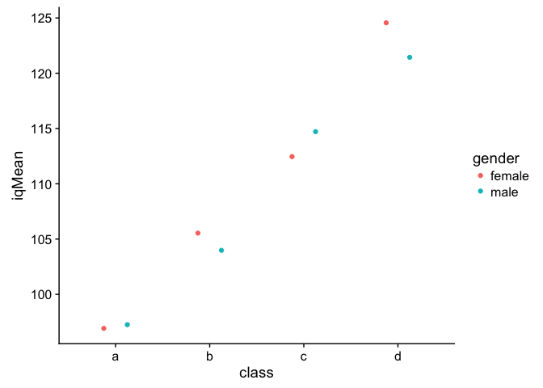

Tutorial 2: tidyverse and datatable
================
Hause Lin

-   [Loading frequently-used packages with `library()`](#loading-frequently-used-packages-with-library)
-   [Reading data into R](#reading-data-into-r)
-   [Comparing the outputs of read.csv(x), fread(x), and tbl\_dt(fread(x))](#comparing-the-outputs-of-read.csvx-freadx-and-tbl_dtfreadx)
    -   [Reading URLs and other formats](#reading-urls-and-other-formats)
-   [Summarizing objects](#summarizing-objects)
-   [Using `$` and `[]` to extract elements using their names](#using-and-to-extract-elements-using-their-names)
-   [Writing/saving dataframes or datatables as csv files](#writingsaving-dataframes-or-datatables-as-csv-files)
-   [tidyverse: a collection of R packages](#tidyverse-a-collection-of-r-packages)
    -   [Manipulating datasets with `dplyr` (a package in tidyverse)](#manipulating-datasets-with-dplyr-a-package-in-tidyverse)
    -   [Select columns/variables with `select()`](#select-columnsvariables-with-select)
    -   [Select rows with `slice()`](#select-rows-with-slice)
    -   [Filtering or subsetting data/rows with `filter()`](#filtering-or-subsetting-datarows-with-filter)
    -   [Rename variables/columns with `rename()`](#rename-variablescolumns-with-rename)
    -   [Create new columns/variables with `mutate()`](#create-new-columnsvariables-with-mutate)
    -   [Sorting or arranging data rows with `arrange()`](#sorting-or-arranging-data-rows-with-arrange)
    -   [Combining functions with pipes `%in%`](#combining-functions-with-pipes-in)
    -   [Compute summary statistics with `summarize()` or `summarise()`](#compute-summary-statistics-with-summarize-or-summarise)
-   [More `dplyr` and `tidyverse` information](#more-dplyr-and-tidyverse-information)
-   [Supercharging your workflow with data.table()](#supercharging-your-workflow-with-data.table)
    -   [`data.table()` basics: \[i, j, by\]](#data.table-basics-i-j-by)
    -   [Filter data.table via i](#filter-data.table-via-i)
    -   [Selecting columns via j](#selecting-columns-via-j)
    -   [Summarize data via j](#summarize-data-via-j)
    -   [Compute summary statistics and apply functions to j by groups](#compute-summary-statistics-and-apply-functions-to-j-by-groups)
    -   [Creating new variables/columns and reassigning in data.tables with `:=`](#creating-new-variablescolumns-and-reassigning-in-data.tables-with)
    -   [Renaming with `setnames()`](#renaming-with-setnames)
-   [More `data.table` information](#more-data.table-information)

Loading frequently-used packages with `library()`
-------------------------------------------------

I always load my frequently-used packages at the top of each script.

``` r
library(tidyverse); library(data.table); library(broom); library(dtplyr); library(lme4); library(lmerTest); library(ggbeeswarm); library(cowplot)
```

Reading data into R
-------------------

Read file in a directory and save the data as an object in the environment by using the assignment `<-` operator.

``` r
df1 <- read.csv("./Data/sleep.csv") # base R read.csv() function
# same as df1 <- read.csv("Data/sleep.csv")
# READ: assign the output read.csv("Data/sleep.csv") into df1

df2 <- fread("./Data/sleep.csv") # fread() from library(data.table)
# same as df2 <- fread("Data/sleep.csv")

# my favorite way of reading data: combining tbl_dt() and fread()
df3 <- tbl_dt(fread("./Data/sleep.csv")) # tbl_dt() from library(dtplyr)
# same as df3 <- tbl_dt(fread("Data/sleep.csv"))
```

The `.` in the file path simply refers to the current working directory, so it can be dropped. And `..` can be used to refer to the parent directory.

Comparing the outputs of read.csv(x), fread(x), and tbl\_dt(fread(x))
---------------------------------------------------------------------

``` r
df1 # read.csv("./Data/sleep.csv")
```

    ##    extra group ID
    ## 1    0.7     1  1
    ## 2   -1.6     1  2
    ## 3   -0.2     1  3
    ## 4   -1.2     1  4
    ## 5   -0.1     1  5
    ## 6    3.4     1  6
    ## 7    3.7     1  7
    ## 8    0.8     1  8
    ## 9    0.0     1  9
    ## 10   2.0     1 10
    ## 11   1.9     2  1
    ## 12   0.8     2  2
    ## 13   1.1     2  3
    ## 14   0.1     2  4
    ## 15  -0.1     2  5
    ## 16   4.4     2  6
    ## 17   5.5     2  7
    ## 18   1.6     2  8
    ## 19   4.6     2  9
    ## 20   3.4     2 10

``` r
class(df1) # read.csv("./Data/sleep.csv")
```

    ## [1] "data.frame"

``` r
df2 # fread("./Data/sleep.csv") # fread() from library(data.table)
```

    ##     extra group ID
    ##  1:   0.7     1  1
    ##  2:  -1.6     1  2
    ##  3:  -0.2     1  3
    ##  4:  -1.2     1  4
    ##  5:  -0.1     1  5
    ##  6:   3.4     1  6
    ##  7:   3.7     1  7
    ##  8:   0.8     1  8
    ##  9:   0.0     1  9
    ## 10:   2.0     1 10
    ## 11:   1.9     2  1
    ## 12:   0.8     2  2
    ## 13:   1.1     2  3
    ## 14:   0.1     2  4
    ## 15:  -0.1     2  5
    ## 16:   4.4     2  6
    ## 17:   5.5     2  7
    ## 18:   1.6     2  8
    ## 19:   4.6     2  9
    ## 20:   3.4     2 10

``` r
class(df2) # fread("./Data/sleep.csv") # fread() from library(data.table)
```

    ## [1] "data.table" "data.frame"

How's the output different from the one above?

``` r
df3 # tbl_dt(fread("./Data/sleep.csv")) # tbl_dt() from library(dtplyr)
```

    ## Source: local data table [20 x 3]
    ## 
    ## # A tibble: 20 x 3
    ##    extra group    ID
    ##    <dbl> <int> <int>
    ##  1   0.7     1     1
    ##  2  -1.6     1     2
    ##  3  -0.2     1     3
    ##  4  -1.2     1     4
    ##  5  -0.1     1     5
    ##  6   3.4     1     6
    ##  7   3.7     1     7
    ##  8   0.8     1     8
    ##  9   0       1     9
    ## 10   2       1    10
    ## 11   1.9     2     1
    ## 12   0.8     2     2
    ## 13   1.1     2     3
    ## 14   0.1     2     4
    ## 15  -0.1     2     5
    ## 16   4.4     2     6
    ## 17   5.5     2     7
    ## 18   1.6     2     8
    ## 19   4.6     2     9
    ## 20   3.4     2    10

``` r
class(df3) # tbl_dt(fread("./Data/sleep.csv")) # tbl_dt() from library(dtplyr)
```

    ## [1] "tbl_dt"     "tbl"        "data.table" "data.frame"

How's the output different from the two outputs above?

### Reading URLs and other formats

Check out the csv (comma separated values) data [here](https://raw.githubusercontent.com/hauselin/RDataScience/master/Data/sleep.csv). You can read data directly off a website.

Most of these read functions can import/read different types of files (e.g., csv, txt, URLs) as long as the raw data are formatted properly (e.g., separated by commas, tabs). But if you're trying to read proprietary data formats (e.g., SPSS datasets, Excel sheets), you'll need to use other libraries (e.g., `readxl`, `foreign`) to read those data into R.

``` r
df_url <- tbl_dt(fread("https://raw.githubusercontent.com/hauselin/RDataScience/master/Data/sleep.csv"))
df_url # print data to console; same dataset as tbl_dt(fread("./Data/sleep.csv"))
```

    ## Source: local data table [20 x 3]
    ## 
    ## # A tibble: 20 x 3
    ##    extra group    ID
    ##    <dbl> <int> <int>
    ##  1   0.7     1     1
    ##  2  -1.6     1     2
    ##  3  -0.2     1     3
    ##  4  -1.2     1     4
    ##  5  -0.1     1     5
    ##  6   3.4     1     6
    ##  7   3.7     1     7
    ##  8   0.8     1     8
    ##  9   0       1     9
    ## 10   2       1    10
    ## 11   1.9     2     1
    ## 12   0.8     2     2
    ## 13   1.1     2     3
    ## 14   0.1     2     4
    ## 15  -0.1     2     5
    ## 16   4.4     2     6
    ## 17   5.5     2     7
    ## 18   1.6     2     8
    ## 19   4.6     2     9
    ## 20   3.4     2    10

Summarizing objects
-------------------

You can summarize objects quickly by using `summary()`, `str()`, `glimpse()`, or `print(x, n)`.

To view the first/last few items of an object, use `head()` or `tail()`.

``` r
summary(df1) # we use summary() for many many other purposes
```

    ##      extra            group           ID      
    ##  Min.   :-1.600   Min.   :1.0   Min.   : 1.0  
    ##  1st Qu.:-0.025   1st Qu.:1.0   1st Qu.: 3.0  
    ##  Median : 0.950   Median :1.5   Median : 5.5  
    ##  Mean   : 1.540   Mean   :1.5   Mean   : 5.5  
    ##  3rd Qu.: 3.400   3rd Qu.:2.0   3rd Qu.: 8.0  
    ##  Max.   : 5.500   Max.   :2.0   Max.   :10.0

``` r
str(df1) 
```

    ## 'data.frame':    20 obs. of  3 variables:
    ##  $ extra: num  0.7 -1.6 -0.2 -1.2 -0.1 3.4 3.7 0.8 0 2 ...
    ##  $ group: int  1 1 1 1 1 1 1 1 1 1 ...
    ##  $ ID   : int  1 2 3 4 5 6 7 8 9 10 ...

``` r
glimpse(df1)
```

    ## Observations: 20
    ## Variables: 3
    ## $ extra <dbl> 0.7, -1.6, -0.2, -1.2, -0.1, 3.4, 3.7, 0.8, 0.0, 2.0, 1....
    ## $ group <int> 1, 1, 1, 1, 1, 1, 1, 1, 1, 1, 2, 2, 2, 2, 2, 2, 2, 2, 2, 2
    ## $ ID    <int> 1, 2, 3, 4, 5, 6, 7, 8, 9, 10, 1, 2, 3, 4, 5, 6, 7, 8, 9...

``` r
head(df1)
```

    ##   extra group ID
    ## 1   0.7     1  1
    ## 2  -1.6     1  2
    ## 3  -0.2     1  3
    ## 4  -1.2     1  4
    ## 5  -0.1     1  5
    ## 6   3.4     1  6

``` r
head(df3, n = 3) # what does this do?
```

    ## Source: local data table [3 x 3]
    ## 
    ## # A tibble: 3 x 3
    ##   extra group    ID
    ##   <dbl> <int> <int>
    ## 1   0.7     1     1
    ## 2  -1.6     1     2
    ## 3  -0.2     1     3

``` r
tail(df3, n = 2)
```

    ## Source: local data table [2 x 3]
    ## 
    ## # A tibble: 2 x 3
    ##   extra group    ID
    ##   <dbl> <int> <int>
    ## 1   4.6     2     9
    ## 2   3.4     2    10

``` r
print(df3, n = Inf) # Inf is infinte (so print all rows)
```

    ## Source: local data table [20 x 3]
    ## 
    ## # A tibble: 20 x 3
    ##    extra group    ID
    ##    <dbl> <int> <int>
    ##  1   0.7     1     1
    ##  2  -1.6     1     2
    ##  3  -0.2     1     3
    ##  4  -1.2     1     4
    ##  5  -0.1     1     5
    ##  6   3.4     1     6
    ##  7   3.7     1     7
    ##  8   0.8     1     8
    ##  9   0       1     9
    ## 10   2       1    10
    ## 11   1.9     2     1
    ## 12   0.8     2     2
    ## 13   1.1     2     3
    ## 14   0.1     2     4
    ## 15  -0.1     2     5
    ## 16   4.4     2     6
    ## 17   5.5     2     7
    ## 18   1.6     2     8
    ## 19   4.6     2     9
    ## 20   3.4     2    10

Use pipes `%>%` to summarize objects

``` r
df3 %>% head(n = 2)
```

    ## Source: local data table [2 x 3]
    ## 
    ## # A tibble: 2 x 3
    ##   extra group    ID
    ##   <dbl> <int> <int>
    ## 1   0.7     1     1
    ## 2  -1.6     1     2

``` r
df3 %>% head(2) # why does this work?
```

    ## Source: local data table [2 x 3]
    ## 
    ## # A tibble: 2 x 3
    ##   extra group    ID
    ##   <dbl> <int> <int>
    ## 1   0.7     1     1
    ## 2  -1.6     1     2

``` r
df3 %>% print(Inf)
```

    ## Source: local data table [20 x 3]
    ## 
    ## # A tibble: 20 x 3
    ##    extra group    ID
    ##    <dbl> <int> <int>
    ##  1   0.7     1     1
    ##  2  -1.6     1     2
    ##  3  -0.2     1     3
    ##  4  -1.2     1     4
    ##  5  -0.1     1     5
    ##  6   3.4     1     6
    ##  7   3.7     1     7
    ##  8   0.8     1     8
    ##  9   0       1     9
    ## 10   2       1    10
    ## 11   1.9     2     1
    ## 12   0.8     2     2
    ## 13   1.1     2     3
    ## 14   0.1     2     4
    ## 15  -0.1     2     5
    ## 16   4.4     2     6
    ## 17   5.5     2     7
    ## 18   1.6     2     8
    ## 19   4.6     2     9
    ## 20   3.4     2    10

``` r
df3 %>% summary() # does this work? why?
```

    ##      extra            group           ID      
    ##  Min.   :-1.600   Min.   :1.0   Min.   : 1.0  
    ##  1st Qu.:-0.025   1st Qu.:1.0   1st Qu.: 3.0  
    ##  Median : 0.950   Median :1.5   Median : 5.5  
    ##  Mean   : 1.540   Mean   :1.5   Mean   : 5.5  
    ##  3rd Qu.: 3.400   3rd Qu.:2.0   3rd Qu.: 8.0  
    ##  Max.   : 5.500   Max.   :2.0   Max.   :10.0

Datatables and `dplyr`'s data\_frame are much better because they tell us the class of each variable at the top when you print the object in the console. They also tell you the dimensions of your data.

``` r
df3 # data_frame (dplyr) + data.table + tibble
```

    ## Source: local data table [20 x 3]
    ## 
    ## # A tibble: 20 x 3
    ##    extra group    ID
    ##    <dbl> <int> <int>
    ##  1   0.7     1     1
    ##  2  -1.6     1     2
    ##  3  -0.2     1     3
    ##  4  -1.2     1     4
    ##  5  -0.1     1     5
    ##  6   3.4     1     6
    ##  7   3.7     1     7
    ##  8   0.8     1     8
    ##  9   0       1     9
    ## 10   2       1    10
    ## 11   1.9     2     1
    ## 12   0.8     2     2
    ## 13   1.1     2     3
    ## 14   0.1     2     4
    ## 15  -0.1     2     5
    ## 16   4.4     2     6
    ## 17   5.5     2     7
    ## 18   1.6     2     8
    ## 19   4.6     2     9
    ## 20   3.4     2    10

Using `$` and `[]` to extract elements using their names
--------------------------------------------------------

``` r
names(df3)
```

    ## [1] "extra" "group" "ID"

``` r
df3$extra # extracts column/variable as a vector
```

    ##  [1]  0.7 -1.6 -0.2 -1.2 -0.1  3.4  3.7  0.8  0.0  2.0  1.9  0.8  1.1  0.1
    ## [15] -0.1  4.4  5.5  1.6  4.6  3.4

``` r
df3$group
```

    ##  [1] 1 1 1 1 1 1 1 1 1 1 2 2 2 2 2 2 2 2 2 2

``` r
df3$ID
```

    ##  [1]  1  2  3  4  5  6  7  8  9 10  1  2  3  4  5  6  7  8  9 10

``` r
myList <- list(a = -999, b = c(TRUE, FALSE, T, T), c = c('myAmazingList')) # create a list with named items a, b, c
class(myList)
```

    ## [1] "list"

``` r
names(myList) 
```

    ## [1] "a" "b" "c"

``` r
myList # note the formatting/structure of a list ($ signs tell you how to extract items)
```

    ## $a
    ## [1] -999
    ## 
    ## $b
    ## [1]  TRUE FALSE  TRUE  TRUE
    ## 
    ## $c
    ## [1] "myAmazingList"

``` r
myList$a
```

    ## [1] -999

``` r
myList$b # lists can store objects of different classes (unlike most other objects, which expect all items to be of same class)
```

    ## [1]  TRUE FALSE  TRUE  TRUE

``` r
myList$c
```

    ## [1] "myAmazingList"

``` r
df1['extra'] # same as df$extra, but uses characters (in '') to extract elements
```

    ##    extra
    ## 1    0.7
    ## 2   -1.6
    ## 3   -0.2
    ## 4   -1.2
    ## 5   -0.1
    ## 6    3.4
    ## 7    3.7
    ## 8    0.8
    ## 9    0.0
    ## 10   2.0
    ## 11   1.9
    ## 12   0.8
    ## 13   1.1
    ## 14   0.1
    ## 15  -0.1
    ## 16   4.4
    ## 17   5.5
    ## 18   1.6
    ## 19   4.6
    ## 20   3.4

\*\* BUT the syntax above only works for the `data.frame` class!\*\*

``` r
df3['extra'] # fails!!!
```

    ## Error in `[.data.table`(df3, "extra"): When i is a data.table (or character vector), the columns to join by must be specified either using 'on=' argument (see ?data.table) or by keying x (i.e. sorted, and, marked as sorted, see ?setkey). Keyed joins might have further speed benefits on very large data due to x being sorted in RAM.

If it's a `data.table` class, you do it differently (so know the classes of your objects)! More on `data.table` later on.

``` r
df3[, extra] # df3[i, j] (i is row, and j is column)
```

    ##  [1]  0.7 -1.6 -0.2 -1.2 -0.1  3.4  3.7  0.8  0.0  2.0  1.9  0.8  1.1  0.1
    ## [15] -0.1  4.4  5.5  1.6  4.6  3.4

Writing/saving dataframes or datatables as csv files
----------------------------------------------------

``` r
write.csv(df3, 'example1_df3.csv', row.names = F) # saves in your working directory
```

``` r
write.csv(df3, './Data/example2_df3.csv', row.names = F) # saves in your Data directory (assumes Data directory exists!)
```

`write.csv()` overwrites any existing files that have the same name and you can't recover the original file if you've overwritten it!

tidyverse: a collection of R packages
-------------------------------------

[tidyverse:](https://www.tidyverse.org/packages/)

> The tidyverse is an opinionated collection of R packages designed for data science. All packages share an underlying design philosophy, grammar, and data structures.

Included packages: `ggplot2`, `dplyr`, `tidyr`, `stringr` etc. [see official website for documentation](https://www.tidyverse.org/packages/)

``` r
library(tidyverse) # load tidyverse packages (I'm running this line here for educational purposes; there's actually no need for this because I've already loaded all my packages at the beginning of this script)
```

### Manipulating datasets with `dplyr` (a package in tidyverse)

Read in data from a csv file (stored in "./Data/simpsonsParadox.csv").

-   `fread()`: a function from `data.table` (fast-read, hence fread) that is **EXTREMELY** fast and powerful, and much better than `read.csv()` or `read.table()` from base R
-   `tbl_dt()`: converts data to a `tibble` class and `data.table` class

``` r
df4 <- tbl_dt(fread("./Data/simpsonsParadox.csv"))
df4 # print table in console 
```

    ## Source: local data table [40 x 3]
    ## 
    ## # A tibble: 40 x 3
    ##       iq grades class
    ##    <dbl>  <dbl> <chr>
    ##  1  94.5   67.9 a    
    ##  2  95.4   82.5 a    
    ##  3  97.8   69.1 a    
    ##  4  98.1   83.3 a    
    ##  5  96.6   99.1 a    
    ##  6 102.    89.9 a    
    ##  7 101.    73.7 a    
    ##  8  97.1   47.9 a    
    ##  9  94.2   55.6 a    
    ## 10  94.4   44.5 a    
    ## # ... with 30 more rows

``` r
class(df4) # note the different classes
```

    ## [1] "tbl_dt"     "tbl"        "data.table" "data.frame"

Note the information at the top.

-   Source: local data table \[40 x 3\]: data.table and dimensions (40 rows, 3 columns)
-   A tibble: 40 x 3: tibble and dimensions
-   Below each variable/column name you see the class of each column (dbl is double/a number/numeric, chr is character)

``` r
class(df4$iq)
```

    ## [1] "numeric"

``` r
class(df4$grades)
```

    ## [1] "numeric"

``` r
class(df4$class)
```

    ## [1] "character"

``` r
glimpse(df4) # have a glimpse of the data (quick summary of data)
```

    ## Observations: 40
    ## Variables: 3
    ## $ iq     <dbl> 94.5128, 95.4359, 97.7949, 98.1026, 96.5641, 101.5897, ...
    ## $ grades <dbl> 67.9295, 82.5449, 69.0833, 83.3141, 99.0833, 89.8526, 7...
    ## $ class  <chr> "a", "a", "a", "a", "a", "a", "a", "a", "a", "a", "b", ...

``` r
print(df4, n = Inf) # tibbles are automatically truncated to facilitate printing; using print(df4, n = Inf) allows me to print Inf (infinite) rows
```

    ## Source: local data table [40 x 3]
    ## 
    ## # A tibble: 40 x 3
    ##       iq grades class
    ##    <dbl>  <dbl> <chr>
    ##  1  94.5   67.9 a    
    ##  2  95.4   82.5 a    
    ##  3  97.8   69.1 a    
    ##  4  98.1   83.3 a    
    ##  5  96.6   99.1 a    
    ##  6 102.    89.9 a    
    ##  7 101.    73.7 a    
    ##  8  97.1   47.9 a    
    ##  9  94.2   55.6 a    
    ## 10  94.4   44.5 a    
    ## 11 104.    74.1 b    
    ## 12 103.    59.9 b    
    ## 13 102.    47.9 b    
    ## 14 105.    44.9 b    
    ## 15 106.    60.2 b    
    ## 16 109.    64.9 b    
    ## 17 107.    74.5 b    
    ## 18 107.    49.9 b    
    ## 19 102.    37.9 b    
    ## 20 100.    54.9 b    
    ## 21 111.    56.0 c    
    ## 22 115.    56.0 c    
    ## 23 112.    46.4 c    
    ## 24 109.    43.7 c    
    ## 25 111.    36.4 c    
    ## 26 114.    30.2 c    
    ## 27 115.    39.5 c    
    ## 28 119.    51.0 c    
    ## 29 113.    64.1 c    
    ## 30 118     55.3 c    
    ## 31 117.    17.5 d    
    ## 32 121.    35.2 d    
    ## 33 118.    29.9 d    
    ## 34 122.    18.3 d    
    ## 35 124.    29.5 d    
    ## 36 121.    53.7 d    
    ## 37 124.    63.7 d    
    ## 38 125.    48.7 d    
    ## 39 125.    38.3 d    
    ## 40 128.    51.8 d

### Select columns/variables with `select()`

Select with names

``` r
select(df4, iq) # just prints the output to console without saving
```

    ## Source: local data table [40 x 1]
    ## 
    ## # A tibble: 40 x 1
    ##       iq
    ##    <dbl>
    ##  1  94.5
    ##  2  95.4
    ##  3  97.8
    ##  4  98.1
    ##  5  96.6
    ##  6 102. 
    ##  7 101. 
    ##  8  97.1
    ##  9  94.2
    ## 10  94.4
    ## # ... with 30 more rows

``` r
df4_iq <- select(df4, iq) # if you want to save as a new object
df4_iq # print df4_iq
```

    ## Source: local data table [40 x 1]
    ## 
    ## # A tibble: 40 x 1
    ##       iq
    ##    <dbl>
    ##  1  94.5
    ##  2  95.4
    ##  3  97.8
    ##  4  98.1
    ##  5  96.6
    ##  6 102. 
    ##  7 101. 
    ##  8  97.1
    ##  9  94.2
    ## 10  94.4
    ## # ... with 30 more rows

``` r
select(df4, class, grades)
```

    ## Source: local data table [40 x 2]
    ## 
    ## # A tibble: 40 x 2
    ##    class grades
    ##    <chr>  <dbl>
    ##  1 a       67.9
    ##  2 a       82.5
    ##  3 a       69.1
    ##  4 a       83.3
    ##  5 a       99.1
    ##  6 a       89.9
    ##  7 a       73.7
    ##  8 a       47.9
    ##  9 a       55.6
    ## 10 a       44.5
    ## # ... with 30 more rows

``` r
select(df4, iq, grades)
```

    ## Source: local data table [40 x 2]
    ## 
    ## # A tibble: 40 x 2
    ##       iq grades
    ##    <dbl>  <dbl>
    ##  1  94.5   67.9
    ##  2  95.4   82.5
    ##  3  97.8   69.1
    ##  4  98.1   83.3
    ##  5  96.6   99.1
    ##  6 102.    89.9
    ##  7 101.    73.7
    ##  8  97.1   47.9
    ##  9  94.2   55.6
    ## 10  94.4   44.5
    ## # ... with 30 more rows

Select multiple columns in sequence with :

``` r
select(df4, iq:class)
```

    ## Source: local data table [40 x 3]
    ## 
    ## # A tibble: 40 x 3
    ##       iq grades class
    ##    <dbl>  <dbl> <chr>
    ##  1  94.5   67.9 a    
    ##  2  95.4   82.5 a    
    ##  3  97.8   69.1 a    
    ##  4  98.1   83.3 a    
    ##  5  96.6   99.1 a    
    ##  6 102.    89.9 a    
    ##  7 101.    73.7 a    
    ##  8  97.1   47.9 a    
    ##  9  94.2   55.6 a    
    ## 10  94.4   44.5 a    
    ## # ... with 30 more rows

Select with numbers

``` r
select(df4, 1, 3)
```

    ## Source: local data table [40 x 2]
    ## 
    ## # A tibble: 40 x 2
    ##       iq class
    ##    <dbl> <chr>
    ##  1  94.5 a    
    ##  2  95.4 a    
    ##  3  97.8 a    
    ##  4  98.1 a    
    ##  5  96.6 a    
    ##  6 102.  a    
    ##  7 101.  a    
    ##  8  97.1 a    
    ##  9  94.2 a    
    ## 10  94.4 a    
    ## # ... with 30 more rows

``` r
select(df4, 1:3) # what does 1:3 do?
```

    ## Source: local data table [40 x 3]
    ## 
    ## # A tibble: 40 x 3
    ##       iq grades class
    ##    <dbl>  <dbl> <chr>
    ##  1  94.5   67.9 a    
    ##  2  95.4   82.5 a    
    ##  3  97.8   69.1 a    
    ##  4  98.1   83.3 a    
    ##  5  96.6   99.1 a    
    ##  6 102.    89.9 a    
    ##  7 101.    73.7 a    
    ##  8  97.1   47.9 a    
    ##  9  94.2   55.6 a    
    ## 10  94.4   44.5 a    
    ## # ... with 30 more rows

How can we reorder columns with `select()`?

``` r
select(df4, 3:1) # column 3, then 2, then 1
```

    ## Source: local data table [40 x 3]
    ## 
    ## # A tibble: 40 x 3
    ##    class grades    iq
    ##    <chr>  <dbl> <dbl>
    ##  1 a       67.9  94.5
    ##  2 a       82.5  95.4
    ##  3 a       69.1  97.8
    ##  4 a       83.3  98.1
    ##  5 a       99.1  96.6
    ##  6 a       89.9 102. 
    ##  7 a       73.7 101. 
    ##  8 a       47.9  97.1
    ##  9 a       55.6  94.2
    ## 10 a       44.5  94.4
    ## # ... with 30 more rows

Select with `starts_with()` or `ends_with()`

``` r
select(df4, starts_with("c"))
```

    ## Source: local data table [40 x 1]
    ## 
    ## # A tibble: 40 x 1
    ##    class
    ##    <chr>
    ##  1 a    
    ##  2 a    
    ##  3 a    
    ##  4 a    
    ##  5 a    
    ##  6 a    
    ##  7 a    
    ##  8 a    
    ##  9 a    
    ## 10 a    
    ## # ... with 30 more rows

``` r
select(df4, starts_with("g"))
```

    ## Source: local data table [40 x 1]
    ## 
    ## # A tibble: 40 x 1
    ##    grades
    ##     <dbl>
    ##  1   67.9
    ##  2   82.5
    ##  3   69.1
    ##  4   83.3
    ##  5   99.1
    ##  6   89.9
    ##  7   73.7
    ##  8   47.9
    ##  9   55.6
    ## 10   44.5
    ## # ... with 30 more rows

``` r
select(df4, starts_with("g"), ends_with("s"))
```

    ## Source: local data table [40 x 2]
    ## 
    ## # A tibble: 40 x 2
    ##    grades class
    ##     <dbl> <chr>
    ##  1   67.9 a    
    ##  2   82.5 a    
    ##  3   69.1 a    
    ##  4   83.3 a    
    ##  5   99.1 a    
    ##  6   89.9 a    
    ##  7   73.7 a    
    ##  8   47.9 a    
    ##  9   55.6 a    
    ## 10   44.5 a    
    ## # ... with 30 more rows

Dropping columns with `-`

``` r
select(df4, -grades) # what should you get?
```

    ## Source: local data table [40 x 2]
    ## 
    ## # A tibble: 40 x 2
    ##       iq class
    ##    <dbl> <chr>
    ##  1  94.5 a    
    ##  2  95.4 a    
    ##  3  97.8 a    
    ##  4  98.1 a    
    ##  5  96.6 a    
    ##  6 102.  a    
    ##  7 101.  a    
    ##  8  97.1 a    
    ##  9  94.2 a    
    ## 10  94.4 a    
    ## # ... with 30 more rows

``` r
select(df4, -ends_with("s")) # what should you get?
```

    ## Source: local data table [40 x 1]
    ## 
    ## # A tibble: 40 x 1
    ##       iq
    ##    <dbl>
    ##  1  94.5
    ##  2  95.4
    ##  3  97.8
    ##  4  98.1
    ##  5  96.6
    ##  6 102. 
    ##  7 101. 
    ##  8  97.1
    ##  9  94.2
    ## 10  94.4
    ## # ... with 30 more rows

``` r
select(df4, -ends_with("s"), class, -1) # what should you get?
```

    ## Source: local data table [40 x 1]
    ## 
    ## # A tibble: 40 x 1
    ##    class
    ##    <chr>
    ##  1 a    
    ##  2 a    
    ##  3 a    
    ##  4 a    
    ##  5 a    
    ##  6 a    
    ##  7 a    
    ##  8 a    
    ##  9 a    
    ## 10 a    
    ## # ... with 30 more rows

Renaming while selecting columns/variables

``` r
select(df4, intelligence = iq) # select iq and rename it to intelligence
```

    ## Source: local data table [40 x 1]
    ## 
    ## # A tibble: 40 x 1
    ##    intelligence
    ##           <dbl>
    ##  1         94.5
    ##  2         95.4
    ##  3         97.8
    ##  4         98.1
    ##  5         96.6
    ##  6        102. 
    ##  7        101. 
    ##  8         97.1
    ##  9         94.2
    ## 10         94.4
    ## # ... with 30 more rows

Other options for `select()` include `matches()`, `contains()`. For more information, see tutorial/vignette [here](https://cran.r-project.org/web/packages/dplyr/vignettes/dplyr.html). For official documentation, see [here](https://cran.r-project.org/web/packages/dplyr/dplyr.pdf).

### Select rows with `slice()`

``` r
slice(df4, 1:5) # rows 1 to 5
```

    ## Source: local data table [5 x 3]
    ## 
    ## # A tibble: 5 x 3
    ##      iq grades class
    ##   <dbl>  <dbl> <chr>
    ## 1  94.5   67.9 a    
    ## 2  95.4   82.5 a    
    ## 3  97.8   69.1 a    
    ## 4  98.1   83.3 a    
    ## 5  96.6   99.1 a

``` r
slice(df4, c(1, 3, 5, 7, 9)) # rows 1, 3, 5, 7, 9
```

    ## Source: local data table [5 x 3]
    ## 
    ## # A tibble: 5 x 3
    ##      iq grades class
    ##   <dbl>  <dbl> <chr>
    ## 1  94.5   67.9 a    
    ## 2  97.8   69.1 a    
    ## 3  96.6   99.1 a    
    ## 4 101.    73.7 a    
    ## 5  94.2   55.6 a

``` r
slice(df4, seq(1, 10, by = 2)) # same as above, but using sequence function (from 1 to 10, by/in steps of 2)
```

    ## Source: local data table [5 x 3]
    ## 
    ## # A tibble: 5 x 3
    ##      iq grades class
    ##   <dbl>  <dbl> <chr>
    ## 1  94.5   67.9 a    
    ## 2  97.8   69.1 a    
    ## 3  96.6   99.1 a    
    ## 4 101.    73.7 a    
    ## 5  94.2   55.6 a

``` r
slice(df4, -c(1:39)) # remove rows 1 to 39
```

    ## Source: local data table [1 x 3]
    ## 
    ## # A tibble: 1 x 3
    ##      iq grades class
    ##   <dbl>  <dbl> <chr>
    ## 1  128.   51.8 d

### Filtering or subsetting data/rows with `filter()`

While `select()` acts on columns, `filter()` acts on rows. It chooses/subsets rows based on criteria you specify.

How many classes are there in this dataset? How many unique classes?

``` r
df4$class
```

    ##  [1] "a" "a" "a" "a" "a" "a" "a" "a" "a" "a" "b" "b" "b" "b" "b" "b" "b"
    ## [18] "b" "b" "b" "c" "c" "c" "c" "c" "c" "c" "c" "c" "c" "d" "d" "d" "d"
    ## [35] "d" "d" "d" "d" "d" "d"

``` r
unique(df4$class) # unique classes
```

    ## [1] "a" "b" "c" "d"

``` r
df4$class %>% unique() # same as above but with pipes
```

    ## [1] "a" "b" "c" "d"

Filter rows that match one criterion

``` r
filter(df4, class == "a") # how many rows of data do we have now?
```

    ## Source: local data table [10 x 3]
    ## 
    ## # A tibble: 10 x 3
    ##       iq grades class
    ##    <dbl>  <dbl> <chr>
    ##  1  94.5   67.9 a    
    ##  2  95.4   82.5 a    
    ##  3  97.8   69.1 a    
    ##  4  98.1   83.3 a    
    ##  5  96.6   99.1 a    
    ##  6 102.    89.9 a    
    ##  7 101.    73.7 a    
    ##  8  97.1   47.9 a    
    ##  9  94.2   55.6 a    
    ## 10  94.4   44.5 a

``` r
filter(df4, class == 'b') # R accepths single or double quotations
```

    ## Source: local data table [10 x 3]
    ## 
    ## # A tibble: 10 x 3
    ##       iq grades class
    ##    <dbl>  <dbl> <chr>
    ##  1  104.   74.1 b    
    ##  2  103.   59.9 b    
    ##  3  102.   47.9 b    
    ##  4  105.   44.9 b    
    ##  5  106.   60.2 b    
    ##  6  109.   64.9 b    
    ##  7  107.   74.5 b    
    ##  8  107.   49.9 b    
    ##  9  102.   37.9 b    
    ## 10  100.   54.9 b

``` r
df4_classA <- filter(df4, class == 'a') # to save filtered data as an object
df4_classA
```

    ## Source: local data table [10 x 3]
    ## 
    ## # A tibble: 10 x 3
    ##       iq grades class
    ##    <dbl>  <dbl> <chr>
    ##  1  94.5   67.9 a    
    ##  2  95.4   82.5 a    
    ##  3  97.8   69.1 a    
    ##  4  98.1   83.3 a    
    ##  5  96.6   99.1 a    
    ##  6 102.    89.9 a    
    ##  7 101.    73.7 a    
    ##  8  97.1   47.9 a    
    ##  9  94.2   55.6 a    
    ## 10  94.4   44.5 a

Filter rows that match multiple criteria

``` r
filter(df4, class == c("a", "b")) 
```

    ## Source: local data table [10 x 3]
    ## 
    ## # A tibble: 10 x 3
    ##       iq grades class
    ##    <dbl>  <dbl> <chr>
    ##  1  94.5   67.9 a    
    ##  2  97.8   69.1 a    
    ##  3  96.6   99.1 a    
    ##  4 101.    73.7 a    
    ##  5  94.2   55.6 a    
    ##  6 103.    59.9 b    
    ##  7 105.    44.9 b    
    ##  8 109.    64.9 b    
    ##  9 107.    49.9 b    
    ## 10 100.    54.9 b

Is anything wrong? Look at the output and compare with `filter(df4, class == "a")` and `filter(df4, class == "b")`. How many rows should you expect from `filter(df4, class == c("a", "b"))`? How many rows did you get?

Here's how to do it properly. You use `%in%` if you want to match multiple criteria. `==` only works if you're matching by just ONE criterion

``` r
filter(df4, class %in% c("a", "b")) # check number of rows of output
```

    ## Source: local data table [20 x 3]
    ## 
    ## # A tibble: 20 x 3
    ##       iq grades class
    ##    <dbl>  <dbl> <chr>
    ##  1  94.5   67.9 a    
    ##  2  95.4   82.5 a    
    ##  3  97.8   69.1 a    
    ##  4  98.1   83.3 a    
    ##  5  96.6   99.1 a    
    ##  6 102.    89.9 a    
    ##  7 101.    73.7 a    
    ##  8  97.1   47.9 a    
    ##  9  94.2   55.6 a    
    ## 10  94.4   44.5 a    
    ## 11 104.    74.1 b    
    ## 12 103.    59.9 b    
    ## 13 102.    47.9 b    
    ## 14 105.    44.9 b    
    ## 15 106.    60.2 b    
    ## 16 109.    64.9 b    
    ## 17 107.    74.5 b    
    ## 18 107.    49.9 b    
    ## 19 102.    37.9 b    
    ## 20 100.    54.9 b

Filter by range

``` r
filter(df4, iq > 120) # iq greater than 120
```

    ## Source: local data table [8 x 3]
    ## 
    ## # A tibble: 8 x 3
    ##      iq grades class
    ##   <dbl>  <dbl> <chr>
    ## 1  121.   35.2 d    
    ## 2  122.   18.3 d    
    ## 3  124.   29.5 d    
    ## 4  121.   53.7 d    
    ## 5  124.   63.7 d    
    ## 6  125.   48.7 d    
    ## 7  125.   38.3 d    
    ## 8  128.   51.8 d

``` r
filter(df4, iq >= 115) # iq greater than or equal to 120 (> and =, without space in between)
```

    ## Source: local data table [13 x 3]
    ## 
    ## # A tibble: 13 x 3
    ##       iq grades class
    ##    <dbl>  <dbl> <chr>
    ##  1  115.   39.5 c    
    ##  2  119.   51.0 c    
    ##  3  118    55.3 c    
    ##  4  117.   17.5 d    
    ##  5  121.   35.2 d    
    ##  6  118.   29.9 d    
    ##  7  122.   18.3 d    
    ##  8  124.   29.5 d    
    ##  9  121.   53.7 d    
    ## 10  124.   63.7 d    
    ## 11  125.   48.7 d    
    ## 12  125.   38.3 d    
    ## 13  128.   51.8 d

``` r
filter(df4, grades < 20) # grades less than 20
```

    ## Source: local data table [2 x 3]
    ## 
    ## # A tibble: 2 x 3
    ##      iq grades class
    ##   <dbl>  <dbl> <chr>
    ## 1  117.   17.5 d    
    ## 2  122.   18.3 d

``` r
filter(df4, grades <= 30) # grades less than 30
```

    ## Source: local data table [4 x 3]
    ## 
    ## # A tibble: 4 x 3
    ##      iq grades class
    ##   <dbl>  <dbl> <chr>
    ## 1  117.   17.5 d    
    ## 2  118.   29.9 d    
    ## 3  122.   18.3 d    
    ## 4  124.   29.5 d

``` r
filter(df4, grades <= 30 & iq > 120) # the intelligent but lazy students
```

    ## Source: local data table [2 x 3]
    ## 
    ## # A tibble: 2 x 3
    ##      iq grades class
    ##   <dbl>  <dbl> <chr>
    ## 1  122.   18.3 d    
    ## 2  124.   29.5 d

Filter through negating `!`

``` r
filter(df4, class != "a") # class IS NOT "a" (! and =, without space in between)
```

    ## Source: local data table [30 x 3]
    ## 
    ## # A tibble: 30 x 3
    ##       iq grades class
    ##    <dbl>  <dbl> <chr>
    ##  1  104.   74.1 b    
    ##  2  103.   59.9 b    
    ##  3  102.   47.9 b    
    ##  4  105.   44.9 b    
    ##  5  106.   60.2 b    
    ##  6  109.   64.9 b    
    ##  7  107.   74.5 b    
    ##  8  107.   49.9 b    
    ##  9  102.   37.9 b    
    ## 10  100.   54.9 b    
    ## # ... with 20 more rows

How would you remove values that match "a" and "b"?

``` r
filter(df4, class !%in% c("a", "b")) # note RStudio underlies potential errors for you (like Microsoft Word highlighting typos and grammar errors)
```

    ## Error: <text>:1:19: unexpected '!'
    ## 1: filter(df4, class !
    ##                       ^

Oops, what's wrong?

``` r
filter(df4, !class %in% c("a", "b")) # correct way to do it
```

    ## Source: local data table [20 x 3]
    ## 
    ## # A tibble: 20 x 3
    ##       iq grades class
    ##    <dbl>  <dbl> <chr>
    ##  1  111.   56.0 c    
    ##  2  115.   56.0 c    
    ##  3  112.   46.4 c    
    ##  4  109.   43.7 c    
    ##  5  111.   36.4 c    
    ##  6  114.   30.2 c    
    ##  7  115.   39.5 c    
    ##  8  119.   51.0 c    
    ##  9  113.   64.1 c    
    ## 10  118    55.3 c    
    ## 11  117.   17.5 d    
    ## 12  121.   35.2 d    
    ## 13  118.   29.9 d    
    ## 14  122.   18.3 d    
    ## 15  124.   29.5 d    
    ## 16  121.   53.7 d    
    ## 17  124.   63.7 d    
    ## 18  125.   48.7 d    
    ## 19  125.   38.3 d    
    ## 20  128.   51.8 d

#### Operators

`==`, `%in%`, `%between%`, `>`, `>=`, `<`, `<=`, `!=` are operators. See [here](https://www.statmethods.net/management/operators.html) for more information.

### Rename variables/columns with `rename()`

``` r
df4_renamed <- rename(df4, intelligence = iq, examGrades = grades, classroom = class) # rename(data, newname = oldname)
df4_renamed
```

    ## Source: local data table [40 x 3]
    ## 
    ## # A tibble: 40 x 3
    ##    intelligence examGrades classroom
    ##           <dbl>      <dbl> <chr>    
    ##  1         94.5       67.9 a        
    ##  2         95.4       82.5 a        
    ##  3         97.8       69.1 a        
    ##  4         98.1       83.3 a        
    ##  5         96.6       99.1 a        
    ##  6        102.        89.9 a        
    ##  7        101.        73.7 a        
    ##  8         97.1       47.9 a        
    ##  9         94.2       55.6 a        
    ## 10         94.4       44.5 a        
    ## # ... with 30 more rows

``` r
glimpse(df4_renamed)
```

    ## Observations: 40
    ## Variables: 3
    ## $ intelligence <dbl> 94.5128, 95.4359, 97.7949, 98.1026, 96.5641, 101....
    ## $ examGrades   <dbl> 67.9295, 82.5449, 69.0833, 83.3141, 99.0833, 89.8...
    ## $ classroom    <chr> "a", "a", "a", "a", "a", "a", "a", "a", "a", "a",...

``` r
names(df4_renamed)
```

    ## [1] "intelligence" "examGrades"   "classroom"

### Create new columns/variables with `mutate()`

``` r
mutate(df4, 
       iqMeanCentered = iq - mean(iq, na.rm = T), # substract mean iq from each iq
       gradesRound0dp = round(grades) # round grades
       )
```

    ## Source: local data table [40 x 5]
    ## 
    ## # A tibble: 40 x 5
    ##       iq grades class iqMeanCentered gradesRound0dp
    ##    <dbl>  <dbl> <chr>          <dbl>          <dbl>
    ##  1  94.5   67.9 a             -14.9              68
    ##  2  95.4   82.5 a             -14.0              83
    ##  3  97.8   69.1 a             -11.6              69
    ##  4  98.1   83.3 a             -11.3              83
    ##  5  96.6   99.1 a             -12.8              99
    ##  6 102.    89.9 a              -7.82             90
    ##  7 101.    73.7 a              -8.54             74
    ##  8  97.1   47.9 a             -12.3              48
    ##  9  94.2   55.6 a             -15.2              56
    ## 10  94.4   44.5 a             -15.0              44
    ## # ... with 30 more rows

``` r
mutate(df4, studentNumber = 1:nrow(df4))
```

    ## Source: local data table [40 x 4]
    ## 
    ## # A tibble: 40 x 4
    ##       iq grades class studentNumber
    ##    <dbl>  <dbl> <chr>         <int>
    ##  1  94.5   67.9 a                 1
    ##  2  95.4   82.5 a                 2
    ##  3  97.8   69.1 a                 3
    ##  4  98.1   83.3 a                 4
    ##  5  96.6   99.1 a                 5
    ##  6 102.    89.9 a                 6
    ##  7 101.    73.7 a                 7
    ##  8  97.1   47.9 a                 8
    ##  9  94.2   55.6 a                 9
    ## 10  94.4   44.5 a                10
    ## # ... with 30 more rows

``` r
nrow(df4) # number of rows; ncol() gives you number of columns
```

    ## [1] 40

``` r
1:nrow(df4) # generate sequence of numbers from 1 to number of rows of dataset
```

    ##  [1]  1  2  3  4  5  6  7  8  9 10 11 12 13 14 15 16 17 18 19 20 21 22 23
    ## [24] 24 25 26 27 28 29 30 31 32 33 34 35 36 37 38 39 40

``` r
mutate(df4, studentNumber = 1:nrow(df4)) %>% print(n = Inf)
```

    ## Source: local data table [40 x 4]
    ## 
    ## # A tibble: 40 x 4
    ##       iq grades class studentNumber
    ##    <dbl>  <dbl> <chr>         <int>
    ##  1  94.5   67.9 a                 1
    ##  2  95.4   82.5 a                 2
    ##  3  97.8   69.1 a                 3
    ##  4  98.1   83.3 a                 4
    ##  5  96.6   99.1 a                 5
    ##  6 102.    89.9 a                 6
    ##  7 101.    73.7 a                 7
    ##  8  97.1   47.9 a                 8
    ##  9  94.2   55.6 a                 9
    ## 10  94.4   44.5 a                10
    ## 11 104.    74.1 b                11
    ## 12 103.    59.9 b                12
    ## 13 102.    47.9 b                13
    ## 14 105.    44.9 b                14
    ## 15 106.    60.2 b                15
    ## 16 109.    64.9 b                16
    ## 17 107.    74.5 b                17
    ## 18 107.    49.9 b                18
    ## 19 102.    37.9 b                19
    ## 20 100.    54.9 b                20
    ## 21 111.    56.0 c                21
    ## 22 115.    56.0 c                22
    ## 23 112.    46.4 c                23
    ## 24 109.    43.7 c                24
    ## 25 111.    36.4 c                25
    ## 26 114.    30.2 c                26
    ## 27 115.    39.5 c                27
    ## 28 119.    51.0 c                28
    ## 29 113.    64.1 c                29
    ## 30 118     55.3 c                30
    ## 31 117.    17.5 d                31
    ## 32 121.    35.2 d                32
    ## 33 118.    29.9 d                33
    ## 34 122.    18.3 d                34
    ## 35 124.    29.5 d                35
    ## 36 121.    53.7 d                36
    ## 37 124.    63.7 d                37
    ## 38 125.    48.7 d                38
    ## 39 125.    38.3 d                39
    ## 40 128.    51.8 d                40

### Sorting or arranging data rows with `arrange()`

``` r
arrange(df4, iq) # ascending order of iq
```

    ## Source: local data table [40 x 3]
    ## 
    ## # A tibble: 40 x 3
    ##       iq grades class
    ##    <dbl>  <dbl> <chr>
    ##  1  94.2   55.6 a    
    ##  2  94.4   44.5 a    
    ##  3  94.5   67.9 a    
    ##  4  95.4   82.5 a    
    ##  5  96.6   99.1 a    
    ##  6  97.1   47.9 a    
    ##  7  97.8   69.1 a    
    ##  8  98.1   83.3 a    
    ##  9 100.    54.9 b    
    ## 10 101.    73.7 a    
    ## # ... with 30 more rows

``` r
arrange(df4, iq, grades) # ascending order of iq then grades
```

    ## Source: local data table [40 x 3]
    ## 
    ## # A tibble: 40 x 3
    ##       iq grades class
    ##    <dbl>  <dbl> <chr>
    ##  1  94.2   55.6 a    
    ##  2  94.4   44.5 a    
    ##  3  94.5   67.9 a    
    ##  4  95.4   82.5 a    
    ##  5  96.6   99.1 a    
    ##  6  97.1   47.9 a    
    ##  7  97.8   69.1 a    
    ##  8  98.1   83.3 a    
    ##  9 100.    54.9 b    
    ## 10 101.    73.7 a    
    ## # ... with 30 more rows

``` r
arrange(df4, desc(iq)) # descending order of iq
```

    ## Source: local data table [40 x 3]
    ## 
    ## # A tibble: 40 x 3
    ##       iq grades class
    ##    <dbl>  <dbl> <chr>
    ##  1  128.   51.8 d    
    ##  2  125.   38.3 d    
    ##  3  125.   48.7 d    
    ##  4  124.   63.7 d    
    ##  5  124.   29.5 d    
    ##  6  122.   18.3 d    
    ##  7  121.   53.7 d    
    ##  8  121.   35.2 d    
    ##  9  119.   51.0 c    
    ## 10  118    55.3 c    
    ## # ... with 30 more rows

``` r
arrange(df4, desc(class)) # descending order of class
```

    ## Source: local data table [40 x 3]
    ## 
    ## # A tibble: 40 x 3
    ##       iq grades class
    ##    <dbl>  <dbl> <chr>
    ##  1  117.   17.5 d    
    ##  2  121.   35.2 d    
    ##  3  118.   29.9 d    
    ##  4  122.   18.3 d    
    ##  5  124.   29.5 d    
    ##  6  121.   53.7 d    
    ##  7  124.   63.7 d    
    ##  8  125.   48.7 d    
    ##  9  125.   38.3 d    
    ## 10  128.   51.8 d    
    ## # ... with 30 more rows

`order()` is another function (base R function) people often use to arrange rows. See [here](https://www.statmethods.net/management/sorting.html) for more information.

### Combining functions with pipes `%in%`

``` r
df4 %>% print(n = Inf) # reminder what the dataset looks like
```

    ## Source: local data table [40 x 3]
    ## 
    ## # A tibble: 40 x 3
    ##       iq grades class
    ##    <dbl>  <dbl> <chr>
    ##  1  94.5   67.9 a    
    ##  2  95.4   82.5 a    
    ##  3  97.8   69.1 a    
    ##  4  98.1   83.3 a    
    ##  5  96.6   99.1 a    
    ##  6 102.    89.9 a    
    ##  7 101.    73.7 a    
    ##  8  97.1   47.9 a    
    ##  9  94.2   55.6 a    
    ## 10  94.4   44.5 a    
    ## 11 104.    74.1 b    
    ## 12 103.    59.9 b    
    ## 13 102.    47.9 b    
    ## 14 105.    44.9 b    
    ## 15 106.    60.2 b    
    ## 16 109.    64.9 b    
    ## 17 107.    74.5 b    
    ## 18 107.    49.9 b    
    ## 19 102.    37.9 b    
    ## 20 100.    54.9 b    
    ## 21 111.    56.0 c    
    ## 22 115.    56.0 c    
    ## 23 112.    46.4 c    
    ## 24 109.    43.7 c    
    ## 25 111.    36.4 c    
    ## 26 114.    30.2 c    
    ## 27 115.    39.5 c    
    ## 28 119.    51.0 c    
    ## 29 113.    64.1 c    
    ## 30 118     55.3 c    
    ## 31 117.    17.5 d    
    ## 32 121.    35.2 d    
    ## 33 118.    29.9 d    
    ## 34 122.    18.3 d    
    ## 35 124.    29.5 d    
    ## 36 121.    53.7 d    
    ## 37 124.    63.7 d    
    ## 38 125.    48.7 d    
    ## 39 125.    38.3 d    
    ## 40 128.    51.8 d

You can combine multiple functions with `%in%`. After adding each function/line, you can check your output before you add the next function/line. This way, you can build really complicated and long code/syntax without nesting functions!

NOTE that comments \# are placed AFTER the pipe symbol!

``` r
df4 %>% 
    mutate(gradesRound = round(grades), studentNo = 1:.N) %>% # round grades, add subject number: .N is a shortcut for nrow(df4)
    select(-grades) %>% # remove original grades variable
    select(studentNo, class, iq, gradesRound) %>%  # reorder columns
    rename(intelligence = iq, examGrades = gradesRound, classroom = class) %>% # rename variables
    filter(intelligence %between% c(90, 105)) # select only those with intelligence between 90 and 105
```

    ## Source: local data table [15 x 4]
    ## 
    ## # A tibble: 15 x 4
    ##    studentNo classroom intelligence examGrades
    ##        <int> <chr>            <dbl>      <dbl>
    ##  1         1 a                 94.5         68
    ##  2         2 a                 95.4         83
    ##  3         3 a                 97.8         69
    ##  4         4 a                 98.1         83
    ##  5         5 a                 96.6         99
    ##  6         6 a                102.          90
    ##  7         7 a                101.          74
    ##  8         8 a                 97.1         48
    ##  9         9 a                 94.2         56
    ## 10        10 a                 94.4         44
    ## 11        11 b                104.          74
    ## 12        12 b                103.          60
    ## 13        13 b                102.          48
    ## 14        19 b                102.          38
    ## 15        20 b                100.          55

The code above doesn't save the output as an object. Below we save it as an object.

``` r
df5 <- df4 %>% 
    mutate(gradesRound = round(grades), studentNo = 1:.N) %>% # round grades, add subject number: .N is a shortcut for nrow(df4)
    select(-grades) %>% # remove original grades variable
    select(studentNo, class, iq, gradesRound) %>%  # reorder columns
    rename(intelligence = iq, examGrades = gradesRound, classroom = class) %>% # rename variables
    filter(intelligence %between% c(90, 105)) # select only those with intelligence between 90 and 105
df5 # check output
```

    ## Source: local data table [15 x 4]
    ## 
    ## # A tibble: 15 x 4
    ##    studentNo classroom intelligence examGrades
    ##        <int> <chr>            <dbl>      <dbl>
    ##  1         1 a                 94.5         68
    ##  2         2 a                 95.4         83
    ##  3         3 a                 97.8         69
    ##  4         4 a                 98.1         83
    ##  5         5 a                 96.6         99
    ##  6         6 a                102.          90
    ##  7         7 a                101.          74
    ##  8         8 a                 97.1         48
    ##  9         9 a                 94.2         56
    ## 10        10 a                 94.4         44
    ## 11        11 b                104.          74
    ## 12        12 b                103.          60
    ## 13        13 b                102.          48
    ## 14        19 b                102.          38
    ## 15        20 b                100.          55

You can even pipe the output to any other functions (e.g., plotting functions)

``` r
df4 %>% 
    mutate(gradesRound = round(grades), studentNo = 1:.N) %>% # round grades, add subject number: .N is a shortcut for nrow(df4)
    select(-grades) %>% # remove original grades variable
    select(studentNo, class, iq, gradesRound) %>%  # reorder columns
    rename(intelligence = iq, examGrades = gradesRound, classroom = class) %>% # rename variables
    filter(intelligence %between% c(80, 115)) %>% # select only those with intelligence between 80 and 115
    ggplot(aes(x = intelligence, y = examGrades)) + # note the + sign! (ggplot uses + sign)
    geom_point() + # add each data point
    geom_smooth(method = 'lm', se = T) # fit regression line with standard error (se = TRUE)
```


Higher intelligence, worse grades? What's going on? We figure out why later on. And more on `ggplot2` package in future tutorials.

### Compute summary statistics with `summarize()` or `summarise()`

``` r
df5 %>% 
    group_by(classroom) %>% # grouping by classroom
    summarise(iqMean = mean(intelligence, na.rm = T))
```

    ## Source: local data table [2 x 2]
    ## 
    ## # A tibble: 2 x 2
    ##   classroom iqMean
    ##   <chr>      <dbl>
    ## 1 a           97.1
    ## 2 b          102.

``` r
df5 %>% 
    group_by(classroom) %>% # grouping by classroom
    summarize(iqClassMean = mean(intelligence, na.rm = T),
              examGradesClassMean = mean(examGrades, na.rm = T))
```

    ## Source: local data table [2 x 3]
    ## 
    ## # A tibble: 2 x 3
    ##   classroom iqClassMean examGradesClassMean
    ##   <chr>           <dbl>               <dbl>
    ## 1 a                97.1                71.4
    ## 2 b               102.                 55

Same code but with original dataset (dimensions: 40 x 3)

``` r
df4 %>% 
    group_by(class) %>% # grouping by class
    summarise(iqClassMean = mean(iq, na.rm = T), 
              examGradesClassMean = mean(grades, na.rm = T))
```

    ## Source: local data table [4 x 3]
    ## 
    ## # A tibble: 4 x 3
    ##   class iqClassMean examGradesClassMean
    ##   <chr>       <dbl>               <dbl>
    ## 1 a            97.1                71.4
    ## 2 b           105.                 56.9
    ## 3 c           114.                 47.9
    ## 4 d           122.                 38.7

Group by multiple variables/conditions

Randomly generate gender of student for each row of data with `sample()`

``` r
sample(x = c("female", "male"), size = 40, replace = T) # what is this doing
```

    ##  [1] "male"   "female" "male"   "female" "male"   "male"   "female"
    ##  [8] "male"   "female" "male"   "male"   "male"   "female" "female"
    ## [15] "female" "female" "male"   "male"   "female" "female" "male"  
    ## [22] "male"   "male"   "male"   "male"   "female" "female" "male"  
    ## [29] "male"   "female" "male"   "female" "male"   "female" "female"
    ## [36] "male"   "female" "male"   "male"   "female"

``` r
df4$gender <- sample(x = c("female", "male"), size = 40, replace = T)
# same as df4 <- mutate(df4, gender = sample(x = c("female", "male"), size = .N, replace = T))
```

Because the gender labels are generated randomly, you'll get different values each time you re-run the code.

``` r
print(df4, n = Inf)
```

    ## Source: local data table [40 x 4]
    ## 
    ## # A tibble: 40 x 4
    ##       iq grades class gender
    ##    <dbl>  <dbl> <chr> <chr> 
    ##  1  94.5   67.9 a     female
    ##  2  95.4   82.5 a     male  
    ##  3  97.8   69.1 a     male  
    ##  4  98.1   83.3 a     female
    ##  5  96.6   99.1 a     female
    ##  6 102.    89.9 a     male  
    ##  7 101.    73.7 a     female
    ##  8  97.1   47.9 a     female
    ##  9  94.2   55.6 a     male  
    ## 10  94.4   44.5 a     female
    ## 11 104.    74.1 b     male  
    ## 12 103.    59.9 b     male  
    ## 13 102.    47.9 b     male  
    ## 14 105.    44.9 b     female
    ## 15 106.    60.2 b     male  
    ## 16 109.    64.9 b     female
    ## 17 107.    74.5 b     male  
    ## 18 107.    49.9 b     female
    ## 19 102.    37.9 b     male  
    ## 20 100.    54.9 b     female
    ## 21 111.    56.0 c     female
    ## 22 115.    56.0 c     male  
    ## 23 112.    46.4 c     male  
    ## 24 109.    43.7 c     female
    ## 25 111.    36.4 c     female
    ## 26 114.    30.2 c     female
    ## 27 115.    39.5 c     male  
    ## 28 119.    51.0 c     male  
    ## 29 113.    64.1 c     male  
    ## 30 118     55.3 c     female
    ## 31 117.    17.5 d     male  
    ## 32 121.    35.2 d     female
    ## 33 118.    29.9 d     male  
    ## 34 122.    18.3 d     male  
    ## 35 124.    29.5 d     male  
    ## 36 121.    53.7 d     male  
    ## 37 124.    63.7 d     male  
    ## 38 125.    48.7 d     male  
    ## 39 125.    38.3 d     female
    ## 40 128.    51.8 d     female

Compute mean for each class by gender

``` r
df4 %>% 
    group_by(class, gender) %>% # group by class then gender
    summarise(iqClassMean = mean(iq, na.rm = T), 
              examGradesClassMean = mean(grades, na.rm = T))
```

    ## Source: local data table [8 x 4]
    ## Groups: class
    ## 
    ## # A tibble: 8 x 4
    ##   class gender iqClassMean examGradesClassMean
    ##   <chr> <chr>        <dbl>               <dbl>
    ## 1 a     female        96.9                69.4
    ## 2 a     male          97.3                74.3
    ## 3 b     male         104.                 59.1
    ## 4 b     female       106.                 53.6
    ## 5 c     female       112.                 44.3
    ## 6 c     male         115.                 51.4
    ## 7 d     male         121.                 37.3
    ## 8 d     female       125.                 41.8

More `dplyr` and `tidyverse` information
----------------------------------------

For much more information, see the following sites

-   [dplyr tutorial/vignette](https://cran.r-project.org/web/packages/dplyr/vignettes/dplyr.html)
-   [official dplyr documentation](https://cran.r-project.org/web/packages/dplyr/dplyr.pdf)
-   [tidyverse](https://www.tidyverse.org/)

Supercharging your workflow with data.table()
---------------------------------------------

While the syntax of `tidyverse` and `dplyr` functions are really easy to understand, they sometimes can be quite long-winded. Using pipes `%>%` makes your code readable, but is a bit long to read sometimes. Now we'll see how `data.table()` can shorten all that code while maintaining readability. Also, `data.table()` is MUCH faster, which is especially useful when dealing with bigger datasets (hundreds of MBs and GBs and even TBs).

If you use `tbl_dt(fread('filename'))` to read your dataset into R, then your object is already a `data.table`. Check it with `class(objectName)`.

``` r
df4
```

    ## Source: local data table [40 x 4]
    ## 
    ## # A tibble: 40 x 4
    ##       iq grades class gender
    ##    <dbl>  <dbl> <chr> <chr> 
    ##  1  94.5   67.9 a     female
    ##  2  95.4   82.5 a     male  
    ##  3  97.8   69.1 a     male  
    ##  4  98.1   83.3 a     female
    ##  5  96.6   99.1 a     female
    ##  6 102.    89.9 a     male  
    ##  7 101.    73.7 a     female
    ##  8  97.1   47.9 a     female
    ##  9  94.2   55.6 a     male  
    ## 10  94.4   44.5 a     female
    ## # ... with 30 more rows

``` r
class(df4)
```

    ## [1] "tbl_dt"     "tbl"        "data.table" "data.frame"

``` r
df1
```

    ##    extra group ID
    ## 1    0.7     1  1
    ## 2   -1.6     1  2
    ## 3   -0.2     1  3
    ## 4   -1.2     1  4
    ## 5   -0.1     1  5
    ## 6    3.4     1  6
    ## 7    3.7     1  7
    ## 8    0.8     1  8
    ## 9    0.0     1  9
    ## 10   2.0     1 10
    ## 11   1.9     2  1
    ## 12   0.8     2  2
    ## 13   1.1     2  3
    ## 14   0.1     2  4
    ## 15  -0.1     2  5
    ## 16   4.4     2  6
    ## 17   5.5     2  7
    ## 18   1.6     2  8
    ## 19   4.6     2  9
    ## 20   3.4     2 10

``` r
class(df1)
```

    ## [1] "data.frame"

If your object isn't a `data.table`, you can convert it to one using `tbl_dt()` from the `dtplyr` package. `tbl_dt()` turns your dataset into `tibble` (tbl) and `data.table`.

``` r
df1_dt <- tbl_dt(df1) # preferred approach, especially for datasets with many columns and rows
class(df1_dt)
```

    ## [1] "tbl_dt"     "tbl"        "data.table" "data.frame"

``` r
setDT(df1) # setDT() also works (and works without reassignment: no need to use <-)
class(df1) # but setDT() doesn't convert your dataset to a tibble class at the same time
```

    ## [1] "data.table" "data.frame"

### `data.table()` basics: \[i, j, by\]

`data.table` use a special but extremely concise syntax that only works with objects that have the `data.table` class associated with them. If you try to use this special syntax on other classes, you'll screw up big time. So check your class or try to convert to or use `data.table()` whenever possible!

data.table\[i, j, by\]

-   i: row (equivalent to `filter()` and `slice()`)
-   j: column (equivelent to `select()` and `summarize()` and `mutate()`)
-   by: group by (equivalent to `group_by()`)

### Filter data.table via i

``` r
print(df4, n = Inf) # remind yourself what your data look like
```

    ## Source: local data table [40 x 4]
    ## 
    ## # A tibble: 40 x 4
    ##       iq grades class gender
    ##    <dbl>  <dbl> <chr> <chr> 
    ##  1  94.5   67.9 a     female
    ##  2  95.4   82.5 a     male  
    ##  3  97.8   69.1 a     male  
    ##  4  98.1   83.3 a     female
    ##  5  96.6   99.1 a     female
    ##  6 102.    89.9 a     male  
    ##  7 101.    73.7 a     female
    ##  8  97.1   47.9 a     female
    ##  9  94.2   55.6 a     male  
    ## 10  94.4   44.5 a     female
    ## 11 104.    74.1 b     male  
    ## 12 103.    59.9 b     male  
    ## 13 102.    47.9 b     male  
    ## 14 105.    44.9 b     female
    ## 15 106.    60.2 b     male  
    ## 16 109.    64.9 b     female
    ## 17 107.    74.5 b     male  
    ## 18 107.    49.9 b     female
    ## 19 102.    37.9 b     male  
    ## 20 100.    54.9 b     female
    ## 21 111.    56.0 c     female
    ## 22 115.    56.0 c     male  
    ## 23 112.    46.4 c     male  
    ## 24 109.    43.7 c     female
    ## 25 111.    36.4 c     female
    ## 26 114.    30.2 c     female
    ## 27 115.    39.5 c     male  
    ## 28 119.    51.0 c     male  
    ## 29 113.    64.1 c     male  
    ## 30 118     55.3 c     female
    ## 31 117.    17.5 d     male  
    ## 32 121.    35.2 d     female
    ## 33 118.    29.9 d     male  
    ## 34 122.    18.3 d     male  
    ## 35 124.    29.5 d     male  
    ## 36 121.    53.7 d     male  
    ## 37 124.    63.7 d     male  
    ## 38 125.    48.7 d     male  
    ## 39 125.    38.3 d     female
    ## 40 128.    51.8 d     female

``` r
class(df4) # is it a data.table?
```

    ## [1] "tbl_dt"     "tbl"        "data.table" "data.frame"

Different ways to filter via i

``` r
df4[i = gender == 'female',] # just female (j, by are NULL)
```

    ## Source: local data table [18 x 4]
    ## 
    ## # A tibble: 18 x 4
    ##       iq grades class gender
    ##    <dbl>  <dbl> <chr> <chr> 
    ##  1  94.5   67.9 a     female
    ##  2  98.1   83.3 a     female
    ##  3  96.6   99.1 a     female
    ##  4 101.    73.7 a     female
    ##  5  97.1   47.9 a     female
    ##  6  94.4   44.5 a     female
    ##  7 105.    44.9 b     female
    ##  8 109.    64.9 b     female
    ##  9 107.    49.9 b     female
    ## 10 100.    54.9 b     female
    ## 11 111.    56.0 c     female
    ## 12 109.    43.7 c     female
    ## 13 111.    36.4 c     female
    ## 14 114.    30.2 c     female
    ## 15 118     55.3 c     female
    ## 16 121.    35.2 d     female
    ## 17 125.    38.3 d     female
    ## 18 128.    51.8 d     female

``` r
df4[i = gender != 'female',] # not female 
```

    ## Source: local data table [22 x 4]
    ## 
    ## # A tibble: 22 x 4
    ##       iq grades class gender
    ##    <dbl>  <dbl> <chr> <chr> 
    ##  1  95.4   82.5 a     male  
    ##  2  97.8   69.1 a     male  
    ##  3 102.    89.9 a     male  
    ##  4  94.2   55.6 a     male  
    ##  5 104.    74.1 b     male  
    ##  6 103.    59.9 b     male  
    ##  7 102.    47.9 b     male  
    ##  8 106.    60.2 b     male  
    ##  9 107.    74.5 b     male  
    ## 10 102.    37.9 b     male  
    ## # ... with 12 more rows

``` r
df4[gender != 'female',] # also works
```

    ## Source: local data table [22 x 4]
    ## 
    ## # A tibble: 22 x 4
    ##       iq grades class gender
    ##    <dbl>  <dbl> <chr> <chr> 
    ##  1  95.4   82.5 a     male  
    ##  2  97.8   69.1 a     male  
    ##  3 102.    89.9 a     male  
    ##  4  94.2   55.6 a     male  
    ##  5 104.    74.1 b     male  
    ##  6 103.    59.9 b     male  
    ##  7 102.    47.9 b     male  
    ##  8 106.    60.2 b     male  
    ##  9 107.    74.5 b     male  
    ## 10 102.    37.9 b     male  
    ## # ... with 12 more rows

``` r
df4[grades > 85,] # also works
```

    ## Source: local data table [2 x 4]
    ## 
    ## # A tibble: 2 x 4
    ##      iq grades class gender
    ##   <dbl>  <dbl> <chr> <chr> 
    ## 1  96.6   99.1 a     female
    ## 2 102.    89.9 a     male

``` r
# same as filter(df4, grades > 85), but much more concise
df4[grades > 85] # also works
```

    ## Source: local data table [2 x 4]
    ## 
    ## # A tibble: 2 x 4
    ##      iq grades class gender
    ##   <dbl>  <dbl> <chr> <chr> 
    ## 1  96.6   99.1 a     female
    ## 2 102.    89.9 a     male

``` r
df4[i = grades > 85] # also works
```

    ## Source: local data table [2 x 4]
    ## 
    ## # A tibble: 2 x 4
    ##      iq grades class gender
    ##   <dbl>  <dbl> <chr> <chr> 
    ## 1  96.6   99.1 a     female
    ## 2 102.    89.9 a     male

``` r
df4[grades < 50 & iq > 120] # smart but (AND &) lazy people (grades < 50 AND iq > 120)
```

    ## Source: local data table [5 x 4]
    ## 
    ## # A tibble: 5 x 4
    ##      iq grades class gender
    ##   <dbl>  <dbl> <chr> <chr> 
    ## 1  121.   35.2 d     female
    ## 2  122.   18.3 d     male  
    ## 3  124.   29.5 d     male  
    ## 4  125.   48.7 d     male  
    ## 5  125.   38.3 d     female

``` r
df4[grades < 50 | iq > 120] # smart but OR lazy people (grades < 50 OR iq > 120)
```

    ## Source: local data table [21 x 4]
    ## 
    ## # A tibble: 21 x 4
    ##       iq grades class gender
    ##    <dbl>  <dbl> <chr> <chr> 
    ##  1  97.1   47.9 a     female
    ##  2  94.4   44.5 a     female
    ##  3 102.    47.9 b     male  
    ##  4 105.    44.9 b     female
    ##  5 107.    49.9 b     female
    ##  6 102.    37.9 b     male  
    ##  7 112.    46.4 c     male  
    ##  8 109.    43.7 c     female
    ##  9 111.    36.4 c     female
    ## 10 114.    30.2 c     female
    ## # ... with 11 more rows

Slice (select rows) with indices via i

``` r
df4[1:3] # rows 1 to 3
```

    ## Source: local data table [3 x 4]
    ## 
    ## # A tibble: 3 x 4
    ##      iq grades class gender
    ##   <dbl>  <dbl> <chr> <chr> 
    ## 1  94.5   67.9 a     female
    ## 2  95.4   82.5 a     male  
    ## 3  97.8   69.1 a     male

``` r
df4[35:.N] # rows 35 to last row
```

    ## Source: local data table [6 x 4]
    ## 
    ## # A tibble: 6 x 4
    ##      iq grades class gender
    ##   <dbl>  <dbl> <chr> <chr> 
    ## 1  124.   29.5 d     male  
    ## 2  121.   53.7 d     male  
    ## 3  124.   63.7 d     male  
    ## 4  125.   48.7 d     male  
    ## 5  125.   38.3 d     female
    ## 6  128.   51.8 d     female

### Selecting columns via j

``` r
df4[, j = grades] # vector
```

    ##  [1] 67.9295 82.5449 69.0833 83.3141 99.0833 89.8526 73.6987 47.9295
    ##  [9] 55.6218 44.4679 74.0833 59.8526 47.9295 44.8526 60.2372 64.8526
    ## [17] 74.4679 49.8526 37.9295 54.8526 56.0064 56.0064 46.3910 43.6987
    ## [25] 36.3910 30.2372 39.4679 51.0064 64.0833 55.3000 17.5449 35.2372
    ## [33] 29.8526 18.3141 29.4679 53.6987 63.6987 48.6987 38.3141 51.7756

``` r
df4[, grades] # same as above, but note the comma, which indicates j via position (i is before the first comma)
```

    ##  [1] 67.9295 82.5449 69.0833 83.3141 99.0833 89.8526 73.6987 47.9295
    ##  [9] 55.6218 44.4679 74.0833 59.8526 47.9295 44.8526 60.2372 64.8526
    ## [17] 74.4679 49.8526 37.9295 54.8526 56.0064 56.0064 46.3910 43.6987
    ## [25] 36.3910 30.2372 39.4679 51.0064 64.0833 55.3000 17.5449 35.2372
    ## [33] 29.8526 18.3141 29.4679 53.6987 63.6987 48.6987 38.3141 51.7756

``` r
class(df4[, grades]) # not a data.table!
```

    ## [1] "numeric"

``` r
df4$grades # vector (same as above)
```

    ##  [1] 67.9295 82.5449 69.0833 83.3141 99.0833 89.8526 73.6987 47.9295
    ##  [9] 55.6218 44.4679 74.0833 59.8526 47.9295 44.8526 60.2372 64.8526
    ## [17] 74.4679 49.8526 37.9295 54.8526 56.0064 56.0064 46.3910 43.6987
    ## [25] 36.3910 30.2372 39.4679 51.0064 64.0833 55.3000 17.5449 35.2372
    ## [33] 29.8526 18.3141 29.4679 53.6987 63.6987 48.6987 38.3141 51.7756

``` r
class(df4$grades) # not a data.table!
```

    ## [1] "numeric"

How to select columns and keep them as data.table?

``` r
df4[, .(grades)] # output looks like a table (tibble + local data table)
```

    ## Source: local data table [40 x 1]
    ## 
    ## # A tibble: 40 x 1
    ##    grades
    ##     <dbl>
    ##  1   67.9
    ##  2   82.5
    ##  3   69.1
    ##  4   83.3
    ##  5   99.1
    ##  6   89.9
    ##  7   73.7
    ##  8   47.9
    ##  9   55.6
    ## 10   44.5
    ## # ... with 30 more rows

``` r
class(df4[, .(grades)]) # still a data.table!
```

    ## [1] "tbl_dt"     "tbl"        "data.table" "data.frame"

``` r
df4[, j = .(grades, gender, iq)] # select multiple columns
```

    ## Source: local data table [40 x 3]
    ## 
    ## # A tibble: 40 x 3
    ##    grades gender    iq
    ##     <dbl> <chr>  <dbl>
    ##  1   67.9 female  94.5
    ##  2   82.5 male    95.4
    ##  3   69.1 male    97.8
    ##  4   83.3 female  98.1
    ##  5   99.1 female  96.6
    ##  6   89.9 male   102. 
    ##  7   73.7 female 101. 
    ##  8   47.9 female  97.1
    ##  9   55.6 male    94.2
    ## 10   44.5 female  94.4
    ## # ... with 30 more rows

``` r
df4[, .(grades,gender, iq)] # same as above and we often omit j =
```

    ## Source: local data table [40 x 3]
    ## 
    ## # A tibble: 40 x 3
    ##    grades gender    iq
    ##     <dbl> <chr>  <dbl>
    ##  1   67.9 female  94.5
    ##  2   82.5 male    95.4
    ##  3   69.1 male    97.8
    ##  4   83.3 female  98.1
    ##  5   99.1 female  96.6
    ##  6   89.9 male   102. 
    ##  7   73.7 female 101. 
    ##  8   47.9 female  97.1
    ##  9   55.6 male    94.2
    ## 10   44.5 female  94.4
    ## # ... with 30 more rows

``` r
# select(df4, grades, gender, iq) # same as above but with select()
df4[, grades:gender] # select grades to gender
```

    ## Source: local data table [40 x 3]
    ## 
    ## # A tibble: 40 x 3
    ##    grades class gender
    ##     <dbl> <chr> <chr> 
    ##  1   67.9 a     female
    ##  2   82.5 a     male  
    ##  3   69.1 a     male  
    ##  4   83.3 a     female
    ##  5   99.1 a     female
    ##  6   89.9 a     male  
    ##  7   73.7 a     female
    ##  8   47.9 a     female
    ##  9   55.6 a     male  
    ## 10   44.5 a     female
    ## # ... with 30 more rows

``` r
# select(df4, grades:gender) # same as above but with select()
# df4[, .(grades:gender)] # this version doesn't work at the moment
```

``` r
df4[, c(2, 3, 4)] # via column index/number
```

    ## Source: local data table [40 x 3]
    ## 
    ## # A tibble: 40 x 3
    ##    grades class gender
    ##     <dbl> <chr> <chr> 
    ##  1   67.9 a     female
    ##  2   82.5 a     male  
    ##  3   69.1 a     male  
    ##  4   83.3 a     female
    ##  5   99.1 a     female
    ##  6   89.9 a     male  
    ##  7   73.7 a     female
    ##  8   47.9 a     female
    ##  9   55.6 a     male  
    ## 10   44.5 a     female
    ## # ... with 30 more rows

``` r
df4[, -c(2, 3, 4)] # via column index/number (minus/not columns 1, 3, 4)
```

    ## Source: local data table [40 x 1]
    ## 
    ## # A tibble: 40 x 1
    ##       iq
    ##    <dbl>
    ##  1  94.5
    ##  2  95.4
    ##  3  97.8
    ##  4  98.1
    ##  5  96.6
    ##  6 102. 
    ##  7 101. 
    ##  8  97.1
    ##  9  94.2
    ## 10  94.4
    ## # ... with 30 more rows

``` r
df4[, 1:3] # via column index/number (1 to 3)
```

    ## Source: local data table [40 x 3]
    ## 
    ## # A tibble: 40 x 3
    ##       iq grades class
    ##    <dbl>  <dbl> <chr>
    ##  1  94.5   67.9 a    
    ##  2  95.4   82.5 a    
    ##  3  97.8   69.1 a    
    ##  4  98.1   83.3 a    
    ##  5  96.6   99.1 a    
    ##  6 102.    89.9 a    
    ##  7 101.    73.7 a    
    ##  8  97.1   47.9 a    
    ##  9  94.2   55.6 a    
    ## 10  94.4   44.5 a    
    ## # ... with 30 more rows

### Summarize data via j

``` r
df4[, j = .(iqGrandMean = mean(iq, na.rm = T))] # compute grand mean iq and rename variable as iqGrandMean
```

    ## Source: local data table [1 x 1]
    ## 
    ## # A tibble: 1 x 1
    ##   iqGrandMean
    ##         <dbl>
    ## 1        109.

``` r
df4[, .(iqGrandMean = mean(iq, na.rm = T))] # also works
```

    ## Source: local data table [1 x 1]
    ## 
    ## # A tibble: 1 x 1
    ##   iqGrandMean
    ##         <dbl>
    ## 1        109.

``` r
df4[, mean(iq, na.rm = T)] # also works, but no renaming and returns a vector (not a data.table!)
```

    ## [1] 109.4077

Compare output with `summary()`

``` r
summary(df4) # check mean
```

    ##        iq             grades         class              gender         
    ##  Min.   : 94.21   Min.   :17.54   Length:40          Length:40         
    ##  1st Qu.:101.41   1st Qu.:42.64   Class :character   Class :character  
    ##  Median :109.08   Median :52.74   Mode  :character   Mode  :character  
    ##  Mean   :109.41   Mean   :53.69                                        
    ##  3rd Qu.:117.77   3rd Qu.:64.28                                        
    ##  Max.   :127.64   Max.   :99.08

What about other statistics and variables? Standard deviation?

``` r
df4[, .(iqGrandMean = mean(iq, na.rm = T),
        iqSD = sd(iq, na.rm = T),
        gradesGrandMean = mean(grades, na.rm = T),
        gradesSD = sd(grades, na.rm = T))]
```

    ## Source: local data table [1 x 4]
    ## 
    ## # A tibble: 1 x 4
    ##   iqGrandMean  iqSD gradesGrandMean gradesSD
    ##         <dbl> <dbl>           <dbl>    <dbl>
    ## 1        109.  10.1            53.7     18.4

Extra stuff...

``` r
df4[, lm(formula = grades ~ iq)] # fit linear regression (lm), y predicted by x (grades predicted by iq) 
```

    ## 
    ## Call:
    ## lm(formula = grades ~ iq)
    ## 
    ## Coefficients:
    ## (Intercept)           iq  
    ##    161.1355      -0.9821

``` r
lm(formula = grades ~ iq, data = df4) # standard way to fit regression models
```

    ## 
    ## Call:
    ## lm(formula = grades ~ iq, data = df4)
    ## 
    ## Coefficients:
    ## (Intercept)           iq  
    ##    161.1355      -0.9821

Again, note the negative relationship between iq and grades. We'll explore why in future tutorials.

The point here is to show how powerful `j` is in `data.table`. You can't use this syntax if your object is not a `data.table`.

``` r
df4[, summary(lm(formula = grades ~ iq))] # more extensive output
```

    ## 
    ## Call:
    ## lm(formula = grades ~ iq)
    ## 
    ## Residuals:
    ##     Min      1Q  Median      3Q     Max 
    ## -28.715 -12.841  -0.248  11.661  32.779 
    ## 
    ## Coefficients:
    ##             Estimate Std. Error t value Pr(>|t|)    
    ## (Intercept) 161.1355    27.5316   5.853 9.07e-07 ***
    ## iq           -0.9821     0.2506  -3.919 0.000359 ***
    ## ---
    ## Signif. codes:  0 '***' 0.001 '**' 0.01 '*' 0.05 '.' 0.1 ' ' 1
    ## 
    ## Residual standard error: 15.74 on 38 degrees of freedom
    ## Multiple R-squared:  0.2878, Adjusted R-squared:  0.2691 
    ## F-statistic: 15.36 on 1 and 38 DF,  p-value: 0.0003592

``` r
# summary(lm(formula = grades ~ iq, data = df4)) # standard way to fit regression models
```

Or you can use functions written by me to generate American Psychological Association formatted output. To use those functions, run `source("https://raw.githubusercontent.com/hauselin/Rcode/master/summaryh.R")` just once per script. After you've run this line of code, you'll have access to the `summaryh()` function. For more information, see [here](https://github.com/hauselin/Rcode).

``` r
source("https://raw.githubusercontent.com/hauselin/Rcode/master/summaryh.R")
```

    ## 
    ## Attaching package: 'sjstats'

    ## The following object is masked from 'package:broom':
    ## 
    ##     bootstrap

    ## r: .10 (small), .30 (medium), .50 (large) (Cohen, 1992)
    ## d: 0.20 (small), 0.50 (medium), .80 (large) (Cohen, 1992)
    ## R2: .02 (small), .13 (medium), .26 (large) (Cohen, 1992)

``` r
df4[, summaryh(lm(formula = grades ~ iq))] # summaryh function gives you APA-format results and effect size estimates
```

    ## Source: local data table [2 x 2]
    ## 
    ## # A tibble: 2 x 2
    ##   term        results                                                 
    ##   <chr>       <chr>                                                   
    ## 1 (Intercept) b = 161.14, SE = 27.53, t(38) = 5.85, p < .001, r = 0.69
    ## 2 iq          b = 0.98, SE = 0.25, t(38) = 3.92, p < .001, r = 0.54

``` r
# summaryh(lm(formula = grades ~ iq, data = df4)) # standard way to fit regression models
```

### Compute summary statistics and apply functions to j by groups

What if we want the mean iq and grades for each class? Here is where `data.table` is much more concise than `dplyr` and `tidyverse`.

`data.table` syntax

``` r
df4[, .(iqMean = mean(iq, na.rm = T)), by = class]
```

    ## Source: local data table [4 x 2]
    ## 
    ## # A tibble: 4 x 2
    ##   class iqMean
    ##   <chr>  <dbl>
    ## 1 a       97.1
    ## 2 b      105. 
    ## 3 c      114. 
    ## 4 d      122.

``` r
df4[, .(iqMean = mean(iq, na.rm = T)), class] # also works
```

    ## Source: local data table [4 x 2]
    ## 
    ## # A tibble: 4 x 2
    ##   class iqMean
    ##   <chr>  <dbl>
    ## 1 a       97.1
    ## 2 b      105. 
    ## 3 c      114. 
    ## 4 d      122.

`dplyr` syntax

``` r
df4 %>%
    group_by(class) %>% 
    summarize(iqMean = mean(iq, na.rm = T))
```

    ## Source: local data table [4 x 2]
    ## 
    ## # A tibble: 4 x 2
    ##   class iqMean
    ##   <chr>  <dbl>
    ## 1 a       97.1
    ## 2 b      105. 
    ## 3 c      114. 
    ## 4 d      122.

Summarize by class and gender

``` r
df4[, .(iqMean = mean(iq, na.rm = T)), .(class, gender)]
```

    ## Source: local data table [8 x 3]
    ## 
    ## # A tibble: 8 x 3
    ##   class gender iqMean
    ##   <chr> <chr>   <dbl>
    ## 1 a     female   96.9
    ## 2 a     male     97.3
    ## 3 b     male    104. 
    ## 4 b     female  106. 
    ## 5 c     female  112. 
    ## 6 c     male    115. 
    ## 7 d     male    121. 
    ## 8 d     female  125.

``` r
df4[, .(iqMean = mean(iq, na.rm = T)), keyby = .(class, gender)] # summarize and sort/arrange by class then gender
```

    ## Source: local data table [8 x 3]
    ## 
    ## # A tibble: 8 x 3
    ##   class gender iqMean
    ##   <chr> <chr>   <dbl>
    ## 1 a     female   96.9
    ## 2 a     male     97.3
    ## 3 b     female  106. 
    ## 4 b     male    104. 
    ## 5 c     female  112. 
    ## 6 c     male    115. 
    ## 7 d     female  125. 
    ## 8 d     male    121.

Combining pipes with `data.table` and `ggplot`

``` r
df4[, .(iqMean = mean(iq, na.rm = T)), .(class, gender)] %>% # compute class/gender mean
    ggplot(aes(class, iqMean, col = gender)) + # plot mean values
    geom_point(position = position_dodge(0.5)) # plot points and dodge points to avoid overlapping
```



Extra cool stuff again...

``` r
df4[, summaryh(lm(grades ~ iq))] # reminder: fit model to entire dataset (grades ~ iq) and use summaryh to summarize model results
```

    ## Source: local data table [2 x 2]
    ## 
    ## # A tibble: 2 x 2
    ##   term        results                                                 
    ##   <chr>       <chr>                                                   
    ## 1 (Intercept) b = 161.14, SE = 27.53, t(38) = 5.85, p < .001, r = 0.69
    ## 2 iq          b = 0.98, SE = 0.25, t(38) = 3.92, p < .001, r = 0.54

``` r
df4[, summaryh(lm(grades ~ iq)), class] # fit model to each class separately
```

    ## Source: local data table [8 x 3]
    ## 
    ## # A tibble: 8 x 3
    ##   class term        results                                               
    ##   <chr> <chr>       <chr>                                                 
    ## 1 a     (Intercept) b = 239.52, SE = 210.07, t(8) = 1.14, p = .287, r =
    ## 2 a     iq          b = 3.20, SE = 2.16, t(8) = 1.48, p = .177, r = 0.46  
    ## 3 b     (Intercept) b = 105.91, SE = 137.69, t(8) = 0.77, p = .464, r =
    ## 4 b     iq          b = 1.56, SE = 1.32, t(8) = 1.18, p = .271, r = 0.39  
    ## 5 c     (Intercept) b = 29.07, SE = 129.22, t(8) = 0.22, p = .828, r = 
    ## 6 c     iq          b = 0.68, SE = 1.14, t(8) = 0.60, p = .568, r = 0.21  
    ## 7 d     (Intercept) b = 301.13, SE = 165.25, t(8) = 1.82, p = .106, r =
    ## 8 d     iq          b = 2.78, SE = 1.35, t(8) = 2.06, p = .074, r = 0.59

``` r
df4[, tidy(lm(grades ~ iq)), class] # another way to summarize model output
```

    ## Source: local data table [8 x 6]
    ## 
    ## # A tibble: 8 x 6
    ##   class term        estimate std.error statistic p.value
    ##   <chr> <chr>          <dbl>     <dbl>     <dbl>   <dbl>
    ## 1 a     (Intercept) -240.       210.      -1.14   0.287 
    ## 2 a     iq             3.20       2.16     1.48   0.177 
    ## 3 b     (Intercept) -106.       138.      -0.769  0.464 
    ## 4 b     iq             1.56       1.32     1.18   0.271 
    ## 5 c     (Intercept)  -29.1      129.      -0.225  0.828 
    ## 6 c     iq             0.677      1.14     0.595  0.568 
    ## 7 d     (Intercept) -301.       165.      -1.82   0.106 
    ## 8 d     iq             2.78       1.35     2.06   0.0737

What we fit just one model to all the data (all 40 rows), what's the relationship between iq and grades? Positive or negative?

And what happens when we fit the model to each class separately, what's the relationship between iq and grades? Positive or negative? We'll explore these relationships in depth in future tutorials.

### Creating new variables/columns and reassigning in data.tables with `:=`

``` r
df4[, class := toupper(class)] # convert to upper case
df4[, class := tolower(class)] # convert to lower case
df4[, sex := gender] # make a copy of column
# same as df4$sex <- df4$gender
df4[, sex := substr(sex, 1, 1)] # take only first character
# same as df4$sex <- substr(df4$sex, 1, 1)
df4[, iqCopy := iq]
df4[iqCopy < 100, iqCopy := NA] # convert values less than 100 to NA
df4[is.na(iqCopy)] # filter via i (show only rows where iqCopy is NA)
```

    ## Source: local data table [8 x 6]
    ## 
    ## # A tibble: 8 x 6
    ##      iq grades class gender sex   iqCopy
    ##   <dbl>  <dbl> <chr> <chr>  <chr>  <dbl>
    ## 1  94.5   67.9 a     female f         NA
    ## 2  95.4   82.5 a     male   m         NA
    ## 3  97.8   69.1 a     male   m         NA
    ## 4  98.1   83.3 a     female f         NA
    ## 5  96.6   99.1 a     female f         NA
    ## 6  97.1   47.9 a     female f         NA
    ## 7  94.2   55.6 a     male   m         NA
    ## 8  94.4   44.5 a     female f         NA

``` r
df4[iqCopy == NA] # DOESN'T WORK!!! use is.na()
```

    ## Source: local data table [0 x 6]
    ## 
    ## # A tibble: 0 x 6
    ## # ... with 6 variables: iq <dbl>, grades <dbl>, class <chr>, gender <chr>,
    ## #   sex <chr>, iqCopy <dbl>

Remove columns with `NULL`

``` r
df4[, iqCopy := NULL]
# same as df4$iqCopy <- NULL
df4[, sex := NULL]
```

### Renaming with `setnames()`

You don't need to reassign with &lt;- if you use `setnames()`!

``` r
setnames(df4, "iq", "intelligence") # setnames(datatable, oldname, newname)
setnames(df4, c("intelligence", "scores", "classroom", "sex")) # rename all variables
```

More `data.table` information
-----------------------------

For more `data.table` information and tips and tricks, google for them...

-   [tutorial/vignette](https://cran.r-project.org/web/packages/data.table/vignettes/datatable-intro.html)
-   [official documentation](https://cran.r-project.org/web/packages/data.table/data.table.pdf)
