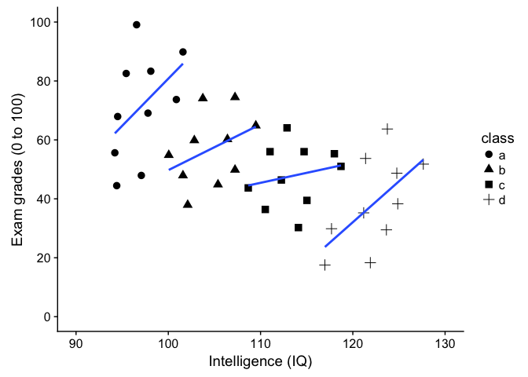
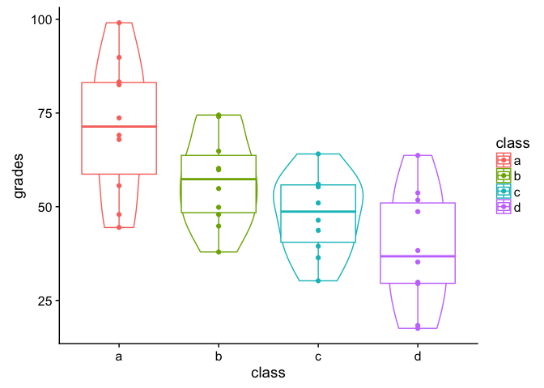
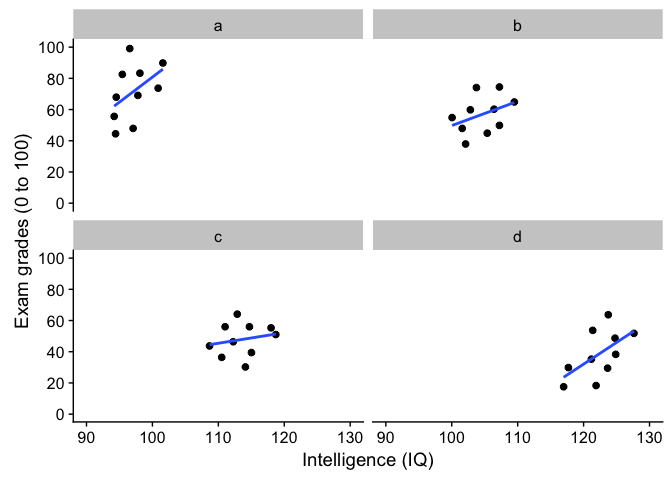
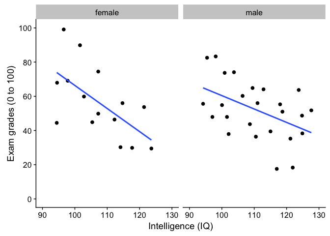
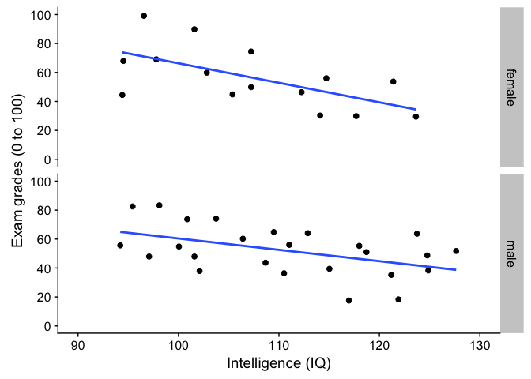

Tutorial 3: ggplot2 and model fitting
================
Hause Lin

-   [Loading frequently-used packages with `library()`](#loading-frequently-used-packages-with-library)
-   [Read data from folder/directory into R](#read-data-from-folderdirectory-into-r)
-   [`ggplot2` basics: layering](#ggplot2-basics-layering)
    -   [Layer 1: specify data object, axes, and grouping variables](#layer-1-specify-data-object-axes-and-grouping-variables)
    -   [Subsequent layers: add data points and everything else](#subsequent-layers-add-data-points-and-everything-else)
-   [Save the plot as an object](#save-the-plot-as-an-object)
-   [Save a plot to your directory](#save-a-plot-to-your-directory)
-   [Add line of best fit](#add-line-of-best-fit)
-   [Grouping](#grouping)
    -   [Use `col` to specify grouping variable](#use-col-to-specify-grouping-variable)
    -   [Use `shape` to specify grouping variable](#use-shape-to-specify-grouping-variable)
    -   [Adding an overall line of best fit while ignoring class](#adding-an-overall-line-of-best-fit-while-ignoring-class)
    -   [Adding an overall line of best fit AND separate lines for each group](#adding-an-overall-line-of-best-fit-and-separate-lines-for-each-group)
-   [Plotting histograms, boxplots, and violinplots](#plotting-histograms-boxplots-and-violinplots)
-   [Distribution of points with `geom_quasirandom()`](#distribution-of-points-with-geom_quasirandom)
-   [Summary statistics with ggplot2](#summary-statistics-with-ggplot2)
-   [Facets for grouping: `facet_wrap()` and `facet_grid()`](#facets-for-grouping-facet_wrap-and-facet_grid)
-   [Fitting linear models (general linear model framework)](#fitting-linear-models-general-linear-model-framework)
    -   [Model specification in R](#model-specification-in-r)
    -   [Reference groups and releveling (changing reference group)](#reference-groups-and-releveling-changing-reference-group)
    -   [Specify interactions](#specify-interactions)
    -   [Fitting ANOVA with `anova` and `aov`](#fitting-anova-with-anova-and-aov)
    -   [Specify contrasts resources](#specify-contrasts-resources)
    -   [Post-hoc tests resources](#post-hoc-tests-resources)
    -   [Plotting and testing simple effects when you have interactions](#plotting-and-testing-simple-effects-when-you-have-interactions)
    -   [Fit t-test with `t.test()`](#fit-t-test-with-t.test)
    -   [Multi-level (hierarchical) model with `lmer()` from the `lme4` package](#multi-level-hierarchical-model-with-lmer-from-the-lme4-package)
    -   [More multi-level model resources](#more-multi-level-model-resources)
-   [MANOVA](#manova)
    -   [MANOVA resources](#manova-resources)
    -   [Computing between- and within-subjects error bars (also between-within designs)](#computing-between--and-within-subjects-error-bars-also-between-within-designs)

Loading frequently-used packages with `library()`
-------------------------------------------------

I always load my frequently-used packages at the top of each script.

``` r
library(tidyverse); library(data.table); library(broom); library(dtplyr); library(lme4); library(lmerTest); library(ggbeeswarm); library(cowplot)
```

Read data from folder/directory into R
--------------------------------------

``` r
df1 <- tbl_dt(fread("Data/simpsonsParadox.csv")) # data.table
print(df1, n = Inf)
```

    ## Source: local data table [40 x 3]
    ## 
    ## # A tibble: 40 x 3
    ##       iq grades class
    ##    <dbl>  <dbl> <chr>
    ##  1  94.5   67.9 a    
    ##  2  95.4   82.5 a    
    ##  3  97.8   69.1 a    
    ##  4  98.1   83.3 a    
    ##  5  96.6   99.1 a    
    ##  6 102.    89.9 a    
    ##  7 101.    73.7 a    
    ##  8  97.1   47.9 a    
    ##  9  94.2   55.6 a    
    ## 10  94.4   44.5 a    
    ## 11 104.    74.1 b    
    ## 12 103.    59.9 b    
    ## 13 102.    47.9 b    
    ## 14 105.    44.9 b    
    ## 15 106.    60.2 b    
    ## 16 109.    64.9 b    
    ## 17 107.    74.5 b    
    ## 18 107.    49.9 b    
    ## 19 102.    37.9 b    
    ## 20 100.    54.9 b    
    ## 21 111.    56.0 c    
    ## 22 115.    56.0 c    
    ## 23 112.    46.4 c    
    ## 24 109.    43.7 c    
    ## 25 111.    36.4 c    
    ## 26 114.    30.2 c    
    ## 27 115.    39.5 c    
    ## 28 119.    51.0 c    
    ## 29 113.    64.1 c    
    ## 30 118     55.3 c    
    ## 31 117.    17.5 d    
    ## 32 121.    35.2 d    
    ## 33 118.    29.9 d    
    ## 34 122.    18.3 d    
    ## 35 124.    29.5 d    
    ## 36 121.    53.7 d    
    ## 37 124.    63.7 d    
    ## 38 125.    48.7 d    
    ## 39 125.    38.3 d    
    ## 40 128.    51.8 d

``` r
glimpse(df1)
```

    ## Observations: 40
    ## Variables: 3
    ## $ iq     <dbl> 94.5128, 95.4359, 97.7949, 98.1026, 96.5641, 101.5897, ...
    ## $ grades <dbl> 67.9295, 82.5449, 69.0833, 83.3141, 99.0833, 89.8526, 7...
    ## $ class  <chr> "a", "a", "a", "a", "a", "a", "a", "a", "a", "a", "b", ...

`ggplot2` basics: layering
--------------------------

`ggplot2` produces figures by adding layers one at a time. New layers are added using the + sign. The first line is the first/bottom-most layer, and second line is on top of the bottom layer, and third line is on top of the second layer, and the last line of code is the top-most layer.

See [official documentation here](http://ggplot2.tidyverse.org/).

Note: ggplot prefers long-form (tidy) data.

### Layer 1: specify data object, axes, and grouping variables

Use `ggplot` function (not `ggplot2`, which is the name of the library, not a function!). Plot iq on x-axis and grades on y-axis.

``` r
ggplot(data = df1, aes(x = iq, y = grades)) # see Plots panel (empty plot with correct axis labels)
```


### Subsequent layers: add data points and everything else

``` r
ggplot(df1, aes(iq, grades)) + # also works without specifying data, x, and y
    geom_point() # add points
```


Each time you want to know more about a `ggplot2` function, google **ggplot2 function\_name** to see official documentation and examples and learn those examples! That's usually how we plot figures. Even [Hadley Wickham](http://hadley.nz/), the creator of `tidyverse` and many many cool things in R refers to his own online documentations all the time. There are way too many things for everyone to remember, and we usually just look them up on the internet whenever we need to use them (e.g., google **ggplot2 geom point**).

You'll use `geom_point()` most frequently to add points to your plots. Check out the official documentation for `geom_point` [here](http://ggplot2.tidyverse.org/reference/geom_point.html).

``` r
ggplot(df1, aes(iq, grades)) + 
    geom_point(size = 8, col = 'green') + # change size and colour
    labs(y = "Exam grades (0 to 100)", x = "Intelligence (IQ)") # rename axes
```


``` r
ggplot(df1, aes(iq, grades)) + 
    geom_point(size = 3, col = 'blue') + # change size and colour
    labs(y = "Exam grades (0 to 100)", x = "Intelligence (IQ)") + # rename axes
    scale_y_continuous(limits = c(0, 100), breaks = c(0, 20, 40, 60, 80, 100)) + # y axis limits/range (0, 100), break points
    scale_x_continuous(limits = c(90, 130)) # x axis limits/range
```


Save the plot as an object
--------------------------

``` r
plot1 <- ggplot(df1, aes(iq, grades)) + 
    geom_point(size = 3, col = 'red') + # change size and colour
    labs(y = "Exam grades (0 to 100)", x = "Intelligence (IQ)") + # rename axes
    scale_y_continuous(limits = c(0, 100), breaks = c(0, 20, 40, 60, 80, 100)) + # y axis limits/range (0, 100), break points
    scale_x_continuous(limits = c(90, 130)) # x axis limits/range
plot1 # print plot
```


Save a plot to your directory
-----------------------------

Save to Figures directory, assuming this directory/folder already exists. You can also change the width/height of your figure and dpi (resolution/quality) of your figure (journals usually expect around 300 dpi).

``` r
ggsave(plot1, './Figures/iq_grades.png', width = 10, heigth = 10, dpi = 100)
```

Add line of best fit
--------------------

``` r
plot1 + 
    geom_smooth() # fit line to data (defaults loess smoothing)
```

    ## `geom_smooth()` using method = 'loess'


Same as above

``` r
ggplot(df1, aes(iq, grades)) + 
    geom_point(size = 3, col = 'red') + # change size and colour
    labs(y = "Exam grades (0 to 100)", x = "Intelligence (IQ)") + # rename axes
    scale_y_continuous(limits = c(0, 100), breaks = c(0, 20, 40, 60, 80, 100)) + # y axis limits/range (0, 100), break points
    scale_x_continuous(limits = c(90, 130)) + # x axis limits/range 
    geom_smooth()
```

    ## `geom_smooth()` using method = 'loess'


Note that the smooth (i.e., the line of best fit) is on top of the dots, because of layering. Let's add the line first, then use `geom_point()`. What do you think will happen?

``` r
ggplot(df1, aes(iq, grades)) + 
    geom_smooth(size = 2) +
    geom_point(size = 3, col = 'red') + # change size and colour
    labs(y = "Exam grades (0 to 100)", x = "Intelligence (IQ)", title = 'Changed layers') + # rename axes
    scale_y_continuous(limits = c(0, 100), breaks = c(0, 20, 40, 60, 80, 100)) + # y axis limits/range (0, 100), break points
    scale_x_continuous(limits = c(90, 130))# x axis limits/range 
```

    ## `geom_smooth()` using method = 'loess'


Note that now the points are above the line. Also, I've added a title via the `labs()` line.

``` r
ggplot(df1, aes(iq, grades)) + 
    geom_point(size = 3, col = 'red') + # change size and colour
    labs(y = "Exam grades (0 to 100)", x = "Intelligence (IQ)") + # rename axes
    scale_y_continuous(limits = c(0, 100), breaks = c(0, 20, 40, 60, 80, 100)) + # y axis limits/range (0, 100), break points
    scale_x_continuous(limits = c(90, 130)) + # x axis limits/range 
    geom_smooth(method = 'lm', se = F, col = 'black') # fit linear regression line, remove standard error, black line
```


Why is IQ negatively correlated with grades?

Grouping
--------

### Use `col` to specify grouping variable

Note what's new in the first line/layer to add grouping.

``` r
ggplot(df1, aes(iq, grades, col = class)) + 
    geom_point(size = 3) + # change size and colour
    labs(y = "Exam grades (0 to 100)", x = "Intelligence (IQ)") + # rename axes
    scale_y_continuous(limits = c(0, 100), breaks = c(0, 20, 40, 60, 80, 100)) + # y axis limits/range (0, 100), break points
    scale_x_continuous(limits = c(90, 130)) + # x axis limits/range 
    geom_smooth(method = 'lm', se = F) # fit linear regression line 
```


`ggplot(df1, aes(iq, grades, col = class))` specifies the data to plot `df1`, x-axis `iq`, y-axis `grades`, and to give different colours to different groups `col = class`, where `class` refers to the grouping variable in the dataset.

What is the relationship between IQ and grades within each class now? What happened?!?

### Use `shape` to specify grouping variable

``` r
ggplot(df1, aes(iq, grades, shape = class)) + 
    geom_point(size = 3) + # change size and colour
    labs(y = "Exam grades (0 to 100)", x = "Intelligence (IQ)") + # rename axes
    scale_y_continuous(limits = c(0, 100), breaks = c(0, 20, 40, 60, 80, 100)) + # y axis limits/range (0, 100), break points
    scale_x_continuous(limits = c(90, 130)) + # x axis limits/range 
    geom_smooth(method = 'lm', se = F) # fit linear regression line 
```



### Adding an overall line of best fit while ignoring class

``` r
ggplot(df1, aes(iq, grades, col = class)) + 
    geom_point(size = 3) + # change size and colour
    labs(y = "Exam grades (0 to 100)", x = "Intelligence (IQ)") + # rename axes
    scale_y_continuous(limits = c(0, 100), breaks = c(0, 20, 40, 60, 80, 100)) + # y axis limits/range (0, 100), break points
    scale_x_continuous(limits = c(90, 130)) + # x axis limits/range 
    geom_smooth(method = 'lm', se = F, aes(group = 1)) # fit linear regression line 
```


### Adding an overall line of best fit AND separate lines for each group

``` r
plot2 <- ggplot(df1, aes(iq, grades, col = class)) + 
    geom_point(size = 3) + # change size and colour
    labs(y = "Exam grades (0 to 100)", x = "Intelligence (IQ)") + # rename axes
    scale_y_continuous(limits = c(0, 100), breaks = c(0, 20, 40, 60, 80, 100)) + # y axis limits/range (0, 100), break points
    scale_x_continuous(limits = c(90, 130)) + # x axis limits/range 
    geom_smooth(method = 'lm', se = F) + # fit linear regression line 
    geom_smooth(method = 'lm', se = F, aes(group = 1))
plot2
```


[Simpson's paradox](https://en.wikipedia.org/wiki/Simpson%27s_paradox): Negative overall relationship, but positive relationship within each class.

Plotting histograms, boxplots, and violinplots
----------------------------------------------

Histogram

``` r
ggplot(df1, aes(iq)) +
    geom_histogram()
```

    ## `stat_bin()` using `bins = 30`. Pick better value with `binwidth`.


Specifying binwidth

``` r
ggplot(df1, aes(iq)) +
    geom_histogram(binwidth = 5)
```


Density plot

``` r
ggplot(df1, aes(iq)) +
    geom_density()
```


Boxplot for each class

``` r
ggplot(df1, aes(class, grades)) +
    geom_boxplot()
```


Violinplot for each class

``` r
ggplot(df1, aes(class, grades)) +
    geom_violin()
```


Layering and colouring plots

``` r
ggplot(df1, aes(class, grades, col = class)) +
    geom_violin() +
    geom_boxplot() +
    geom_point()
```



Distribution of points with `geom_quasirandom()`
------------------------------------------------

An alternative that I prefer more than both boxplots and violin plots: `geom_quasirandom()` from the `ggbeeswarm` package. See [here](https://github.com/eclarke/ggbeeswarm) for more information.

`geom_quasirandom()` extends `geom_point()` by showing the distribution information at the same time. It basically combines all the good things in `geom_boxplot`, `geom_violin`, `geom_point` and `geom_histogram`.

``` r
ggplot(df1, aes(class, grades, col = class)) +
    geom_quasirandom()
```


``` r
df1$overallClass <- "one_class" # create variable that assigns everyone to one class
# df1[, overallClass := "one_class"] # data.table syntax for the line above
```

`geom_quasirandom` shows distribution information!

``` r
ggplot(df1, aes(overallClass, grades)) + # y: grades
    geom_quasirandom()
```


``` r
ggplot(df1, aes(overallClass, iq)) + # y: iq
    geom_quasirandom() +
    labs(x = "") # remove x-axis label (compare with above)
```


Summary statistics with ggplot2
-------------------------------

`stat_summary()` can quickly help you compute summary statistics and plot them. If you get a warning message about Hmisc package, just install that package using `install.packages('Hmisc')` and then `library(Hmisc)`

``` r
ggplot(df1, aes(class, iq)) + # y: iq
    geom_quasirandom(alpha = 0.3) +
    stat_summary(fun.y = mean, geom = 'point', size = 3) + # apply mean function to y axis (fun.y = mean)
    stat_summary(fun.data = mean_cl_normal, geom = 'errorbar', width = 0, size = 1) # apply mean_cl_normal function to data
```


Facets for grouping: `facet_wrap()` and `facet_grid()`
------------------------------------------------------

Randomly assign gender to each row (see previous tutorial for detailed explanation of the code below)

``` r
df1$gender <- sample(x = c("female", "male"), size = 40, replace = T)
```

Code from before

``` r
ggplot(df1, aes(iq, grades)) + 
    geom_point(size = 3) + # change size and colour
    labs(y = "Exam grades (0 to 100)", x = "Intelligence (IQ)") + # rename axes
    scale_y_continuous(limits = c(0, 100), breaks = c(0, 20, 40, 60, 80, 100)) + # y axis limits/range (0, 100), break points
    scale_x_continuous(limits = c(90, 130)) + # x axis limits/range 
    geom_smooth(method = 'lm', se = F)
```


Using facets instead of `col = class`. See the last line of code `facet_wrap()`.

`facet_wrap()`: one facet per class

``` r
ggplot(df1, aes(iq, grades)) + 
    geom_point(size = 2) + # change size and colour
    labs(y = "Exam grades (0 to 100)", x = "Intelligence (IQ)") + # rename axes
    scale_y_continuous(limits = c(0, 100), breaks = c(0, 20, 40, 60, 80, 100)) + # y axis limits/range (0, 100), break points
    scale_x_continuous(limits = c(90, 130)) + # x axis limits/range 
    geom_smooth(method = 'lm', se = F) +
    facet_wrap(~class) # one facet per class
```



`facet_wrap()`: one facet per class and gender

``` r
ggplot(df1, aes(iq, grades)) + 
    geom_point(size = 2) + # change size and colour
    labs(y = "Exam grades (0 to 100)", x = "Intelligence (IQ)") + # rename axes
    scale_y_continuous(limits = c(0, 100), breaks = c(0, 20, 40, 60, 80, 100)) + # y axis limits/range (0, 100), break points
    scale_x_continuous(limits = c(90, 130)) + # x axis limits/range 
    geom_smooth(method = 'lm', se = F) +
    facet_wrap(class~gender) # one facet per class and gender
```


`facet_grid()`: one facet per gender

``` r
ggplot(df1, aes(iq, grades)) + 
    geom_point(size = 2) + # change size and colour
    labs(y = "Exam grades (0 to 100)", x = "Intelligence (IQ)") + # rename axes
    scale_y_continuous(limits = c(0, 100), breaks = c(0, 20, 40, 60, 80, 100)) + # y axis limits/range (0, 100), break points
    scale_x_continuous(limits = c(90, 130)) + # x axis limits/range 
    geom_smooth(method = 'lm', se = F) +
    facet_grid(.~gender) # one facet per gender
```



`facet_grid()`: one facet per gender

``` r
ggplot(df1, aes(iq, grades)) + 
    geom_point(size = 2) + # change size and colour
    labs(y = "Exam grades (0 to 100)", x = "Intelligence (IQ)") + # rename axes
    scale_y_continuous(limits = c(0, 100), breaks = c(0, 20, 40, 60, 80, 100)) + # y axis limits/range (0, 100), break points
    scale_x_continuous(limits = c(90, 130)) + # x axis limits/range 
    geom_smooth(method = 'lm', se = F) +
    facet_grid(gender~.) # one facet per gender
```



`facet_grid()`: one facet per class and gender

``` r
ggplot(df1, aes(iq, grades)) + 
    geom_point(size = 2) + # change size and colour
    labs(y = "Exam grades (0 to 100)", x = "Intelligence (IQ)") + # rename axes
    scale_y_continuous(limits = c(0, 100), breaks = c(0, 20, 40, 60, 80, 100)) + # y axis limits/range (0, 100), break points
    scale_x_continuous(limits = c(90, 130)) + # x axis limits/range 
    geom_smooth(method = 'lm', se = F) +
    facet_grid(gender~class) # one facet per gender
```


`facet_grid()`: one facet per class and gender

Add variable name

``` r
ggplot(df1, aes(iq, grades)) + 
    geom_point(size = 2) + # change size and colour
    labs(y = "Exam grades (0 to 100)", x = "Intelligence (IQ)") + # rename axes
    scale_y_continuous(limits = c(0, 100), breaks = c(0, 20, 40, 60, 80, 100)) + # y axis limits/range (0, 100), break points
    scale_x_continuous(limits = c(90, 130)) + # x axis limits/range 
    geom_smooth(method = 'lm', se = F) +
    facet_grid(gender~class, labeller = label_both) # one facet per gender
```


Fitting linear models (general linear model framework)
------------------------------------------------------

Fit a model to this this relationship

``` r
ggplot(df1, aes(iq, grades)) + 
    geom_point() +
    labs(y = "Exam grades (0 to 100)", x = "Intelligence (IQ)") + # rename axes
    scale_y_continuous(limits = c(0, 100), breaks = c(0, 20, 40, 60, 80, 100)) + # y axis limits/range (0, 100), break points
    scale_x_continuous(limits = c(90, 130)) + # x axis limits/range 
    geom_smooth(method = 'lm', se = F, col = 'black') # fit linear regression line, remove standard error, black line
```


### Model specification in R

-   most model fitting functions prefer long-form data (aka tidy data)
-   ~ is the symbol for "prediction" (read: "predicted by")
-   y ~ x: y predicted by x (y is outcome/dependent variable, x is predictor/independent variable)
-   `lm(y ~ x, data)` is the most commonly-used and flexible function (linear model)
-   covariates and predictors are specified in the same way (unlike SPSS)

Test the relationship in the plot above

``` r
modelLinear <- lm(formula = iq ~ grades, data = df1)
summary(modelLinear) # get model results and p values
```

    ## 
    ## Call:
    ## lm(formula = iq ~ grades, data = df1)
    ## 
    ## Residuals:
    ##      Min       1Q   Median       3Q      Max 
    ## -17.7002  -4.9650   0.3856   6.0826  17.6721 
    ## 
    ## Coefficients:
    ##              Estimate Std. Error t value Pr(>|t|)    
    ## (Intercept) 125.14212    4.23923  29.520  < 2e-16 ***
    ## grades       -0.29306    0.07479  -3.919 0.000359 ***
    ## ---
    ## Signif. codes:  0 '***' 0.001 '**' 0.01 '*' 0.05 '.' 0.1 ' ' 1
    ## 
    ## Residual standard error: 8.599 on 38 degrees of freedom
    ## Multiple R-squared:  0.2878, Adjusted R-squared:  0.2691 
    ## F-statistic: 15.36 on 1 and 38 DF,  p-value: 0.0003592

Or you can use functions written by me to generate American Psychological Association formatted output. To use those functions, run `source("https://raw.githubusercontent.com/hauselin/Rcode/master/summaryh.R")` just once per script. After you've run this line of code, you'll have access to the `summaryh()` function. It'll also tell you what effect sizes are considered small, medium or large when you first run it. For more information, see [here](https://github.com/hauselin/Rcode).

``` r
source("https://raw.githubusercontent.com/hauselin/Rcode/master/summaryh.R") # I usually run this line of code once at the top of my scripts, when I load my libraries
```

    ## 
    ## Attaching package: 'sjstats'

    ## The following object is masked from 'package:broom':
    ## 
    ##     bootstrap

    ## r: .10 (small), .30 (medium), .50 (large) (Cohen, 1992)
    ## d: 0.20 (small), 0.50 (medium), .80 (large) (Cohen, 1992)
    ## R2: .02 (small), .13 (medium), .26 (large) (Cohen, 1992)

``` r
summaryh(modelLinear) # my summary function (compare with summary(modelLinear))
```

    ##           term                                                  results
    ## 1: (Intercept) b = 125.14, SE = 4.24, t(38) = 29.52, p < .001, r = 0.98
    ## 2:      grades  b = −0.29, SE = 0.07, t(38) = −3.92, p < .001, r = 0.54

Note the significant negative relationship between iq and grades.

Since we know that class "moderates" the effect between iq and grades, let's "control" for class by adding `class` into the model specification.

``` r
ggplot(df1, aes(iq, grades, col = class)) + 
    geom_point(size = 3) + # change size and colour
    labs(y = "Exam grades (0 to 100)", x = "Intelligence (IQ)") + # rename axes
    scale_y_continuous(limits = c(0, 100), breaks = c(0, 20, 40, 60, 80, 100)) + # y axis limits/range (0, 100), break points
    scale_x_continuous(limits = c(90, 130)) + # x axis limits/range 
    geom_smooth(method = 'lm', se = F) + # fit linear regression line 
    geom_smooth(method = 'lm', se = F, aes(group = 1))
```


Test the relationship above by "controlling" for class

``` r
modelLinear_class <- lm(iq ~ grades + class, data = df1)
summary(modelLinear_class) # get model results and p values
```

    ## 
    ## Call:
    ## lm(formula = iq ~ grades + class, data = df1)
    ## 
    ## Residuals:
    ##     Min      1Q  Median      3Q     Max 
    ## -4.5552 -2.2276 -0.1403  2.0785  4.8499 
    ## 
    ## Coefficients:
    ##             Estimate Std. Error t value Pr(>|t|)    
    ## (Intercept) 90.74793    2.48240  36.557  < 2e-16 ***
    ## grades       0.08841    0.03251   2.720   0.0101 *  
    ## classb       8.82731    1.33606   6.607 1.24e-07 ***
    ## classc      18.61047    1.46538  12.700 1.15e-14 ***
    ## classd      28.21349    1.64119  17.191  < 2e-16 ***
    ## ---
    ## Signif. codes:  0 '***' 0.001 '**' 0.01 '*' 0.05 '.' 0.1 ' ' 1
    ## 
    ## Residual standard error: 2.796 on 35 degrees of freedom
    ## Multiple R-squared:  0.9306, Adjusted R-squared:  0.9227 
    ## F-statistic: 117.4 on 4 and 35 DF,  p-value: < 2.2e-16

``` r
summaryh(modelLinear_class)
```

    ##           term                                                 results
    ## 1: (Intercept) b = 90.75, SE = 2.48, t(35) = 36.56, p < .001, r = 0.99
    ## 2:      grades   b = 0.09, SE = 0.03, t(35) = 2.72, p = .010, r = 0.42
    ## 3:      classb   b = 8.83, SE = 1.34, t(35) = 6.61, p < .001, r = 0.74
    ## 4:      classc b = 18.61, SE = 1.47, t(35) = 12.70, p < .001, r = 0.91
    ## 5:      classd b = 28.21, SE = 1.64, t(35) = 17.19, p < .001, r = 0.95

Note the significantly positive relationship between iq and grades now.

### Reference groups and releveling (changing reference group)

R automatically recodes categorical/factor variables into 0s and 1s (i.e., dummy-coding). Alphabets/letters/characters/numbers that come first (a comes before b) will be coded 0, and those that follow will be coded 1.

In our case, class "a" has been coded 0 (reference group) and all other classes ("b", "c", "d") are contrasted against it, hence you have 3 other effects ("classb", "classc", "classd") that reflect the difference between class "a" and each of the other classes.

To change reference group, use `as.factor()` and `relevel()`

To change reference groups, you first have to convert your grouping variable to `factor` class, which explicitly tells R your variable is a categorical/factor variable. Then use `relevel()` to change the reference group.

``` r
df1$class <- relevel(as.factor(df1$class), ref = "d")
levels(df1$class) # check reference levels (d is now the reference/first group)
```

    ## [1] "d" "a" "b" "c"

``` r
summaryh(lm(iq ~ grades + class, data = df1)) # quickly fit model and look at outcome (no assignment to object)
```

    ##           term                                                   results
    ## 1: (Intercept)  b = 118.96, SE = 1.54, t(35) = 77.41, p < .001, r = 1.00
    ## 2:      grades     b = 0.09, SE = 0.03, t(35) = 2.72, p = .010, r = 0.42
    ## 3:      classa b = −28.21, SE = 1.64, t(35) = −17.19, p < .001, r = 0.95
    ## 4:      classb b = −19.39, SE = 1.38, t(35) = −14.01, p < .001, r = 0.92
    ## 5:      classc   b = −9.60, SE = 1.29, t(35) = −7.47, p < .001, r = 0.78

### Specify interactions

-   y predicted by x1, x2, and their interactions: y ~ x1 + x2 + x1:x2
-   concise expression: y ~ x1 \* x2 (includes all main effects and interaction)

``` r
modelLinear_interact <- lm(iq ~ grades + class + grades:class, data = df1)
summary(modelLinear_interact)
```

    ## 
    ## Call:
    ## lm(formula = iq ~ grades + class + grades:class, data = df1)
    ## 
    ## Residuals:
    ##     Min      1Q  Median      3Q     Max 
    ## -4.6623 -2.3238 -0.2229  1.9845  4.9309 
    ## 
    ## Coefficients:
    ##                Estimate Std. Error t value Pr(>|t|)    
    ## (Intercept)   117.56287    2.57958  45.574  < 2e-16 ***
    ## grades          0.12459    0.06237   1.998  0.05433 .  
    ## classa        -25.29661    4.70506  -5.376 6.64e-06 ***
    ## classb        -18.39902    5.29099  -3.477  0.00148 ** 
    ## classc         -6.97275    5.18349  -1.345  0.18802    
    ## grades:classa  -0.05745    0.08226  -0.698  0.48993    
    ## grades:classb  -0.02894    0.10111  -0.286  0.77653    
    ## grades:classc  -0.06191    0.11112  -0.557  0.58131    
    ## ---
    ## Signif. codes:  0 '***' 0.001 '**' 0.01 '*' 0.05 '.' 0.1 ' ' 1
    ## 
    ## Residual standard error: 2.898 on 32 degrees of freedom
    ## Multiple R-squared:  0.9319, Adjusted R-squared:  0.917 
    ## F-statistic: 62.52 on 7 and 32 DF,  p-value: < 2.2e-16

``` r
summaryh(modelLinear_interact)
```

    ##             term                                                  results
    ## 1:   (Intercept) b = 117.56, SE = 2.58, t(32) = 45.57, p < .001, r = 0.99
    ## 2:        grades    b = 0.12, SE = 0.06, t(32) = 2.00, p = .054, r = 0.33
    ## 3:        classa b = −25.30, SE = 4.71, t(32) = −5.38, p < .001, r = 0.69
    ## 4:        classb b = −18.40, SE = 5.29, t(32) = −3.48, p = .002, r = 0.52
    ## 5:        classc  b = −6.97, SE = 5.18, t(32) = −1.35, p = .188, r = 0.23
    ## 6: grades:classa  b = −0.06, SE = 0.08, t(32) = −0.70, p = .490, r = 0.12
    ## 7: grades:classb  b = −0.03, SE = 0.10, t(32) = −0.29, p = .776, r = 0.05
    ## 8: grades:classc  b = −0.06, SE = 0.11, t(32) = −0.56, p = .581, r = 0.10

#### Intercept-only model

R uses `1` to refer to the intercept

``` r
modelLinear_intercept <- lm(iq ~ 1, data = df1) # mean iq
summaryh(modelLinear_intercept)
```

    ##           term                                                  results
    ## 1: (Intercept) b = 109.41, SE = 1.59, t(39) = 68.80, p < .001, r = 1.00

``` r
df1[, mean(iq)] # matches the intercept term
```

    ## [1] 109.4077

``` r
mean(df1$iq) # same as above
```

    ## [1] 109.4077

Remove intercept from model (if you ever need to do so...) by specifying `-1`

``` r
modelLinear_noIntercept <- lm(iq ~ grades - 1, data = df1) # substract intercept
summary(modelLinear_noIntercept)
```

    ## 
    ## Call:
    ## lm(formula = iq ~ grades - 1, data = df1)
    ## 
    ## Residuals:
    ##     Min      1Q  Median      3Q     Max 
    ## -81.586  -6.131  14.935  35.214  88.969 
    ## 
    ## Coefficients:
    ##        Estimate Std. Error t value Pr(>|t|)    
    ## grades   1.7980     0.1158   15.52   <2e-16 ***
    ## ---
    ## Signif. codes:  0 '***' 0.001 '**' 0.01 '*' 0.05 '.' 0.1 ' ' 1
    ## 
    ## Residual standard error: 41.52 on 39 degrees of freedom
    ## Multiple R-squared:  0.8607, Adjusted R-squared:  0.8571 
    ## F-statistic:   241 on 1 and 39 DF,  p-value: < 2.2e-16

``` r
summaryh(modelLinear_noIntercept)
```

    ##      term                                                results
    ## 1: grades b = 1.80, SE = 0.12, t(39) = 15.52, p < .001, r = 0.93

### Fitting ANOVA with `anova` and `aov`

By default, R uses Type I sum of squares.

Let's test this model with ANOVA.

``` r
ggplot(df1, aes(class, iq)) + # y: iq
    geom_quasirandom(alpha = 0.3) +
    stat_summary(fun.y = mean, geom = 'point', size = 3) + # apply mean function to y axis (fun.y = mean)
    stat_summary(fun.data = mean_cl_normal, geom = 'errorbar', width = 0, size = 1) # apply mean_cl_normal function to data
```


Note that class d comes first because we releveled it earlier on (we changed the reference group to d).

Fit ANOVA with `aov()`

``` r
anova_class <- aov(grades ~ class, data = df1)
summary(anova_class)
```

    ##             Df Sum Sq Mean Sq F value   Pr(>F)    
    ## class        3   5821  1940.4    9.44 9.73e-05 ***
    ## Residuals   36   7400   205.6                     
    ## ---
    ## Signif. codes:  0 '***' 0.001 '**' 0.01 '*' 0.05 '.' 0.1 ' ' 1

``` r
summaryh(anova_class)
```

    ##     term                             results
    ## 1: class F(3, 36) = 9.44, p < .001, r = 0.66

Class \* gender interaction (and main effects)

``` r
ggplot(df1, aes(class, iq, col = gender)) + # y: iq
    geom_quasirandom(alpha = 0.3, dodge = 0.5) +
    stat_summary(fun.y = mean, geom = 'point', size = 3, position = position_dodge(0.5)) + 
    stat_summary(fun.data = mean_cl_normal, geom = 'errorbar', width = 0, size = 1, position = position_dodge(0.5))
```


``` r
anova_classGender <- aov(grades ~ class * gender, data = df1)
summary(anova_classGender)
```

    ##              Df Sum Sq Mean Sq F value   Pr(>F)    
    ## class         3   5821  1940.4   8.549 0.000259 ***
    ## gender        1      0     0.2   0.001 0.978892    
    ## class:gender  3    136    45.5   0.200 0.895306    
    ## Residuals    32   7263   227.0                     
    ## ---
    ## Signif. codes:  0 '***' 0.001 '**' 0.01 '*' 0.05 '.' 0.1 ' ' 1

``` r
summaryh(anova_classGender)
```

    ##            term                             results
    ## 1:        class F(3, 32) = 8.55, p < .001, r = 0.67
    ## 2:       gender  F(1, 32) = 0.0007, p = .979, r = 0
    ## 3: class:gender F(3, 32) = 0.20, p = .895, r = 0.14

### Specify contrasts resources

-   [UCLA site](https://stats.idre.ucla.edu/r/library/r-library-contrast-coding-systems-for-categorical-variables/).
-   [another tutorial](https://rstudio-pubs-static.s3.amazonaws.com/65059_586f394d8eb84f84b1baaf56ffb6b47f.html)

### Post-hoc tests resources

-   [UCLA site](https://stats.idre.ucla.edu/r/faq/how-can-i-do-post-hoc-pairwise-comparisons-in-r/)

### Plotting and testing simple effects when you have interactions

-   `sjPlot` package: see [here](http://www.strengejacke.de/sjPlot/)
-   [more tutorial and packages](https://cran.r-project.org/web/packages/jtools/vignettes/interactions.html)

### Fit t-test with `t.test()`

Fit models for this figure

``` r
ggplot(df1, aes(class, iq, col = gender)) + # y: iq
    geom_quasirandom(alpha = 0.3, dodge = 0.5) +
    stat_summary(fun.y = mean, geom = 'point', size = 3, position = position_dodge(0.5)) + 
    stat_summary(fun.data = mean_cl_normal, geom = 'errorbar', width = 0, size = 1, position = position_dodge(0.5))
```


Gender effect

``` r
ttest_gender <- t.test(iq ~ gender, data = df1)
ttest_gender
```

    ## 
    ##  Welch Two Sample t-test
    ## 
    ## data:  iq by gender
    ## t = -0.98447, df = 31.367, p-value = 0.3324
    ## alternative hypothesis: true difference in means is not equal to 0
    ## 95 percent confidence interval:
    ##  -9.754888  3.401384
    ## sample estimates:
    ## mean in group female   mean in group male 
    ##             107.4222             110.5990

``` r
summaryh(ttest_gender)
```

    ##                              results
    ## 1: t(31) = −0.98, p = .332, r = 0.17

class a vs. class d

``` r
ttest_classAD <- t.test(iq ~ class, data = df1[class %in% c("a", "d")]) # data.table subsetting
ttest_classAD
```

    ## 
    ##  Welch Two Sample t-test
    ## 
    ## data:  iq by class
    ## t = 19.105, df = 17.128, p-value = 5.488e-13
    ## alternative hypothesis: true difference in means is not equal to 0
    ## 95 percent confidence interval:
    ##  22.52811 28.11803
    ## sample estimates:
    ## mean in group d mean in group a 
    ##       122.37948        97.05641

``` r
summaryh(ttest_classAD, showEffectSizesTable = T) # show all other effect sizes
```

    ## $results
    ##                              results
    ## 1: t(17) = 19.10, p < .001, r = 0.98
    ## 
    ## $effectSizes
    ##           term    d    r   R2    f oddsratio logoddsratio auc
    ## 1: iq by class 9.16 0.98 0.95 4.58  16528462        16.62   1

### Multi-level (hierarchical) model with `lmer()` from the `lme4` package

Rather than "control" for class when fitting models to test the relationship between iq and grades below, we can use multi-level models to specify nesting within the data. See [here](http://mfviz.com/hierarchical-models/) for beautiful visual introduction to multi-level models.

Another function is `nlme()` from the `lme` package. We use both `nlme()` and `lmer()`, depending on our needs.

``` r
ggplot(df1, aes(iq, grades, col = class)) + 
    geom_point(size = 3) + # change size and colour
    labs(y = "Exam grades (0 to 100)", x = "Intelligence (IQ)") + # rename axes
    scale_y_continuous(limits = c(0, 100), breaks = c(0, 20, 40, 60, 80, 100)) + # y axis limits/range (0, 100), break points
    scale_x_continuous(limits = c(90, 130)) + # x axis limits/range 
    geom_smooth(method = 'lm', se = F) + # fit linear regression line 
    geom_smooth(method = 'lm', se = F, aes(group = 1))
```


Model specification with `lmer()`

-   y ~ x (same as other models)
-   (1 | group): varying intercept (one intercept per group)
-   (1 + x | group): varying intercept and slope (one intercept and slope per group)

#### Random intercept model (fixed slope)

``` r
m_intercept <- lmer(grades ~ iq + (1 | class), data = df1)
summary(m_intercept)
```

    ## Linear mixed model fit by REML. t-tests use Satterthwaite's method [
    ## lmerModLmerTest]
    ## Formula: grades ~ iq + (1 | class)
    ##    Data: df1
    ## 
    ## REML criterion at convergence: 326
    ## 
    ## Scaled residuals: 
    ##      Min       1Q   Median       3Q      Max 
    ## -1.71341 -0.79563  0.03887  0.56708  2.18978 
    ## 
    ## Random effects:
    ##  Groups   Name        Variance Std.Dev.
    ##  class    (Intercept) 895.5    29.92   
    ##  Residual             176.7    13.29   
    ## Number of obs: 40, groups:  class, 4
    ## 
    ## Fixed effects:
    ##              Estimate Std. Error        df t value Pr(>|t|)  
    ## (Intercept) -100.7338    74.1311   27.4649  -1.359   0.1852  
    ## iq             1.4115     0.6633   31.3429   2.128   0.0413 *
    ## ---
    ## Signif. codes:  0 '***' 0.001 '**' 0.01 '*' 0.05 '.' 0.1 ' ' 1
    ## 
    ## Correlation of Fixed Effects:
    ##    (Intr)
    ## iq -0.979

``` r
summaryh(m_intercept)
```

    ##           term                                                    results
    ## 1: (Intercept) b = −100.73, SE = 74.13, t(27) = −1.36, p = .185, r = 0.25
    ## 2:          iq      b = 1.41, SE = 0.66, t(31) = 2.13, p = .041, r = 0.36

``` r
coef(m_intercept) # check coefficients for each class
```

    ## $class
    ##   (Intercept)       iq
    ## d  -133.42844 1.411459
    ## a   -66.31753 1.411459
    ## b   -90.94790 1.411459
    ## c  -112.24144 1.411459
    ## 
    ## attr(,"class")
    ## [1] "coef.mer"

By accounting for nesting within class, the relationship between iq and grades is positive!

#### Random intercept and slope model

``` r
m_interceptSlope <- lmer(grades ~ iq + (1 + iq | class), data = df1)
summary(m_interceptSlope)
```

    ## Linear mixed model fit by REML. t-tests use Satterthwaite's method [
    ## lmerModLmerTest]
    ## Formula: grades ~ iq + (1 + iq | class)
    ##    Data: df1
    ## 
    ## REML criterion at convergence: 326
    ## 
    ## Scaled residuals: 
    ##      Min       1Q   Median       3Q      Max 
    ## -1.71461 -0.79955  0.04047  0.56706  2.19534 
    ## 
    ## Random effects:
    ##  Groups   Name        Variance  Std.Dev. Corr
    ##  class    (Intercept) 4.180e+02 20.44479     
    ##           iq          7.853e-03  0.08862 1.00
    ##  Residual             1.765e+02 13.28371     
    ## Number of obs: 40, groups:  class, 4
    ## 
    ## Fixed effects:
    ##              Estimate Std. Error        df t value Pr(>|t|)  
    ## (Intercept) -101.7384    73.4587   20.6522  -1.385   0.1808  
    ## iq             1.4270     0.6677   19.6229   2.137   0.0454 *
    ## ---
    ## Signif. codes:  0 '***' 0.001 '**' 0.01 '*' 0.05 '.' 0.1 ' ' 1
    ## 
    ## Correlation of Fixed Effects:
    ##    (Intr)
    ## iq -0.978

``` r
summaryh(m_interceptSlope)
```

    ##           term                                                    results
    ## 1: (Intercept) b = −101.74, SE = 73.46, t(21) = −1.38, p = .181, r = 0.29
    ## 2:          iq      b = 1.43, SE = 0.67, t(20) = 2.14, p = .045, r = 0.43

``` r
coef(m_interceptSlope) # check coefficients for each class
```

    ## $class
    ##   (Intercept)       iq
    ## d  -123.68895 1.331876
    ## a   -77.86894 1.530486
    ## b   -95.42589 1.454384
    ## c  -109.96969 1.391343
    ## 
    ## attr(,"class")
    ## [1] "coef.mer"

#### Random slope model (fixed intercept)

``` r
m_slope <- lmer(grades ~ iq + (0 + iq | class), data = df1)
summary(m_slope)
```

    ## Linear mixed model fit by REML. t-tests use Satterthwaite's method [
    ## lmerModLmerTest]
    ## Formula: grades ~ iq + (0 + iq | class)
    ##    Data: df1
    ## 
    ## REML criterion at convergence: 326
    ## 
    ## Scaled residuals: 
    ##      Min       1Q   Median       3Q      Max 
    ## -1.71468 -0.75940  0.02992  0.57631  2.20673 
    ## 
    ## Random effects:
    ##  Groups   Name Variance  Std.Dev.
    ##  class    iq     0.07825  0.2797 
    ##  Residual      176.30986 13.2782 
    ## Number of obs: 40, groups:  class, 4
    ## 
    ## Fixed effects:
    ##              Estimate Std. Error        df t value Pr(>|t|)  
    ## (Intercept) -102.5776    72.8997   31.8195  -1.407   0.1691  
    ## iq             1.4484     0.6854   27.8155   2.113   0.0437 *
    ## ---
    ## Signif. codes:  0 '***' 0.001 '**' 0.01 '*' 0.05 '.' 0.1 ' ' 1
    ## 
    ## Correlation of Fixed Effects:
    ##    (Intr)
    ## iq -0.979

``` r
summaryh(m_slope)
```

    ##           term                                                    results
    ## 1: (Intercept) b = −102.58, SE = 72.90, t(32) = −1.41, p = .169, r = 0.24
    ## 2:          iq      b = 1.45, SE = 0.69, t(28) = 2.11, p = .044, r = 0.37

``` r
coef(m_slope) # check coefficients for each class
```

    ## $class
    ##   (Intercept)       iq
    ## d   -102.5776 1.159490
    ## a   -102.5776 1.784924
    ## b   -102.5776 1.522970
    ## c   -102.5776 1.326058
    ## 
    ## attr(,"class")
    ## [1] "coef.mer"

### More multi-level model resources

-   [what lmer (and lme) can do](https://github.com/clayford/LMEMInR/blob/master/lme4_cheat_sheet.Rmd)
-   [lmer cheatsheet on stackexchange](https://stats.stackexchange.com/questions/13166/rs-lmer-cheat-sheet)
-   [two/three level models](http://rpsychologist.com/r-guide-longitudinal-lme-lmer)

MANOVA
------

Let's use a different dataset. `iris`, a famous dataset that comes with R. Type `?iris` in your console for more information about this dataset.

``` r
irisDT <- tbl_dt(iris) # convert to data.table and tibble
irisDT # wide form data
```

    ## Source: local data table [150 x 5]
    ## 
    ## # A tibble: 150 x 5
    ##    Sepal.Length Sepal.Width Petal.Length Petal.Width Species
    ##           <dbl>       <dbl>        <dbl>       <dbl> <fct>  
    ##  1          5.1         3.5          1.4         0.2 setosa 
    ##  2          4.9         3            1.4         0.2 setosa 
    ##  3          4.7         3.2          1.3         0.2 setosa 
    ##  4          4.6         3.1          1.5         0.2 setosa 
    ##  5          5           3.6          1.4         0.2 setosa 
    ##  6          5.4         3.9          1.7         0.4 setosa 
    ##  7          4.6         3.4          1.4         0.3 setosa 
    ##  8          5           3.4          1.5         0.2 setosa 
    ##  9          4.4         2.9          1.4         0.2 setosa 
    ## 10          4.9         3.1          1.5         0.1 setosa 
    ## # ... with 140 more rows

The dataset is in wide form. To visualize easily with `ggplot`, we need to convert it to long form (more on converting between forms) in future tutorials.

``` r
gather(irisDT, meaureLength, length, -Species) %>% # convert from wide to long form
    tbl_dt() %>% # convert to data.table and tibble
    ggplot(aes(Species, length, col = meaureLength)) + # no need to specify data because of piping
    geom_quasirandom(alpha = 0.3, dodge = 0.5) 
```


MANOVA to test if species predicts length of sepal length and petal length?


``` r
outcome <- cbind(irisDT$Sepal.Length, irisDT$Petal.Length) # cbind (column bind)
manova_results <- manova(outcome ~ Species, data = iris)
summary(manova_results) # manova results
```

    ##            Df Pillai approx F num Df den Df    Pr(>F)    
    ## Species     2 0.9885   71.829      4    294 < 2.2e-16 ***
    ## Residuals 147                                            
    ## ---
    ## Signif. codes:  0 '***' 0.001 '**' 0.01 '*' 0.05 '.' 0.1 ' ' 1

``` r
summary.aov(manova_results) # see which outcome variables differ
```

    ##  Response 1 :
    ##              Df Sum Sq Mean Sq F value    Pr(>F)    
    ## Species       2 63.212  31.606  119.26 < 2.2e-16 ***
    ## Residuals   147 38.956   0.265                      
    ## ---
    ## Signif. codes:  0 '***' 0.001 '**' 0.01 '*' 0.05 '.' 0.1 ' ' 1
    ## 
    ##  Response 2 :
    ##              Df Sum Sq Mean Sq F value    Pr(>F)    
    ## Species       2 437.10 218.551  1180.2 < 2.2e-16 ***
    ## Residuals   147  27.22   0.185                      
    ## ---
    ## Signif. codes:  0 '***' 0.001 '**' 0.01 '*' 0.05 '.' 0.1 ' ' 1

#### MANOVA resources

-   [link 1](https://rpubs.com/aaronsc32/manova)
-   [link 2](https://www.statmethods.net/stats/anova.html)
-   [link 3](http://www.sthda.com/english/wiki/manova-test-in-r-multivariate-analysis-of-variance)

### Computing between- and within-subjects error bars (also between-within designs)

Error bars for between- and within-subjects designs have to be calculated differently. There's much debate on how to compute within-subjects this properly...

``` r
cw <- tbl_dt(ChickWeight) # convert built-in ChickWeight data to data.table and tibble
```

Data information

-   ID variable: Chick (50 chicks)
-   outcome/dependent variable: weight (weight of Chick) (**within**-subjects variable)
-   predictor/indepedent variable: Diet (diet each Chick was assigned to) (**between**-subjects variable)

``` r
cw # weight of 50 chicks are different times, on different diets
```

    ## Source: local data table [578 x 4]
    ## 
    ## # A tibble: 578 x 4
    ##    weight  Time Chick Diet 
    ##     <dbl> <dbl> <ord> <fct>
    ##  1     42     0 1     1    
    ##  2     51     2 1     1    
    ##  3     59     4 1     1    
    ##  4     64     6 1     1    
    ##  5     76     8 1     1    
    ##  6     93    10 1     1    
    ##  7    106    12 1     1    
    ##  8    125    14 1     1    
    ##  9    149    16 1     1    
    ## 10    171    18 1     1    
    ## # ... with 568 more rows

``` r
cw[, unique(Time)] # time points
```

    ##  [1]  0  2  4  6  8 10 12 14 16 18 20 21

``` r
cw[, n_distinct(Chick)] # no. of Chicks
```

    ## [1] 50

``` r
cw[, unique(Diet)] # Diets
```

    ## [1] 1 2 3 4
    ## Levels: 1 2 3 4

#### Between-subject error bars

Do different diets lead to different weights? Each chick is only assigned to one diet (rather than &gt; 1 diet), so we can use between-subjects error bars (or confidence intervals).

``` r
ggplot(cw, aes(Diet, weight)) +
    geom_quasirandom(alpha = 0.3) + # this line plots raw data and can be omitted, depending on your plotting preferences
    stat_summary(fun.y = mean, geom = 'point', size = 5) + # compute mean and plot
    stat_summary(fun.data = mean_cl_normal, geom = 'errorbar', width = 0, size = 1) # compute between-sub confidence intervals
```


#### Within-subject error bars

How does weight change over time (ignoring diet)? Each chick has multiple measurements of time, so we'll use within-subjects error bars, which we have to calculate ourselves.

[Here](https://github.com/hauselin/Rcode) is a function to do it (check out the website to see how to compute both between- and within-subject error bars). To compute within-subject error bars, first run `source("https://raw.githubusercontent.com/hauselin/Rcode/master/se.R")` to load a few functions in your environment.

Use `seWithin()` to compute within-subjects error bars.

``` r
source("https://raw.githubusercontent.com/hauselin/Rcode/master/se.R")
cw_weight_withinEB <- seWithin(data = cw, measurevar = c("weight"), withinvars = c("Time"), idvar = "Chick")
```

    ## Automatically converting the following non-factors to factors: Time

    ## Joining, by = "Chick"

    ## Joining, by = c("Time", "N")

    ## Factors have been converted to characters.

    ## Confidence intervals: 0.95

    ## 

    ##     Time  N    weight       sd       se        ci
    ##  1:    0 50  41.06000 34.68062 4.904580  9.856123
    ##  2:    2 50  49.22000 33.12237 4.684210  9.413273
    ##  3:    4 49  59.95918 30.00113 4.285876  8.617331
    ##  4:    6 49  74.30612 26.56071 3.794387  7.629126
    ##  5:    8 49  91.24490 20.70396 2.957709  5.946873
    ##  6:   10 49 107.83673 15.34996 2.192851  4.409023
    ##  7:   12 49 129.24490 12.59951 1.799931  3.619003
    ##  8:   14 48 143.81250 13.08456 1.888593  3.799360
    ##  9:   16 47 168.08511 20.31087 2.962645  5.963495
    ## 10:   18 47 190.19149 30.93940 4.512975  9.084148
    ## 11:   20 46 209.71739 41.22034 6.077607 12.240929
    ## 12:   21 45 218.68889 47.40924 7.067352 14.243313

The output contains the mean weight at each time, number of values (N), standard deviation, standard error, and confidence interval (default 95% unless you change via the `conf.interval` argument). The output contains information you'll use for plotting with `ggplot`.

Plot with within-subjects error bars

``` r
ggplot(cw_weight_withinEB, aes(Time, weight)) +
    geom_quasirandom(data = cw, alpha = 0.1) + # this line plots raw data and can be omitted, depending on your plotting
    geom_point() + # add points
    geom_errorbar(aes(ymin = weight - ci, ymax = weight + ci), width = 0) # ymin (lower bound), ymax (upper bound)
```


Note the second line `geom_quasirandom(data = cw, alpha = 0.1)` adds the raw data to the plot (hence `data = cw`). Depending your data structure and research questions, you might have to compute your "raw data" for the plot differently before specifying it in `geom_quasirandom()`.

Plot with between-subjects error bars (WRONG but illustrative purposes)

``` r
ggplot(cw, aes(Time, weight)) +
    geom_quasirandom(alpha = 0.1) + # this line plots raw data and can be omitted, depending on your plotting preferences
    stat_summary(fun.y = mean, geom = 'point') + # compute mean and plot
    stat_summary(fun.data = mean_cl_normal, geom = 'errorbar', width = 0) # compute between-sub confidence intervals
```


#### Mixed (between-within) designs

Let's investigate the effects of time (within-subjects) and diet (between-subjects) together.

``` r
cw_weight_mixed <- seWithin(data = cw, measurevar = c("weight"), betweenvars = c("Diet"), withinvars = c("Time"), idvar = "Chick")
```

    ## Automatically converting the following non-factors to factors: Time

    ## Joining, by = c("Chick", "Diet")

    ## Joining, by = c("Diet", "Time", "N")

    ## Factors have been converted to characters.

    ## Confidence intervals: 0.95

    ## 

    ##     Diet Time  N    weight        sd        se        ci
    ##  1:    1    0 20  41.40000 32.196088  7.199264 15.068233
    ##  2:    1    2 20  47.25000 31.222053  6.981463 14.612371
    ##  3:    1    4 19  56.47368 28.049332  6.434958 13.519345
    ##  4:    1    6 19  66.78947 24.955540  5.725194 12.028185
    ##  5:    1    8 19  79.68421 21.023526  4.823128 10.133015
    ##  6:    1   10 19  93.05263 14.874487  3.412441  7.169273
    ##  7:    1   12 19 108.52632 11.572480  2.654909  5.577757
    ##  8:    1   14 18 123.38889 13.870327  3.269267  6.897551
    ##  9:    1   16 17 144.64706 21.984518  5.332029 11.303396
    ## 10:    1   18 17 158.94118 26.584912  6.447788 13.668700
    ## 11:    1   20 17 170.41176 34.320498  8.323943 17.645972
    ## 12:    1   21 16 177.75000 38.237769  9.559442 20.375469
    ## 13:    2    0 10  40.70000 33.604854 10.626788 24.039464
    ## 14:    2    2 10  49.40000 33.861652 10.707994 24.223166
    ## 15:    2    4 10  59.80000 32.265022 10.203096 23.081006
    ## 16:    2    6 10  75.40000 29.958647  9.473756 21.431125
    ## 17:    2    8 10  91.70000 19.417095  6.140224 13.890153
    ## 18:    2   10 10 108.50000 10.777143  3.408032  7.709503
    ## 19:    2   12 10 131.30000 11.275312  3.565567  8.065872
    ## 20:    2   14 10 141.90000 15.284023  4.833232 10.933531
    ## 21:    2   16 10 164.70000 22.990849  7.270345 16.446662
    ## 22:    2   18 10 187.70000 33.389549 10.558702 23.885444
    ## 23:    2   20 10 205.60000 41.917684 13.255536 29.986105
    ## 24:    2   21 10 214.70000 50.885426 16.091385 36.401241
    ## 25:    3    0 10  40.80000 28.276080  8.941682 20.227489
    ## 26:    3    2 10  50.40000 27.594930  8.726283 19.740223
    ## 27:    3    4 10  62.20000 26.660100  8.430664 19.071487
    ## 28:    3    6 10  77.90000 23.431511  7.409694 16.761893
    ## 29:    3    8 10  98.40000 17.857046  5.646894 12.774161
    ## 30:    3   10 10 117.10000 12.021922  3.801665  8.599965
    ## 31:    3   12 10 144.40000 11.947923  3.778265  8.547029
    ## 32:    3   14 10 164.50000 12.590895  3.981591  9.006984
    ## 33:    3   16 10 197.40000 19.229222  6.080814 13.755756
    ## 34:    3   18 10 233.10000 32.170338 10.173154 23.013273
    ## 35:    3   20 10 258.90000 40.861992 12.921696 29.230908
    ## 36:    3   21 10 270.30000 48.717298 15.405762 34.850255
    ## 37:    4    0 10  41.00000 17.382195  5.496733 12.434473
    ## 38:    4    2 10  51.80000 16.818054  5.318336 12.030911
    ## 39:    4    4 10  64.50000 17.046321  5.390520 12.194203
    ## 40:    4    6 10  83.90000 17.247248  5.454059 12.337938
    ## 41:    4    8 10 105.60000 16.883489  5.339028 12.077720
    ## 42:    4   10 10 126.00000 16.639228  5.261786 11.902987
    ## 43:    4   12 10 151.40000 12.808176  4.050301  9.162417
    ## 44:    4   14 10 161.80000  9.155805  2.895320  6.549668
    ## 45:    4   16 10 182.00000 11.204764  3.543258  8.015406
    ## 46:    4   18 10 202.90000 19.553833  6.183465 13.987970
    ## 47:    4   20  9 233.88889 29.101735  9.700578 22.369574
    ## 48:    4   21  9 238.55556 34.977292 11.659097 26.885927
    ##     Diet Time  N    weight        sd        se        ci

Now your summary output has an extra Diet column.

``` r
ggplot(cw_weight_mixed, aes(Time, weight, col = as.factor(Diet))) + # Diet is numeric but we want it to be a factor/categorical variable
    geom_quasirandom(data = cw, alpha = 0.3, dodge = 0.7) + # this line plots raw data and can be omitted, depending on your plotting
    geom_point(position = position_dodge(0.7), size = 2.5) + # add points
    geom_errorbar(aes(ymin = weight - ci, ymax = weight + ci), width = 0, position = position_dodge(0.7), size = 1) + # ymin (lower bound), ymax (upper bound)
    labs(col = "Diet")
```


