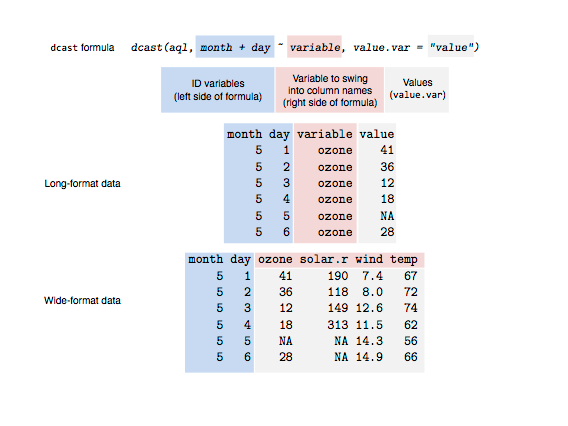

Tutorial 4 Long and wide forms and joins
================
Hause Lin

-   [Loading frequently-used packages with `library()`](#loading-frequently-used-packages-with-library)
-   [Wide vs. long data (messy vs. tidy data)](#wide-vs.-long-data-messy-vs.-tidy-data)
-   [Wide to long with `melt()` (from `data.table`)](#wide-to-long-with-melt-from-data.table)
-   [Wide to long with `gather()` (from `tidyverse` and `tidyr`)](#wide-to-long-with-gather-from-tidyverse-and-tidyr)
-   [Long to wide with `dcast()` (from `data.table`)](#long-to-wide-with-dcast-from-data.table)
-   [Long to wide with `spread()` (from `tidyverse` and `tidyr`)](#long-to-wide-with-spread-from-tidyverse-and-tidyr)
-   [Resources for converting data forms and reshaping](#resources-for-converting-data-forms-and-reshaping)
-   [Joining/binding data (rows)](#joiningbinding-data-rows)
-   [Joining/binding data (columns)](#joiningbinding-data-columns)
-   [Joining data with `left_join()` (from `tidyverse`)](#joining-data-with-left_join-from-tidyverse)
-   [Within-subjects, between-subjects designs, covariates](#within-subjects-between-subjects-designs-covariates)
-   [More join resources](#more-join-resources)

Loading frequently-used packages with `library()`
-------------------------------------------------

I always load my frequently-used packages at the top of each script.

``` r
library(tidyverse); library(data.table); library(broom); library(dtplyr); library(lme4); library(lmerTest); library(ggbeeswarm); library(cowplot)
```

Wide vs. long data (messy vs. tidy data)
----------------------------------------

Create wide data

``` r
wide <- data_frame(student = c("Andy", "Mary"),
                   englishGrades = c(1, -2),
                   mathGrades = englishGrades * 10,
                   physicsGrades = mathGrades * 100)
wide
```

    ## # A tibble: 2 x 4
    ##   student englishGrades mathGrades physicsGrades
    ##   <chr>           <dbl>      <dbl>         <dbl>
    ## 1 Andy                1         10          1000
    ## 2 Mary               -2        -20         -2000

Create equivalent long data

``` r
long <- data_frame(student = rep(c("Andy", "Mary"), each = 3),
                   class = rep(c("englishGrades", "mathGrades", "physicsGrades"), times = 2),
                   grades = c(1, 10, 100, -2, -20, -200))
long
```

    ## # A tibble: 6 x 3
    ##   student class         grades
    ##   <chr>   <chr>          <dbl>
    ## 1 Andy    englishGrades      1
    ## 2 Andy    mathGrades        10
    ## 3 Andy    physicsGrades    100
    ## 4 Mary    englishGrades     -2
    ## 5 Mary    mathGrades       -20
    ## 6 Mary    physicsGrades   -200

Compare wide vs long

``` r
wide # wide
```

    ## # A tibble: 2 x 4
    ##   student englishGrades mathGrades physicsGrades
    ##   <chr>           <dbl>      <dbl>         <dbl>
    ## 1 Andy                1         10          1000
    ## 2 Mary               -2        -20         -2000

``` r
long # long
```

    ## # A tibble: 6 x 3
    ##   student class         grades
    ##   <chr>   <chr>          <dbl>
    ## 1 Andy    englishGrades      1
    ## 2 Andy    mathGrades        10
    ## 3 Andy    physicsGrades    100
    ## 4 Mary    englishGrades     -2
    ## 5 Mary    mathGrades       -20
    ## 6 Mary    physicsGrades   -200

Wide to long with `melt()` (from `data.table`)
----------------------------------------------

There is a base R `melt()` function that is less powerful and slower than the `melt()` that comes with `data.table`. As long as you've loaded `data.table` with `library(data.table)`, you'll be using the more powerful version of `melt()`.

``` r
melt(wide, id.vars = c("student"))
```

    ##   student      variable value
    ## 1    Andy englishGrades     1
    ## 2    Mary englishGrades    -2
    ## 3    Andy    mathGrades    10
    ## 4    Mary    mathGrades   -20
    ## 5    Andy physicsGrades  1000
    ## 6    Mary physicsGrades -2000

Rename variables

``` r
melt(wide, id.vars = c("student"), variable.name = "cLaSs", value.name = "gRaDeS") 
```

    ##   student         cLaSs gRaDeS
    ## 1    Andy englishGrades      1
    ## 2    Mary englishGrades     -2
    ## 3    Andy    mathGrades     10
    ## 4    Mary    mathGrades    -20
    ## 5    Andy physicsGrades   1000
    ## 6    Mary physicsGrades  -2000

Compare with the long form we created

``` r
melt(wide, id.vars = c("student"), variable.name = "cLaSs", value.name = "gRaDeS") %>% arrange(student, cLaSs)
```

    ##   student         cLaSs gRaDeS
    ## 1    Andy englishGrades      1
    ## 2    Andy    mathGrades     10
    ## 3    Andy physicsGrades   1000
    ## 4    Mary englishGrades     -2
    ## 5    Mary    mathGrades    -20
    ## 6    Mary physicsGrades  -2000

``` r
long
```

    ## # A tibble: 6 x 3
    ##   student class         grades
    ##   <chr>   <chr>          <dbl>
    ## 1 Andy    englishGrades      1
    ## 2 Andy    mathGrades        10
    ## 3 Andy    physicsGrades    100
    ## 4 Mary    englishGrades     -2
    ## 5 Mary    mathGrades       -20
    ## 6 Mary    physicsGrades   -200

Wide to long with `gather()` (from `tidyverse` and `tidyr`)
-----------------------------------------------------------

`gather()` is less flexible than `melt()`

``` r
gather(wide, key = cLaSs, value = gRaDeS, -student) # remove the id column
```

    ## # A tibble: 6 x 3
    ##   student cLaSs         gRaDeS
    ##   <chr>   <chr>          <dbl>
    ## 1 Andy    englishGrades      1
    ## 2 Mary    englishGrades     -2
    ## 3 Andy    mathGrades        10
    ## 4 Mary    mathGrades       -20
    ## 5 Andy    physicsGrades   1000
    ## 6 Mary    physicsGrades  -2000

Long to wide with `dcast()` (from `data.table`)
-----------------------------------------------

There is a base R `dcast()` function that is less powerful and slower than the `dcast()` that comes with `data.table`. As long as you've loaded `data.table` with `library(data.table)`, you'll be using the more powerful version of `dcast()`.

-   left-side of formula ~: id variables (can be more than 1)
-   right-wide of formula ~: columns/variables to split by (can be more than 1)
-   value.var: which column has the values (can be more than 1)

``` r
dcast(long, student ~ class, value.var = "grades")
```

    ##   student englishGrades mathGrades physicsGrades
    ## 1    Andy             1         10           100
    ## 2    Mary            -2        -20          -200

``` r
wide # compare with dcast() output
```

    ## # A tibble: 2 x 4
    ##   student englishGrades mathGrades physicsGrades
    ##   <chr>           <dbl>      <dbl>         <dbl>
    ## 1 Andy                1         10          1000
    ## 2 Mary               -2        -20         -2000

Long to wide with `spread()` (from `tidyverse` and `tidyr`)
-----------------------------------------------------------

`spread()` is less flexible than `dcast()`

``` r
spread(long, key = class, value = grades)
```

    ## # A tibble: 2 x 4
    ##   student englishGrades mathGrades physicsGrades
    ##   <chr>           <dbl>      <dbl>         <dbl>
    ## 1 Andy                1         10           100
    ## 2 Mary               -2        -20          -200

``` r
wide # compare with spread() output
```

    ## # A tibble: 2 x 4
    ##   student englishGrades mathGrades physicsGrades
    ##   <chr>           <dbl>      <dbl>         <dbl>
    ## 1 Andy                1         10          1000
    ## 2 Mary               -2        -20         -2000

Another example



Resources for converting data forms and reshaping
-------------------------------------------------

-   [reshaping and converting forms](http://seananderson.ca/2013/10/19/reshape/)
-   [tutorial/vignette](https://cran.r-project.org/web/packages/data.table/vignettes/datatable-reshape.html)

Joining/binding data (rows)
---------------------------

``` r
wide # original data
```

    ## # A tibble: 2 x 4
    ##   student englishGrades mathGrades physicsGrades
    ##   <chr>           <dbl>      <dbl>         <dbl>
    ## 1 Andy                1         10          1000
    ## 2 Mary               -2        -20         -2000

``` r
moreRows <- data_frame(student = c("John", "Jane"),
                       englishGrades = c(5, -5),
                       mathGrades = englishGrades * 10,
                       physicsGrades = mathGrades * NA)
moreRows
```

    ## # A tibble: 2 x 4
    ##   student englishGrades mathGrades physicsGrades
    ##   <chr>           <dbl>      <dbl>         <dbl>
    ## 1 John                5         50            NA
    ## 2 Jane               -5        -50            NA

``` r
rbind(wide, moreRows)
```

    ## # A tibble: 4 x 4
    ##   student englishGrades mathGrades physicsGrades
    ##   <chr>           <dbl>      <dbl>         <dbl>
    ## 1 Andy                1         10          1000
    ## 2 Mary               -2        -20         -2000
    ## 3 John                5         50            NA
    ## 4 Jane               -5        -50            NA

``` r
bind_rows(wide, moreRows) 
```

    ## # A tibble: 4 x 4
    ##   student englishGrades mathGrades physicsGrades
    ##   <chr>           <dbl>      <dbl>         <dbl>
    ## 1 Andy                1         10          1000
    ## 2 Mary               -2        -20         -2000
    ## 3 John                5         50            NA
    ## 4 Jane               -5        -50            NA

`bind_rows` has same effect as rbind() above, but much more efficient/flexible and binds even if column numbers don't match (see below).

``` r
moreRows2 <- data_frame(student = c("John", "Jane"),
                       englishGrades = c(5, -5),
                       mathGrades = englishGrades * 10)
moreRows2
```

    ## # A tibble: 2 x 3
    ##   student englishGrades mathGrades
    ##   <chr>           <dbl>      <dbl>
    ## 1 John                5         50
    ## 2 Jane               -5        -50

``` r
wide
```

    ## # A tibble: 2 x 4
    ##   student englishGrades mathGrades physicsGrades
    ##   <chr>           <dbl>      <dbl>         <dbl>
    ## 1 Andy                1         10          1000
    ## 2 Mary               -2        -20         -2000

``` r
moreRows2 # one less column
```

    ## # A tibble: 2 x 3
    ##   student englishGrades mathGrades
    ##   <chr>           <dbl>      <dbl>
    ## 1 John                5         50
    ## 2 Jane               -5        -50

``` r
rbind(wide, moreRows2) # error
```

    ## Error in rbind(deparse.level, ...): numbers of columns of arguments do not match

``` r
bind_rows(wide, moreRows2) # no error but fills with NA
```

    ## # A tibble: 4 x 4
    ##   student englishGrades mathGrades physicsGrades
    ##   <chr>           <dbl>      <dbl>         <dbl>
    ## 1 Andy                1         10          1000
    ## 2 Mary               -2        -20         -2000
    ## 3 John                5         50            NA
    ## 4 Jane               -5        -50            NA

Joining/binding data (columns)
------------------------------

Same with `rbind()`, you can use `cbind()` to join data by columns. And `bind_cols()` is much more efficient and flexible.

``` r
wide2 <- bind_rows(wide, moreRows2)
wide2
```

    ## # A tibble: 4 x 4
    ##   student englishGrades mathGrades physicsGrades
    ##   <chr>           <dbl>      <dbl>         <dbl>
    ## 1 Andy                1         10          1000
    ## 2 Mary               -2        -20         -2000
    ## 3 John                5         50            NA
    ## 4 Jane               -5        -50            NA

``` r
columnsToBind <- data_frame(extraCol = c(999, NA, 999, NA))
columnsToBind
```

    ## # A tibble: 4 x 1
    ##   extraCol
    ##      <dbl>
    ## 1      999
    ## 2       NA
    ## 3      999
    ## 4       NA

``` r
bind_cols(wide2, columnsToBind)
```

    ## # A tibble: 4 x 5
    ##   student englishGrades mathGrades physicsGrades extraCol
    ##   <chr>           <dbl>      <dbl>         <dbl>    <dbl>
    ## 1 Andy                1         10          1000      999
    ## 2 Mary               -2        -20         -2000       NA
    ## 3 John                5         50            NA      999
    ## 4 Jane               -5        -50            NA       NA

Joining data with `left_join()` (from `tidyverse`)
--------------------------------------------------

Type `?left_join()` in your console to see all other types of joins. I use `left_join()` most frequently.

Look at the data below. What if we have some information about each student in a separate dataframe and we want to merge the datasets?

``` r
wide2
```

    ## # A tibble: 4 x 4
    ##   student englishGrades mathGrades physicsGrades
    ##   <chr>           <dbl>      <dbl>         <dbl>
    ## 1 Andy                1         10          1000
    ## 2 Mary               -2        -20         -2000
    ## 3 John                5         50            NA
    ## 4 Jane               -5        -50            NA

Let's say we know the gender and chemistry grades of each student...

``` r
extraInfo <- data_frame(student = c("Jane", "John", "Mary", "Andy"),
                        chemistryGrades = c(900, 901, 902, 903))
extraInfo
```

    ## # A tibble: 4 x 2
    ##   student chemistryGrades
    ##   <chr>             <dbl>
    ## 1 Jane                900
    ## 2 John                901
    ## 3 Mary                902
    ## 4 Andy                903

Can we merge the data `wide2` and `extraInfo` with `bind_cols()`?

``` r
bind_cols(wide2, extraInfo)
```

    ## # A tibble: 4 x 6
    ##   student englishGrades mathGrades physicsGrades student1 chemistryGrades
    ##   <chr>           <dbl>      <dbl>         <dbl> <chr>              <dbl>
    ## 1 Andy                1         10          1000 Jane                 900
    ## 2 Mary               -2        -20         -2000 John                 901
    ## 3 John                5         50            NA Mary                 902
    ## 4 Jane               -5        -50            NA Andy                 903

What's wrong? How to fix it?

``` r
left_join(wide2, extraInfo)
```

    ## Joining, by = "student"

    ## # A tibble: 4 x 5
    ##   student englishGrades mathGrades physicsGrades chemistryGrades
    ##   <chr>           <dbl>      <dbl>         <dbl>           <dbl>
    ## 1 Andy                1         10          1000             903
    ## 2 Mary               -2        -20         -2000             902
    ## 3 John                5         50            NA             901
    ## 4 Jane               -5        -50            NA             900

Is the output what you expect? Is it correct? What does the 'Joining, by = "student"' mean?

What if we have missing/incomplete extra information?

``` r
extraInfo2 <- data_frame(student = c("Jane", "John"),
                        chemistryGrades = c(900, 901))
extraInfo2
```

    ## # A tibble: 2 x 2
    ##   student chemistryGrades
    ##   <chr>             <dbl>
    ## 1 Jane                900
    ## 2 John                901

``` r
left_join(wide2, extraInfo2)
```

    ## Joining, by = "student"

    ## # A tibble: 4 x 5
    ##   student englishGrades mathGrades physicsGrades chemistryGrades
    ##   <chr>           <dbl>      <dbl>         <dbl>           <dbl>
    ## 1 Andy                1         10          1000              NA
    ## 2 Mary               -2        -20         -2000              NA
    ## 3 John                5         50            NA             901
    ## 4 Jane               -5        -50            NA             900

Works! Rows with missing information have `NA`.

Note that you can specify which columns/variables to join by via the `by` parameter in all join functions. By default, R automatically finds matching column/variable names between both data objects and joins by ALL matching columns/variables.

Also, the output class of join functions are not `data.table`! To convert class, use pipes!

``` r
class(left_join(wide2, extraInfo2)) # not data.table (no...)
```

    ## Joining, by = "student"

    ## [1] "tbl_df"     "tbl"        "data.frame"

``` r
left_join(wide2, extraInfo2) %>% tbl_dt() # convert to data.table
```

    ## Joining, by = "student"

    ## Source: local data table [4 x 5]
    ## 
    ## # A tibble: 4 x 5
    ##   student englishGrades mathGrades physicsGrades chemistryGrades
    ##   <chr>           <dbl>      <dbl>         <dbl>           <dbl>
    ## 1 Andy                1         10          1000              NA
    ## 2 Mary               -2        -20         -2000              NA
    ## 3 John                5         50            NA             901
    ## 4 Jane               -5        -50            NA             900

``` r
left_join(wide2, extraInfo2) %>% tbl_dt() %>% class() # check class (data.table! yea!)
```

    ## Joining, by = "student"

    ## [1] "tbl_dt"     "tbl"        "data.table" "data.frame"

Within-subjects, between-subjects designs, covariates
-----------------------------------------------------

Create some data

``` r
gradesWide <- left_join(wide2, extraInfo2)
```

    ## Joining, by = "student"

``` r
gradesWide
```

    ## # A tibble: 4 x 5
    ##   student englishGrades mathGrades physicsGrades chemistryGrades
    ##   <chr>           <dbl>      <dbl>         <dbl>           <dbl>
    ## 1 Andy                1         10          1000              NA
    ## 2 Mary               -2        -20         -2000              NA
    ## 3 John                5         50            NA             901
    ## 4 Jane               -5        -50            NA             900

Wide form data is good for dependent/paired t.tests in R (within-subjects)

``` r
t.test(gradesWide$englishGrades, gradesWide$mathGrades, paired = T)
```

    ## 
    ##  Paired t-test
    ## 
    ## data:  gradesWide$englishGrades and gradesWide$mathGrades
    ## t = 0.11704, df = 3, p-value = 0.9142
    ## alternative hypothesis: true difference in means is not equal to 0
    ## 95 percent confidence interval:
    ##  -58.92937  63.42937
    ## sample estimates:
    ## mean of the differences 
    ##                    2.25

``` r
t.test(gradesWide$englishGrades, gradesWide$chemistryGrades, paired = T)
```

    ## 
    ##  Paired t-test
    ## 
    ## data:  gradesWide$englishGrades and gradesWide$chemistryGrades
    ## t = -200.11, df = 1, p-value = 0.003181
    ## alternative hypothesis: true difference in means is not equal to 0
    ## 95 percent confidence interval:
    ##  -957.6779 -843.3221
    ## sample estimates:
    ## mean of the differences 
    ##                  -900.5

But long-form data is generally preferred

``` r
gradesLong <- melt(gradesWide, id.vars = "student", variable.name = "class", value.name = "grade") %>% 
    arrange(student) %>% # sort by student
    tbl_dt() # convert to data.table and tibble
gradesLong
```

    ## Source: local data table [16 x 3]
    ## 
    ## # A tibble: 16 x 3
    ##    student class           grade
    ##    <chr>   <fct>           <dbl>
    ##  1 Andy    englishGrades       1
    ##  2 Andy    mathGrades         10
    ##  3 Andy    physicsGrades    1000
    ##  4 Andy    chemistryGrades    NA
    ##  5 Jane    englishGrades      -5
    ##  6 Jane    mathGrades        -50
    ##  7 Jane    physicsGrades      NA
    ##  8 Jane    chemistryGrades   900
    ##  9 John    englishGrades       5
    ## 10 John    mathGrades         50
    ## 11 John    physicsGrades      NA
    ## 12 John    chemistryGrades   901
    ## 13 Mary    englishGrades      -2
    ## 14 Mary    mathGrades        -20
    ## 15 Mary    physicsGrades   -2000
    ## 16 Mary    chemistryGrades    NA

What if we want to use `englishGrades` as a covariate? Then the covariate has to be in a separate column/variable.

Subset data with just covariate and id variable

``` r
covariate_englishGrades <- gradesLong[class == "englishGrades", .(student, grade)]
covariate_englishGrades
```

    ## Source: local data table [4 x 2]
    ## 
    ## # A tibble: 4 x 2
    ##   student grade
    ##   <chr>   <dbl>
    ## 1 Andy        1
    ## 2 Jane       -5
    ## 3 John        5
    ## 4 Mary       -2

Rename covariate

``` r
setnames(covariate_englishGrades, "grade", "englishGrades")
covariate_englishGrades
```

    ## Source: local data table [4 x 2]
    ## 
    ## # A tibble: 4 x 2
    ##   student englishGrades
    ##   <chr>           <dbl>
    ## 1 Andy                1
    ## 2 Jane               -5
    ## 3 John                5
    ## 4 Mary               -2

Use `left_join()` to add covariate to data

``` r
gradesLong_covariate <- left_join(gradesLong, covariate_englishGrades)
```

    ## Joining, by = "student"

``` r
gradesLong_covariate
```

    ## Source: local data table [16 x 4]
    ## 
    ## # A tibble: 16 x 4
    ##    student class           grade englishGrades
    ##    <chr>   <fct>           <dbl>         <dbl>
    ##  1 Andy    englishGrades       1             1
    ##  2 Andy    mathGrades         10             1
    ##  3 Andy    physicsGrades    1000             1
    ##  4 Andy    chemistryGrades    NA             1
    ##  5 Jane    englishGrades      -5            -5
    ##  6 Jane    mathGrades        -50            -5
    ##  7 Jane    physicsGrades      NA            -5
    ##  8 Jane    chemistryGrades   900            -5
    ##  9 John    englishGrades       5             5
    ## 10 John    mathGrades         50             5
    ## 11 John    physicsGrades      NA             5
    ## 12 John    chemistryGrades   901             5
    ## 13 Mary    englishGrades      -2            -2
    ## 14 Mary    mathGrades        -20            -2
    ## 15 Mary    physicsGrades   -2000            -2
    ## 16 Mary    chemistryGrades    NA            -2

``` r
gradesLong_covariate2 <- gradesLong_covariate[class != "englishGrades"] # remove englishGrades from long form data if necessary
gradesLong_covariate2
```

    ## Source: local data table [12 x 4]
    ## 
    ## # A tibble: 12 x 4
    ##    student class           grade englishGrades
    ##    <chr>   <fct>           <dbl>         <dbl>
    ##  1 Andy    mathGrades         10             1
    ##  2 Andy    physicsGrades    1000             1
    ##  3 Andy    chemistryGrades    NA             1
    ##  4 Jane    mathGrades        -50            -5
    ##  5 Jane    physicsGrades      NA            -5
    ##  6 Jane    chemistryGrades   900            -5
    ##  7 John    mathGrades         50             5
    ##  8 John    physicsGrades      NA             5
    ##  9 John    chemistryGrades   901             5
    ## 10 Mary    mathGrades        -20            -2
    ## 11 Mary    physicsGrades   -2000            -2
    ## 12 Mary    chemistryGrades    NA            -2

Fit model with covariate using `lm()` (linear model)

``` r
summary(lm(grade ~ class + englishGrades, data = gradesLong_covariate2))
```

    ## 
    ## Call:
    ## lm(formula = grade ~ class + englishGrades, data = gradesLong_covariate2)
    ## 
    ## Residuals:
    ##        1        2        4        6        7        9       10       11 
    ##   -45.31  1430.63   172.17   230.74  -190.30  -230.74    63.43 -1430.63 
    ## 
    ## Coefficients:
    ##                      Estimate Std. Error t value Pr(>|t|)
    ## (Intercept)             9.062    517.300   0.018    0.987
    ## classphysicsGrades   -485.938    895.308  -0.543    0.616
    ## classchemistryGrades  891.438    895.308   0.996    0.376
    ## englishGrades          46.247     98.870   0.468    0.664
    ## 
    ## Residual standard error: 1033 on 4 degrees of freedom
    ##   (4 observations deleted due to missingness)
    ## Multiple R-squared:  0.3477, Adjusted R-squared:  -0.1415 
    ## F-statistic: 0.7108 on 3 and 4 DF,  p-value: 0.5943

Get ANOVA output from `lm()` output

``` r
summary.aov(lm(grade ~ class + englishGrades, data = gradesLong_covariate2))
```

    ##               Df  Sum Sq Mean Sq F value Pr(>F)
    ## class          2 2043615 1021808   0.957  0.458
    ## englishGrades  1  233664  233664   0.219  0.664
    ## Residuals      4 4271812 1067953               
    ## 4 observations deleted due to missingness

``` r
anova(lm(grade ~ class + englishGrades, data = gradesLong_covariate2))
```

    ## Analysis of Variance Table
    ## 
    ## Response: grade
    ##               Df  Sum Sq Mean Sq F value Pr(>F)
    ## class          2 2043615 1021808  0.9568 0.4575
    ## englishGrades  1  233664  233664  0.2188 0.6643
    ## Residuals      4 4271812 1067953

Fit model with covariate using `aov()` (ANOVA)

``` r
summary(aov(grade ~ class + englishGrades, data = gradesLong_covariate2))
```

    ##               Df  Sum Sq Mean Sq F value Pr(>F)
    ## class          2 2043615 1021808   0.957  0.458
    ## englishGrades  1  233664  233664   0.219  0.664
    ## Residuals      4 4271812 1067953               
    ## 4 observations deleted due to missingness

More join resources
-------------------

-   [official documentation](https://dplyr.tidyverse.org/reference/join.html)
-   [more tutorial](http://stat545.com/bit001_dplyr-cheatsheet.html)
