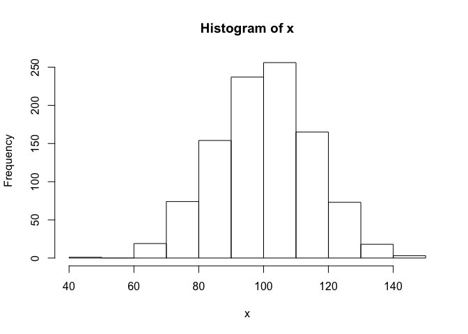
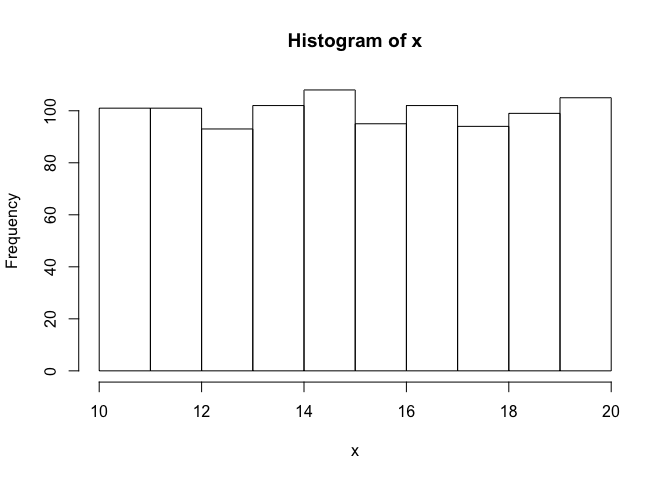

Tutorial 6: Simulating data
================
Hause Lin

-   [Loading frequently-used packages with `library()`](#loading-frequently-used-packages-with-library)
-   [Generate random values from a normal distribution](#generate-random-values-from-a-normal-distribution)
-   [Generate random values from a uniform distribution](#generate-random-values-from-a-uniform-distribution)
-   [Simulate a t-test with `rnorm()`](#simulate-a-t-test-with-rnorm)
-   [Manipulating strings](#manipulating-strings)
    -   [Manipulating string resources](#manipulating-string-resources)
-   [the apply family in R (looping without for loops)](#the-apply-family-in-r-looping-without-for-loops)

Loading frequently-used packages with `library()`
-------------------------------------------------

I always load my frequently-used packages at the top of each script.

``` r
library(tidyverse); library(data.table); library(broom); library(dtplyr); library(lme4); library(lmerTest); library(ggbeeswarm); library(cowplot)
```

Generate random values from a normal distribution
-------------------------------------------------

``` r
rnorm(n = 10) # 10 values (values from standard normal distribution: mean 0, sd 1)
```

    ##  [1]  0.8477690  0.6354139 -0.9916428  0.9549779  0.3629186 -1.4496490
    ##  [7] -1.1360180 -0.8094310 -0.3367988  1.5619097

``` r
rnorm(n = 100, mean = 100, sd = 15) # 100 values from a normal distribution (mean 100, sd = 15)
```

    ##   [1] 108.61496 113.50543  86.58595  84.87790 106.13955  95.14666 104.57999
    ##   [8]  99.75707 122.13782 100.24487  95.62853  96.21966 101.23567  90.65478
    ##  [15]  99.46575  81.02504  88.23201  70.05598  94.79280 110.14183 120.56409
    ##  [22] 123.71502 110.25227  85.40904  98.04528  63.77162  85.07142 107.73592
    ##  [29] 126.59412  90.95393  57.29918 116.97163  90.58807  98.50388  95.11641
    ##  [36] 102.29881  91.61215  85.85885  86.86357  78.17557  98.74421  85.48422
    ##  [43] 101.62678 124.50967  89.91287  96.16041  91.96039 100.10152  99.69056
    ##  [50]  99.01479  68.42615  68.48989  97.55059 103.55450  96.92452  97.10441
    ##  [57] 101.14161 105.12934 108.89520  78.28871 113.95217 100.96597 117.14261
    ##  [64] 112.77211 114.30957  96.39756  78.88632  86.49208 112.94404  83.49054
    ##  [71] 115.45647 116.99769  82.14367 105.29631  92.88621 118.21089  59.46632
    ##  [78] 118.81410 107.00212 106.94752 108.26599 123.32676 125.67225 100.12964
    ##  [85]  74.85904 118.32804 116.89074  99.04053 104.08793  89.83206 127.13295
    ##  [92] 102.51215  82.30248 115.69585 108.29386  98.81678  76.45135  96.79764
    ##  [99]  86.52836  78.28423

``` r
x <- rnorm(n = 1000, mean = 100, sd = 15) # 1000 values from a normal distribution (mean 100, sd = 15)
hist(x) # base R plot histogram
```



Generate random values from a uniform distribution
--------------------------------------------------

``` r
x <- runif(n = 1000, min = 10, max = 20)
hist(x)
```



Simulate a t-test with `rnorm()`
--------------------------------

Group a (n = 20): mean 100, sd 15 Group b (n = 20): mean 115, sd 20

``` r
fakeData <- data_frame(group = rep(c("a", "b"), each = 20), 
                       value = c(rnorm(20, 100, 15), rnorm(20, 115, 20))) 
print(fakeData, n = Inf)
```

    ## # A tibble: 40 x 2
    ##    group value
    ##    <chr> <dbl>
    ##  1 a     131. 
    ##  2 a     105. 
    ##  3 a     119. 
    ##  4 a     107. 
    ##  5 a     101. 
    ##  6 a      97.5
    ##  7 a     103. 
    ##  8 a     121. 
    ##  9 a     119. 
    ## 10 a      70.9
    ## 11 a      86.3
    ## 12 a      92.9
    ## 13 a     117. 
    ## 14 a     103. 
    ## 15 a      89.5
    ## 16 a      85.1
    ## 17 a     108. 
    ## 18 a      82.5
    ## 19 a     104. 
    ## 20 a     129. 
    ## 21 b     106. 
    ## 22 b     137. 
    ## 23 b     134. 
    ## 24 b     145. 
    ## 25 b     119. 
    ## 26 b     115. 
    ## 27 b     136. 
    ## 28 b     118. 
    ## 29 b     121. 
    ## 30 b     118. 
    ## 31 b      82.1
    ## 32 b     127. 
    ## 33 b     140. 
    ## 34 b     117. 
    ## 35 b      81.4
    ## 36 b      87.0
    ## 37 b     113. 
    ## 38 b     153. 
    ## 39 b     102. 
    ## 40 b     101.

Will group differences be significant?

``` r
simulateResults <- t.test(value ~ group, data = fakeData)
simulateResults
```

    ## 
    ##  Welch Two Sample t-test
    ## 
    ## data:  value by group
    ## t = -2.4524, df = 36.092, p-value = 0.01916
    ## alternative hypothesis: true difference in means is not equal to 0
    ## 95 percent confidence interval:
    ##  -25.810913  -2.445207
    ## sample estimates:
    ## mean in group a mean in group b 
    ##        103.4998        117.6278

``` r
source("https://raw.githubusercontent.com/hauselin/Rcode/master/summaryh.R")
```

    ## 
    ## Attaching package: 'sjstats'

    ## The following object is masked from 'package:broom':
    ## 
    ##     bootstrap

    ## r: .10 (small), .30 (medium), .50 (large) (Cohen, 1992)
    ## d: 0.20 (small), 0.50 (medium), .80 (large) (Cohen, 1992)
    ## R2: .02 (small), .13 (medium), .26 (large) (Cohen, 1992)

``` r
summaryh(simulateResults) # my custom function
```

    ##                              results
    ## 1: t(36) = −2.45, p = .019, r = 0.38

Manipulating strings
--------------------

Substitute patterns

``` r
gsub(pattern = "a", replacement = "_HEY_", x = c("aba", "cae", "xxx"))
```

    ## [1] "_HEY_b_HEY_" "c_HEY_e"     "xxx"

``` r
gsub(pattern = "a", replacement = " ", x = c("aba", "cae", "xxx"))
```

    ## [1] " b " "c e" "xxx"

``` r
gsub(pattern = "a", replacement = "", x = c("aba", "cae", "xxx"))
```

    ## [1] "b"   "ce"  "xxx"

Find matching patterns

``` r
text <- c("foot","lefroo", "bafOobar", "zeb")
grep(pattern = "oo", x = text, ignore.case = T)
```

    ## [1] 1 2 3

``` r
grep(pattern = "oo", x = text, ignore.case = F)
```

    ## [1] 1 2

``` r
grepl(pattern = "oo", x = text, ignore.case = T)
```

    ## [1]  TRUE  TRUE  TRUE FALSE

``` r
grepl(pattern = "oo", x = text, ignore.case = F)
```

    ## [1]  TRUE  TRUE FALSE FALSE

### Manipulating string resources

-   [stringr tutorial/vignette](https://cran.r-project.org/web/packages/stringr/vignettes/stringr.html)

the apply family in R (looping without for loops)
-------------------------------------------------

-   `lapply`, `apply`, `sapply`, `vapply`, `tapply`
