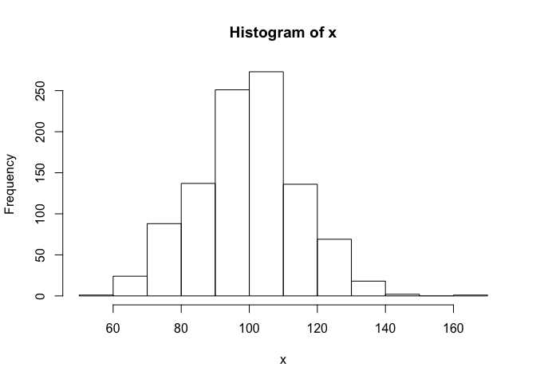
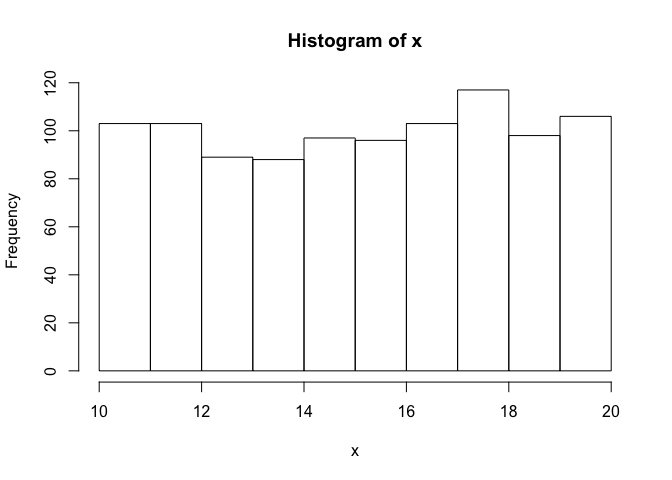

Tutorial 6: Simulating data and manipulating strings/characters
================
Hause Lin

-   [Loading frequently-used packages with `library()`](#loading-frequently-used-packages-with-library)
-   [Generate random values from a normal distribution](#generate-random-values-from-a-normal-distribution)
-   [Generate random values from a uniform distribution](#generate-random-values-from-a-uniform-distribution)
-   [Simulate a t-test with `rnorm()`](#simulate-a-t-test-with-rnorm)
-   [Manipulating strings](#manipulating-strings)
    -   [Manipulating string resources](#manipulating-string-resources)
-   [the apply family in R (looping without for loops)](#the-apply-family-in-r-looping-without-for-loops)

Loading frequently-used packages with `library()`
-------------------------------------------------

I always load my frequently-used packages at the top of each script.

``` r
library(tidyverse); library(data.table); library(broom); library(dtplyr); library(lme4); library(lmerTest); library(ggbeeswarm); library(cowplot)
```

Generate random values from a normal distribution
-------------------------------------------------

``` r
rnorm(n = 10) # 10 values (values from standard normal distribution: mean 0, sd 1)
```

    ##  [1] -0.9150370  0.8172215  1.4266101  0.7401008  0.7779291 -0.2796492
    ##  [7] -0.1453692 -1.3277915 -0.9750920  1.1862153

``` r
rnorm(n = 100, mean = 100, sd = 15) # 100 values from a normal distribution (mean 100, sd = 15)
```

    ##   [1]  98.17177  96.03341  71.67914  86.51697 109.91843  87.70764  78.73796
    ##   [8]  94.09601  86.54212 103.07452 102.26330 107.58908  99.14082 103.16282
    ##  [15] 108.10420 101.54966 114.29968  62.44680 118.12483 118.92033  99.05493
    ##  [22] 131.26929  85.10177  95.46578 103.22523  88.40687  95.07596 112.17138
    ##  [29]  90.72789  78.84195  84.47579  75.98417  89.91197  99.21019  90.34705
    ##  [36]  93.16436 119.43894 104.18176  92.23519 122.44027  71.28991 108.64097
    ##  [43] 113.33560 107.03314 112.61201  86.68362  87.60615 116.38238 108.78447
    ##  [50]  75.18673  87.75419 106.30681  60.16126 123.42445 121.70427 111.46078
    ##  [57] 114.33795  90.25145  93.11016  65.16121  90.01606  89.14579  81.00209
    ##  [64] 105.55037  76.61319  86.90281  83.02171 104.31583 112.18420 101.43354
    ##  [71] 110.98151  89.06989 109.91958 104.05540 104.71296  81.12002  79.44798
    ##  [78] 113.39607  99.12907 120.87058  89.48336  86.87548 134.34683 106.87098
    ##  [85] 100.65184 127.22232 110.73815 117.49887  75.25953  87.87163  94.29255
    ##  [92] 115.47896  97.96997 114.13123 123.50598 115.85229 109.02699  75.88677
    ##  [99]  98.82827  73.35906

``` r
x <- rnorm(n = 1000, mean = 100, sd = 15) # 1000 values from a normal distribution (mean 100, sd = 15)
hist(x) # base R plot histogram
```



Generate random values from a uniform distribution
--------------------------------------------------

``` r
x <- runif(n = 1000, min = 10, max = 20)
hist(x)
```



Simulate a t-test with `rnorm()`
--------------------------------

Group a (n = 20): mean 100, sd 15 Group b (n = 20): mean 115, sd 20

``` r
fakeData <- data_frame(group = rep(c("a", "b"), each = 20), 
                       value = c(rnorm(20, 100, 15), rnorm(20, 115, 20))) 
print(fakeData, n = Inf)
```

    ## # A tibble: 40 x 2
    ##    group value
    ##    <chr> <dbl>
    ##  1 a      69.1
    ##  2 a     107. 
    ##  3 a     117. 
    ##  4 a     111. 
    ##  5 a      94.1
    ##  6 a      99.9
    ##  7 a      78.0
    ##  8 a      91.0
    ##  9 a      98.2
    ## 10 a     117. 
    ## 11 a      81.5
    ## 12 a     101. 
    ## 13 a      84.4
    ## 14 a     114. 
    ## 15 a      82.9
    ## 16 a     101. 
    ## 17 a     104. 
    ## 18 a      84.0
    ## 19 a      92.5
    ## 20 a      91.8
    ## 21 b     113. 
    ## 22 b      92.9
    ## 23 b     139. 
    ## 24 b     152. 
    ## 25 b     134. 
    ## 26 b     149. 
    ## 27 b     137. 
    ## 28 b      87.9
    ## 29 b     125. 
    ## 30 b     111. 
    ## 31 b     169. 
    ## 32 b      88.1
    ## 33 b     118. 
    ## 34 b     112. 
    ## 35 b     114. 
    ## 36 b      88.5
    ## 37 b     115. 
    ## 38 b     101. 
    ## 39 b      93.0
    ## 40 b     100.

Will group differences be significant?

``` r
simulateResults <- t.test(value ~ group, data = fakeData)
simulateResults
```

    ## 
    ##  Welch Two Sample t-test
    ## 
    ## data:  value by group
    ## t = -3.4655, df = 30.309, p-value = 0.001603
    ## alternative hypothesis: true difference in means is not equal to 0
    ## 95 percent confidence interval:
    ##  -33.349061  -8.624125
    ## sample estimates:
    ## mean in group a mean in group b 
    ##         95.9938        116.9804

``` r
source("https://raw.githubusercontent.com/hauselin/Rcode/master/summaryh.R")
```

    ## 
    ## Attaching package: 'sjstats'

    ## The following object is masked from 'package:broom':
    ## 
    ##     bootstrap

    ## r: .10 (small), .30 (medium), .50 (large) (Cohen, 1992)
    ## d: 0.20 (small), 0.50 (medium), .80 (large) (Cohen, 1992)
    ## R2: .02 (small), .13 (medium), .26 (large) (Cohen, 1992)

``` r
summaryh(simulateResults) # my custom function
```

    ##                              results
    ## 1: t(30) = −3.47, p = .002, r = 0.53

Manipulating strings
--------------------

Substitute patterns

``` r
gsub(pattern = "a", replacement = "_HEY_", x = c("aba", "cae", "xxx"))
```

    ## [1] "_HEY_b_HEY_" "c_HEY_e"     "xxx"

``` r
gsub(pattern = "a", replacement = " ", x = c("aba", "cae", "xxx"))
```

    ## [1] " b " "c e" "xxx"

``` r
gsub(pattern = "a", replacement = "", x = c("aba", "cae", "xxx"))
```

    ## [1] "b"   "ce"  "xxx"

Find matching patterns

``` r
text <- c("foot","lefroo", "bafOobar", "zeb")
grep(pattern = "oo", x = text, ignore.case = T)
```

    ## [1] 1 2 3

``` r
grep(pattern = "oo", x = text, ignore.case = F)
```

    ## [1] 1 2

``` r
grepl(pattern = "oo", x = text, ignore.case = T)
```

    ## [1]  TRUE  TRUE  TRUE FALSE

``` r
grepl(pattern = "oo", x = text, ignore.case = F)
```

    ## [1]  TRUE  TRUE FALSE FALSE

### Manipulating string resources

-   [stringr tutorial/vignette](https://cran.r-project.org/web/packages/stringr/vignettes/stringr.html)
-   [stringr github site](https://github.com/tidyverse/stringr)

the apply family in R (looping without for loops)
-------------------------------------------------

-   `lapply`, `apply`, `sapply`, `vapply`, `tapply`
